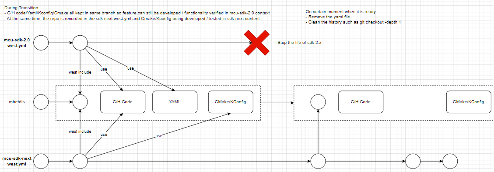

Code Base
==================

.. todo:: Add mcu-int-manifest and internal repository description

Migration
==================

Introduction for how to do migration from SDK 2.0 repository to SDK Next. Some guidelines for how to do migration from SDK 2.0 repository to SDK Next

Try to reuse same bitbucket repository and same branch in mcu-sdk-2.0 and mcu-sdk-3.0 (Temp name for the sdk next manifest repo) so that developers can keep on 
do the feature development within SDK 2.0 code base while verify the cmake & kconfig based build system in sdk next environment.
This is technically possible cause SDK next only request a change in the build system for majority of middlewares. The only exception in the mind is devices/utilities are required to be changed

half month before first SDK next release(Likely Early Auguest), SDK core sw team will use script do a global change to adjust the folder hierachy to expected folder hierachy in SDK Next
- After the global change, all middleware team working on the new hierachy of the folder

Here is a list of work for the migration works for a typical middleware

- Record the SDK 2.0 used branch into the mcu-sdk-3.0 west manifest file
- Record the content into a seperate repository which will never be synced out to github (e.g. source code of your firmware binary)
- Create the Cmake/Kconfig file for the middlewares and record in the top level CMake/Kconfig tree
- Move examples folder in middleware folder into boards repo: src/<category>_examples/
- Create the Yaml files in ecosystem repostiory to make that middleware / examples be available in the SDK Next
- Convert the PDF document to markdown/rst format and record in the middleware repository and record these entry in docs for online document nightly creation
- Record your component into the component map

Before the first SDK Next Release
- Clean your branch history to hide commit history you do not want to public

.. toctree::
  :maxdepth: 1

  Example Folder Migration <migration/example_folder_migration.md>

Build System
==================

.. todo:: Add the Build System Option such as ecosytem data

Release
==================

.. todo:: Add release description

Process
==================

.. todo:: Add Process Description