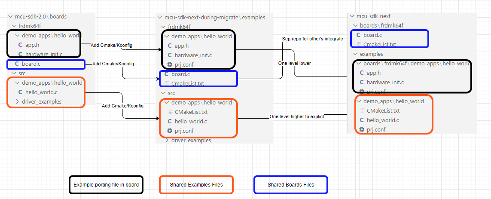

## Overview

### Existing Folder Layout in SDK 2.0

- Common examples files are located in `boards/src`
- Board shared files are located in boards/<board>/*.*
- Example porting files in a boards are located in boards/<boards>/demo_apps/hello_world/*.*

### Target Folder layout

- There are 2 top level folders, `boards` and `examples`
- `boards` folder is for board shared files such as board.c/board.h. Keep these files in one folder is easier for github project to integrate board layer without affording huging size
- `examples` folder is for examples shared source code as well as the board porting parts such as app.h/hardware_init.c
    - a child `boards` folder to keep with the board porting codes for examples
    - `category_example` folders are for common files of these examples such as demo_apps

### Migration consideration

- Before Auguest 1st, reuse the existing mcu-sdk-examples repository and checkout into the mcu-sdk-3.0 patch as `examples`
- Developer move the middleware examples from middleware specific repositories into this repository if applicable
- Developer add the CMake/Kconfig files for these examples and verify the functionalities
- After August 1st, SDK team do a global change to adjust the hierachy to the target folder layout
    - Move the boards shared file such as board.c to a standalone boards repository such as mcu-sdk-boards
- For the future development, use the new folder layout

