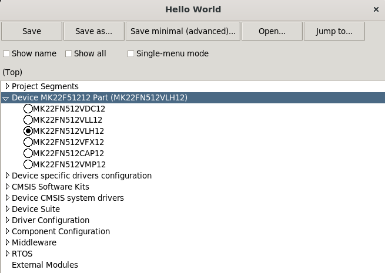

# Soc Arch, Device, Board and Shield Definition

## Soc Arch

MCUXpresso SDK supports all mainstream soc architectures like ARM, RISCV, DSP, etc. The soc architecture specific data are recorded in `mcuxsdk/arch/<arch>` folder.

Here is the hierarchy of arch folder:

```yaml
arch:
  arm:
    CMSIS: CMSIS headers
    configuration: Commonly shared build configuration data
    cortexm: Core settings
    target: Commonly shared build targets data like debug and release
  dsp56800:
  riscv:
  xtensa:
```

## Board

Board data stays in `examples/_boards` folder. Here is a hierarchy demonstrate with single core device board frdmk22f and multicore device board evkbmimxrt1170:

```yaml
_boards:
  frdmk22f: # A single core device board
    board.c: Board common configuration
    board.h:
    clock_config.c: clock configuraion
    clock_config.h:
    CMakeLists.txt: Board specific contents including components and configuration
    Kconfig: Board Kconfig, mainly specify board specific component and project segment dependency
    Kconfig.defconfig: Board specific components selection and configuration for invisible Kconfig symbols
    prj.conf: Board specific components selection and configuration
    board.yml: Board hardware data like on flash memory, optional
    example.yml: The supported toolchains and build configuration targets
    IDE.yml: IDE flash and debug related settings for GUI and standalone project generation
    variable.cmake: Board variables
    board_runner.cmake: Board debug settings
    demo_apps:
      prj.conf: components selection and configuration by all demo_apps, optional  
      hello_world:
        reconfig.cmake: Board example reconfig, mainly replace, remove some default board settings
        prj.conf: Board example specific component selection and configuration
      reconfig.cmake: Board example category reconfig, mainly replace, remove some default settings
      prj.conf: Board example category specific component selection and configuration
    rtos_examples: # like above demo_apps
      freertos_hello:
        reconfig.cmake:
        prj.conf:
      reconfig.cmake:
      prj.conf:
  evkbmimxrt1170: # A multicore device board
    board.c: Board common configuration
    board.h:
    clock_config.c: clock configuraion
    clock_config.h:
    dcd.c: device configuration data
    dcd.h:
    display_support.c: display configuration
    display_support.h:
    cm4: # Core specific contents folder
      example.yml: Board core specific example list
      IDE.yml: Board core specific IDE flash and debug related settings for GUI and standalone project generation
      Kconfig: Board core software Kconfig, mainly specify board core specific component and project segment dependency
      Kconfig.defconfig: Board core specific components selection and configuration for invisible Kconfig symbols
      prj.conf: Board core specific components selection and configuration
      setting.cmake: Board core specific data and settings
      variable.cmake: Board core specific variables
    cm7: # Just like above cm4 core
      example.yml:
      IDE.yml:
      Kconfig:
      Kconfig.defconfig:
      prj.conf: 
      setting.cmake:
      variable.cmake:
    CMakeLists.txt: Board specific contents like components and settings
    Kconfig: Board software Kconfig, mainly specify board specific component and project segment dependency
    Kconfig.defconfig: Board specific components selection and configuration for invisible Kconfig symbols
    prj.conf: Board specific components selection and configuration
    board.yml: Board hardware data like on flash memory, optional  
    variable.cmake: Board variables
    board_runner.cmake: Board debug settings
    demo_apps:
      prj.conf: components selection and configuration by all demo_apps, optional
      reconfig.cmake:  Board example category reconfig, mainly replace, remove some default board settings
      hello_world:
        cm4:
          reconfig.cmake: Board core specific example reconfig, mainly replace, remove some default board settings
          prj.conf: Board core example specific components selection and configuration
        cm7:
          reconfig.cmake:
          prj.conf:
        reconfig.cmake: Board example category reconfig, mainly replace, remove some default board settings
        prj.conf: Board example category specific component selection and configuration
```

The board level supported toolchains and build configuration targets shall be recorded in the example.yml. A typical board example.yml is like

```yaml
board.toolchains:
- +armgcc@debug
- +armgcc@release
- +iar@debug
- +iar@release
- +mdk@debug
- +mdk@release
```

All examples under the board share the toolchains and targets in the board example.yml.

## Shield

Shield is an addon which is attached to a board to extend its features and functionalities. All shields folder are put under its mother board folder. The structure is like

```yaml
_boards:
  <board>:
    shields:
      <shield>:
        <example category>:
        CMakeLists.txt:
        Kconfig:
        prj.conf:
      <other_shield>:
        <example category>:
        CMakeLists.txt:
        Kconfig:
        prj.conf:
```

The shield shares the board example.yml for toolchains and targets support. The shield CMakelists.txt shall be added into the board CMakeLists.txt with mcux_add_cmakelists and the shield Kconfig shall be `rsource` in the board Kconfig.

## Device

### Data

Device data stays in `devices` folder. Here is the device data hierarchy demonstrated with single core device MK22F51212 and multicore device MIMXRT1176

```yaml
devices:
  Kinetis: Device socs sery
    MK22F25612:
      Kconfig: Device Kconfig, mainly specify device specific component and project segment dependency
      Kconfig.chip: Device hardware Kconfig related to device and core
      Kconfig.defconfig: Device specific components selection and configuration for invisible Kconfig symbols
      CMakeLists.txt: Device specific contents like components and settings, usually, just load mainset cmakelist
      driver:
        CMakeLists.txt: Device specific drivers
        Kconfig: Device specific drivers Kconfig
      prj.conf: Device specific components selection and configuration for visible Kconfig symbols
    MK22F51212:
      Kconfig: Device software Kconfig, mainly specify device specific component and project segment dependency
      Kconfig.chip: Device hardware Kconfig related to device and core
      Kconfig.defconfig: Device specific components selection and configuration for invisible Kconfig symbols
      CMakeLists.txt: Device specific contents like components and settings
      driver:
        CMakeLists.txt: Device specific drivers
        Kconfig: Device specific drivers Kconfig
      prj.conf: Device specific components selection and configuration   
    prj.conf: Components selection and configuration by all Kinetis series
  RT:
    MIMXRT1175:
      cm4:
        driver:
          CMakeLists.txt: Device core specific drivers
          Kconfig: Device core specific drivers Kconfig
        Kconfig: Device core software Kconfig, mainly specify device specific component and project segment dependency
        Kconfig.chip: Device core hardware Kconfig related to device and core
        Kconfig.defconfig: Device core specific components selection and configuration for invisible Kconfig symbols
        setting.cmake: Device core specific data and settings
        variable.cmake: Device core specific variables
        prj.conf: Device core specific components selection and configuration
      cm7: # just like core cm4 
        driver:
          CMakeLists.txt:
          Kconfig:        
        Kconfig:
        Kconfig.chip:
        Kconfig.defconfig:
        setting.cmake:
        variable.cmake:
        prj.conf:
      CMakeLists.txt: Device specific contents like components and settings, usually, just load mainset cmakelist
      driver:
        CMakeLists.txt: Device specific drivers
        Kconfig: Device specific drivers Kconfig
      Kconfig: Device 
      Kconfig.chip: Device software Kconfig, mainly specify board specific component and project segment dependency
      Kconfig.defconfig: Device specific components selection and configuration for invisible Kconfig symbols
      prj.conf: Device specific components selection and configuration
    MIMXRT1176:
      cm4:
        driver:
          CMakeLists.txt: Device core specific drivers
          Kconfig: Device specific drivers Kconfig        
        Kconfig: Device core software Kconfig, mainly specify board specific component and project segment dependency
        Kconfig.chip: Device core hardware Kconfig related to device and core
        Kconfig.defconfig: Device core specific components selection and configuration for invisible Kconfig symbols
        setting.cmake: Device core specific data and settings
        variable.cmake: Device core specific variables
        prj.conf: Device core specific components selection and configuration
      cm7: # just like core cm4 
        driver:
          CMakeLists.txt:
          Kconfig:       
        Kconfig:
        Kconfig.chip:
        Kconfig.defconfig:
        setting.cmake:
        variable.cmake:
        prj.conf:
      CMakeLists.txt: Device specific contents like components and settings
      driver:
        CMakeLists.txt: Device specific drivers
        Kconfig: Device specific drivers Kconfig      
      Kconfig: Device 
      Kconfig.chip: Device software Kconfig, mainly specify board specific component and project segment dependency
      Kconfig.defconfig: Device specific components selection and configuration for invisible Kconfig symbols
      prj.conf: Device specific components selection and configuration
    prj.conf: Components selection and configuration by all RT series
  prj.conf: Components selection and configuration by all devices
```

### Switch a Device For a Board Example Build

The device dedicated startup, linker, system, feature files are recorded in cmake files with variables defined in the device Kconfig.chip. Here is the typical device_header.cmake for system and startup:

```cmake
# device spcific drivers for single core device
if(CONFIG_MCUX_COMPONENT_device.CMSIS)

    mcux_add_source(BASE_PATH ${SdkRootDirPath}/${device_root}/${soc_portfolio}/${soc_series}/${device} SOURCES fsl_device_registers.h
                    "${CONFIG_MCUX_HW_DEVICE_CORE}.h" "${CONFIG_MCUX_HW_DEVICE_CORE}_features.h" "${CONFIG_MCUX_HW_DEVICE_CORE}_COMMON.h" "../${soc_periph}/*.h")

    mcux_add_include(BASE_PATH ${SdkRootDirPath}/${device_root}/${soc_portfolio}/${soc_series}/${device} INCLUDES .)
    mcux_add_include(BASE_PATH ${SdkRootDirPath}/${device_root}/${soc_portfolio}/${soc_series}/${soc_periph} INCLUDES .)

endif()

if(CONFIG_MCUX_COMPONENT_device.system)
    mcux_add_source(BASE_PATH ${SdkRootDirPath}/${device_root}/${soc_portfolio}/${soc_series}/${device} SOURCES system_${CONFIG_MCUX_HW_DEVICE_CORE}.c
                    system_${CONFIG_MCUX_HW_DEVICE_CORE}.h)

    mcux_add_include(BASE_PATH ${SdkRootDirPath}/${device_root}/${soc_portfolio}/${soc_series}/${device} INCLUDES .)

endif()

if(CONFIG_MCUX_COMPONENT_device.startup)

    mcux_add_source(
        BASE_PATH
        ${SdkRootDirPath}/${device_root}/${soc_portfolio}/${soc_series}/${device}
        SOURCES
        iar/startup_${CONFIG_MCUX_HW_DEVICE_CORE}.s
        TOOLCHAINS
        iar
        CONFIG
        true)

    mcux_add_source(
        BASE_PATH
        ${SdkRootDirPath}/${device_root}/${soc_portfolio}/${soc_series}/${device}
        SOURCES
        gcc/startup_${CONFIG_MCUX_HW_DEVICE_CORE}.S
        TOOLCHAINS
        armgcc
        CONFIG
        true)

    mcux_add_source(
        BASE_PATH
        ${SdkRootDirPath}/${device_root}/${soc_portfolio}/${soc_series}/${device}
        SOURCES
        arm/startup_${CONFIG_MCUX_HW_DEVICE_CORE}.S
        TOOLCHAINS
        mdk
        CONFIG
        true)

endif()
```

Here is the Kconfig.chip for MK22F51212:

```
config MCUX_HW_CORE
    string
    default "cm4f"

config MCUX_HW_CORE_CM4F
    bool
    default y

config MCUX_HW_CORE_ID
    string
    default "core0"

config MCUX_HW_CORE_ID_CORE0
    bool
    default y

config MCUX_HW_DEVICE_CORE
    string
    default "MK22F51212"

config MCUX_HW_FPU
    string
    default "SP_FPU"

config MCUX_HW_FPU_TYPE
    string
    default "fpv4_sp"

config MCUX_HW_FPV4_SP
    bool
    default y

config MCUX_HW_INT_PRIO_BITS
    int
    default 4

config MCUX_HW_SOC_SERIES_KINETIS
    bool
    default y

config MCUX_HW_SOC_SINGLECORE_DEVICE
    bool
    default y

# device related

config MCUX_HW_DEVICE_ID_MK22FN512xxx12
    bool

choice MCUX_HW_DEVICE_PART_MK22F51212
    prompt "Device MK22F51212 Part"
    config MCUX_HW_DEVICE_PART_MK22FN512VDC12
    bool "MK22FN512VDC12"
    select MCUX_HW_DEVICE_ID_MK22FN512xxx12
    config MCUX_HW_DEVICE_PART_MK22FN512VLL12
    bool "MK22FN512VLL12"
    select MCUX_HW_DEVICE_ID_MK22FN512xxx12
    config MCUX_HW_DEVICE_PART_MK22FN512VLH12
    bool "MK22FN512VLH12"
    select MCUX_HW_DEVICE_ID_MK22FN512xxx12
    config MCUX_HW_DEVICE_PART_MK22FN512VFX12
    bool "MK22FN512VFX12"
    select MCUX_HW_DEVICE_ID_MK22FN512xxx12
    config MCUX_HW_DEVICE_PART_MK22FN512CAP12
    bool "MK22FN512CAP12"
    select MCUX_HW_DEVICE_ID_MK22FN512xxx12
    config MCUX_HW_DEVICE_PART_MK22FN512VMP12
    bool "MK22FN512VMP12"
    select MCUX_HW_DEVICE_ID_MK22FN512xxx12
endchoice

config MCUX_HW_DEVICE_ID
    string
    default "MK22FN512xxx12" if MCUX_HW_DEVICE_ID_MK22FN512xxx12

config MCUX_HW_DEVICE_PART
    string
    default "MK22FN512VDC12" if MCUX_HW_DEVICE_PART_MK22FN512VDC12
    default "MK22FN512VLL12" if MCUX_HW_DEVICE_PART_MK22FN512VLL12
    default "MK22FN512VLH12" if MCUX_HW_DEVICE_PART_MK22FN512VLH12
    default "MK22FN512VFX12" if MCUX_HW_DEVICE_PART_MK22FN512VFX12
    default "MK22FN512CAP12" if MCUX_HW_DEVICE_PART_MK22FN512CAP12
    default "MK22FN512VMP12" if MCUX_HW_DEVICE_PART_MK22FN512VMP12

# For chipmodel generated files
config MCUX_TOOLCHAIN_LINKER_DEVICE_PREFIX
    string
    default "MK22FN512xxx12" if MCUX_HW_DEVICE_ID_MK22FN512xxx12

config MCUX_TOOLCHAIN_MCUX_STARTUP
    string
    default "mk22f51212"

# Toolchain related

config MCUX_TOOLCHAIN_IAR_CPU_IDENTIFIER
    string
    default "MK22FN512xxx12" if MCUX_HW_DEVICE_ID_MK22FN512xxx12

config MCUX_TOOLCHAIN_MDK_CPU_IDENTIFIER
    string
    default "MK22FN512VDC12" if MCUX_HW_DEVICE_PART_MK22FN512VDC12
    default "MK22FN512VLL12" if MCUX_HW_DEVICE_PART_MK22FN512VLL12
    default "MK22FN512VLH12" if MCUX_HW_DEVICE_PART_MK22FN512VLH12
    default "MK22FN512VFX12" if MCUX_HW_DEVICE_PART_MK22FN512VFX12
    default "MK22FN512CAP12" if MCUX_HW_DEVICE_PART_MK22FN512CAP12
    default "MK22FN512VMP12" if MCUX_HW_DEVICE_PART_MK22FN512VMP12

config MCUX_TOOLCHAIN_JLINK_CPU_IDENTIFIER
    string
    default "MK22FN512xxx12"
```

In a build, when the device is set down, then the corresponding device cmake and Kconfig will be loaded, so that device dedicated linker, startup, system, feature files will get the correct variable name and involved into build.

So how a device is chosen for a board build?

For a typical board example build without designating the device:

```bash
west build -b frdmk22f examples/demo_apps/hello_world -p
```

The target device is set through the device in the board variable.cmake:

```cmake
if (NOT DEFINED device)
    mcux_set_variable(device MK22F51212) # default device is set in the board.cmake
endif()

include(${SdkRootDirPath}/devices/Kinetis/K/${device}/variable.cmake)
```

The default device is usually the main set of the device family. If you want to or need to try subset device, you can use `--device` argument, like 

```bash
west build -b frdmk22f examples/demo_apps/hello_world --device MK22F12810
```

Then the MK22F12810 dedicated startup, linker, system and feature files will be used for this build.

### Switch a Device Part For a Board Example Build

When the device is set down through cmake, you can use Kconfig to switch device part.

With the following cmd, you can start the Kconfig GUI:

```bash
west build -b frdmk22f examples/demo_apps/hello_world -t guiconfig -p
```



Then you can select different device part in the Kconfig, save it and `west build`.

## Assembly Point

All the above data are pieces of building blocks. For any build process, all data shall be loaded for selection and configuration. The assembly point is the start entry from where all cmakes and Kconfigs can be loaded.

The assembly point for all cmakes is the root CMakeLists.txt. It looks like

```cmake
# Load device CMakeLists.txt
mcux_add_cmakelists(${SdkRootDirPath}/devices/${soc_portfolio}/${soc_series}/${device})

# Load board CMakeLists.txt
mcux_add_cmakelists(${SdkRootDirPath}/examples/)

# Load all drivers
mcux_load_all_cmakelists_in_directory(${SdkRootDirPath}/drivers)

# all components
mcux_add_cmakelists(${SdkRootDirPath}/components)

# middlewares
mcux_add_cmakelists(${SdkRootDirPath}/rtos/freertos/backoffalgorithm OPTIONAL)
mcux_add_cmakelists(${SdkRootDirPath}/rtos/freertos/corehttp OPTIONAL)
mcux_add_cmakelists(${SdkRootDirPath}/rtos/freertos/corejson OPTIONAL)
mcux_add_cmakelists(${SdkRootDirPath}/rtos/freertos/coremqtt OPTIONAL)
mcux_add_cmakelists(${SdkRootDirPath}/rtos/freertos/coremqtt-agent OPTIONAL)
mcux_add_cmakelists(${SdkRootDirPath}/rtos/freertos/corepkcs11 OPTIONAL)
mcux_add_cmakelists(${SdkRootDirPath}/rtos/freertos/freertos-kernel OPTIONAL)
mcux_add_cmakelists(${SdkRootDirPath}/middleware/usb OPTIONAL)
mcux_add_cmakelists(${SdkRootDirPath}/middleware/fatfs OPTIONAL)
mcux_add_cmakelists(${SdkRootDirPath}/middleware/littlefs OPTIONAL)
# ......
```

The assembly point for all Kconfig is the root Kconfg.mcuxpresso:

```bash
# board
rsource "examples/Kconfig"

# device
rsource "devices/Kconfig"

# Driver config
menu "Driver Configuration"
    rsource "drivers/Kconfig"
    osource "rtos/freertos/freertos-drivers/Kconfig"
endmenu

# Component config
rsource "components/Kconfig"

# middleware config
menu "Middleware"
    osource "middleware/wifi_nxp/Kconfig"
    osource "middleware/mbedtls/Kconfig"
    osource "middleware/usb/Kconfig"
    osource "middleware/fatfs/Kconfig"
    osource "middleware/littlefs/Kconfig"
    osource "middleware/multicore/Kconfig"
    ......
endmenu

# RTOS config
menu "RTOS"
menu "FreeRTOS"
    osource "rtos/freertos/freertos-kernel/Kconfig"
    osource "rtos/freertos/backoffalgorithm/Kconfig"
    ......
endmenu
endmenu

menu "External Modules"

osource "$(KCONFIG_BINARY_DIR)/Kconfig.modules"

endmenu
```

For any component, its cmake `include` and Kconfig `rsource` are generally aligned which means they shall stay together with each other.
