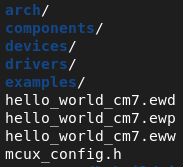

# Example Development

## Overview

In addition to the sources, one example contains CMakeLists.txt, Kconfig, prj.conf and example.yml.

```
hello_world
    ├── hello_world.c
    ├── CMakeLists.txt
    ├── Kconfig
    ├── prj.conf
    ├── example.yml
```

## CMakeLists.txt

CMakeLists.txt defines the sources, includes and static configurations.

Based on the cmake built-in macro `project`, we customize the `project` to provide the following additional arguments:

| Argument Name           | Argument Type | Explanation                              |
| ----------------------- | ------------- | ---------------------------------------- |
| PROJECT_BOARD_PORT_PATH | Single        | Path for board porting files and data.<br />Only applied for examples with board-specific configuration. |
| PROJECT_TYPE            | Single        | Specify the project type, can be `EXECUTABLE` or `LIBRARY` or `LIBRARY_OBJECT`.<br />The default is `EXECUTABLE`. |
| CUSTOM_PRJ_CONF_PATH    | Multiple      | Specify customized prj.conf search paths. |

Here is the hello_world CMakeLists.txt:

```cmake
cmake_minimum_required(VERSION 3.30.0)

include(${SdkRootDirPath}/cmake/extension/mcux.cmake)

# Specify the project
project(hello_world LANGUAGES C CXX ASM PROJECT_BOARD_PORT_PATH examples/_boards/${board}/demo_apps/hello_world)

# Include device, board, drivers, components, middlewares, RTOS
include(${SdkRootDirPath}/CMakeLists.txt)

mcux_add_source(
    SOURCES hello_world.c
)
RTOSRTOS
mcux_add_include(
    INCLUDES .
)

# convert binary to .bin. 
mcux_convert_binary(BINARY ${APPLICATION_BINARY_DIR}/${MCUX_SDK_PROJECT_NAME}.bin)
```

## Kconfig

Kconfig defines the dynamic configurations.

It is not required to always provide example specific Kconfig. If your example has specific Kconfig, then please follow the pattern to add it:

```
rsource "../../../Kconfig.mcuxpresso"

mainmenu "Hello world Example Run Time Configuration"

config HELLO_WORLD_EXAMPLE_MACRO
    bool "Hello world example macro"
    default y
    help
        "Hello world example macro"
```

1. `rsource "../../../Kconfig.mcuxpresso"` must be added to load all device, board and other components Kconfigs.
2. Set `mainmenu` to give the GUI title
3. Set the example specific configurations

> The Kconfig process will take example specific Kconfig as entry point with priority. If not provided, then it will take the mcuxsdk/Kconfig.mcuxpresso instead.

## prj.conf

prj.conf here specifies the example specific configuration values for Kconfig symbols. It will be merged together with other prj.conf values from device, board and shield to produce the final configurations.

See [prj.conf](../build_system/Configuration_System.md#prj-conf) for more details.

## example.yml

example.yml contains data specifying example category, description, supported devices, boards and shields, etc. It is mainly for tool and CI usage.

### Overview

```yaml
# yaml-language-server: $schema=../../../../scripts/data_schema/example_description_schema.json
hello_world:
  section-type: application
  contents:
    meta_path: examples/demo_apps/hello_world
    project-root-path: boards/${board}/demo_apps/hello_world/${multicore_foldername}
    document:
      name: hello_world${core_id_suffix_name}
      category: demo_apps
      brief: The HelloWorld demo prints the "Hello World" string to the terminal using
        the SDK UART drivers and repeat what user input. The purpose of this demo
        is to show how to use the UART, and to provide a simple project for debugging
        and further development.
      example_readme:
      - examples/demo_apps/hello_world/readme.md
      - examples/_boards/${board}/demo_apps/hello_world/example_board_readme.md
      - examples/_boards/${board}/examples_shared_readme.md
  boards:
    evk9mimx8ulp@cm33: []
    evkbimxrt1050:
    - +armgcc@flexspi_nor_sdram_debug
    - +armgcc@flexspi_nor_sdram_release
    - +armgcc@sdram_txt_debug
    - +armgcc@sdram_txt_release
    - +iar@flexspi_nor_sdram_debug
    - +iar@flexspi_nor_sdram_release
    - +iar@ram_0x1400_debug
    - +iar@ram_0x1400_release
    - +iar@sdram_txt_debug
    - +iar@sdram_txt_release
    - +mdk@flexspi_nor_sdram_debug
    - +mdk@flexspi_nor_sdram_release
    - +mdk@ram_0x1400_debug
    - +mdk@ram_0x1400_release
    - +mdk@sdram_txt_debug
    - +mdk@sdram_txt_release
```

### Example Toolchains and Targets

The supported toolchains and build configuration targets for an example can be got in the following way:

1. Get the designated board example.yml to get the board default supported toolchains and build configuration targets from [board.toolchains](./device_board_shield_definition.md#board).

   > This is for board examples. For device examples, it should be the device example.yml. We don't have such cases public yet.
   >
2. Get the designated board from `boards` data attribute

   1. If the data attribute is empty, then the board level toolchains and build configuration targets are the example ones.
   2. If the data attribute exists, `+` to add extra toolchains and build configuration targets pairs with the board ones. `-` to reduce extra ones from board ones.

The `mcuxsdk/scripts/data_schema/example_decription_schema.json` is provided to specify detailedly the data attributes for the example.yml.

## Example Types

### Repository Examples and Freestanding Examples

In MCUXpresso SDK, based on whether supporting the hierarchical configuration for board and device porting, we can distinguish 2 types examples: repository and freestanding examples.

| Example Type | Support hierarchical configuration for board porting | CMakeLists.txt Location |
| ------------ | ---------------------------------------- | ----------------------- |
| Repository   | Yes                                      | Under mcuxsdk/examples  |
| freestanding | No                                       | No restriction.         |

#### Repository Examples

Repository example CMakelists.txt is located inside `mcuxsdk/examples/<example-category>/<example>` folder, like the hello_world CMakelists.txt is located in `mcuxsdk/examples/demo_apps/hello_world`.

```
sdk_next/
├─── .west/
│    └─── config
└─── mcuxsdk/
     ├── arch/
     ├── cmake/
     ├── examples
     │   	├── demo_apps
     │              ├── reconfig.cmake
     │              ├── prj.conf
     │  	        ├── hello_world
     │                     ├── CMakeLists.txt
     │                     ├── Kconfig
     │                     ├── prj.conf
     │                     ├── hello_world.c
     │                     ├── example.yml
```

##### Hierarchical Configuration for Board Porting

For MCUXpresso SDK officially supported boards, the board porting has been done for all board supported examples in a hierarchical way. In any repository example CMakeLists.txt `project` macro, the `PROJECT_BOARD_PORT_PATH` is provided to specify the root board porting path. All the prj.conf files inside each sub folder of `PROJECT_BOARD_PORT_PATH` will be processed during the example build, they are hierarchically configuring the example in different levels.

Take evkbmimxrt1170 hello_world porting for example, in the hello_world CMakeLists.txt, we have set `PROJECT_BOARD_PORT_PATH` as `examples/_boards/${board}/demo_apps/hello_world` as the following:

```cmake
project(hello_world LANGUAGES C CXX ASM PROJECT_BOARD_PORT_PATH examples/_boards/${board}/demo_apps/hello_world)
```

So following prj.conf files are taken into examples to do different level configurations.

| prj.conf                                 | Application scope of configuration       |
| ---------------------------------------- | ---------------------------------------- |
| examples/prj.conf                        | Apply for all examples                   |
| examples/\_boards/prj.conf               | Apply for all NXP official boards examples |
| examples/\_boards/evkbmimxrt1170/prj.conf | Apply for all evkbmimxrt1170 examples    |
| examples/\_boards/evkbmimxrt1170/demo_apps/prj.conf | Apply for all evkbmimxrt1170 demo apps examples |
| examples/\_boards/evkbmimxrt1170/demo_apps/hello_world/prj.conf | Apply for evkbmimxrt1170 hello_world examples |

The deeper path of prj.conf, the higher priority it has.

#### Freestanding Examples

Unlike standard repository examples, freestanding examples don't support hierarchical configuration for the board or device porting, so there is no `PROJECT_BOARD_PORT_PATH` in the `project` macro and there is no location restriction for freestanding examples which means they can be placed anywhere.

- Inside mcuxsdk repo

  ```
  sdk_next/
  ├─── .west/
  │    └─── config
  └─── mcuxsdk/
       ├── arch/
       ├── cmake/
       ├── <any folder>/
       │   ├── hello_world
       │       ├── CMakeLists.txt
       │       ├── Kconfig
       │       ├── prj.conf
       │       ├── hello_world.c
       │       ├── example.yml
  ```
- Outside mcuxsdk repo

  ```
  <home>/
  ├─── sdk_next/
  │     ├─── .west/
  │     │    └─── config
  │     ├── mcuxsdk/
  │     └── ...
  │
  └─── app/
       ├── CMakeLists.txt
       ├── prj.conf
       └── src/
           └── main.c
  ```

Freestanding examples share the same build and run way as repository examples. You can still use `west build` to work.

##### Configuration

All freestanding examples still share the default configuration of the target device, board and the full scope example configuration.

The default prj.conf list is like

```
1. devices/prj.conf
2. devices/<soc_series>/prj.conf
3. devices/<soc_series>/<device>/prj.conf
4. devices/<soc_series>/<device>/<core_id>/prj.conf
5. examples/prj.conf # full scope example configuration
6. examples/_boards/prj.conf
7. examples/_boards/<board>/prj.conf
8. examples/_boards/<board>/<core_id>/prj.conf
9. <example location>/prj.conf # The example itself configuration
```

The freestanding examples may don't need the default pin mux and hardware_init/app prj.conf setting, you can disable them in `<example location>/prj.conf`:

```
CONFIG_MCUX_PRJSEG_module.board.pinmux_project_folder=n
CONFIG_MCUX_PRJSEG_module.board.pinmux_board_folder=n
CONFIG_MCUX_HAS_PRJSEG_project.use_hw_app=n
CONFIG_MCUX_HAS_PRJSEG_module.board.pinmux_sel=n
```

##### Ways to Get MCUXpresso SDK Contents

For freestanding example, there are 2 ways to get the MCUXpresso SDK contents.

###### Explicitly include root CMakeLists.txt

The CMakeLists.txt shall explicitly include mcux.cmake to get the NXP cmake extension and include the root CMakeLists.txt to get MCUXpresso SDK contents.

```cmake
include(${SdkRootDirPath}/cmake/extension/mcux.cmake)
# No PROJECT_BOARD_PORT_PATH in project
project(hello_world LANGUAGES C CXX ASM)
include(${SdkRootDirPath}/CMakeLists.txt)
```

###### Use McuxSDK CMake package

Since the MCUXpresso SDK can be exported to be a standard CMake package, so you can directly use find_package(McuxSDK) way to get MCUXpresso SDK contents:

```cmake
cmake_minimum_required(VERSION 3.30.0)
find_package(McuxSDK 24.12.00 EXACT REQUIRED)
project(hello_world LANGUAGES C CXX ASM)
```

Please refer [McuxSDK CMake Package](./integration.md#mcuxsdk-cmake-package) for details.

#### Standalone Examples

The build system provides a feature to collect and copy all the components and example self configurations and sources into an individual folder so that the example can build and run just with the stuff in the folder without depending on the mcuxsdk repository.

With this feature, it could be very convenient to zip and share examples between developers.

To build the standalone examples, an individual build system is provided in the location folder.

- For toolchains with GUI tool support like IAR/MDK/Codewarrior/Xtensa, the example files like .ewp file for IAR, .uvprojx for MDK, will be generated to use. You can directly use corresponding IDE to work.
- For toolchain without GUI tool support like Armgcc, all the examples files and configurations will be flattened into a complete CMakeLists.txt. Build target specific shell and windows cmd batch will be provided to do the build.

  > There is no Kconfig file in the standalone folder, so there is no Kconfig GUI feature in the standalone example.
  >

The standalone example can be generated with west command line parameters `-t standalone_project` like:

```bash
west build -b evkbmimxrt1170 ./examples/demo_apps/hello_world -Dcore_id=cm7 -p always --toolchain iar -t standalone_project
```

You can find IAR project is generated in build folder with all the sources.



**The standalone example feature supports repository examples and freestanding examples using the explicitly include root CMakeLists.txt. Freestanding examples using McuxSDK CMake package do not have standalone example feature.**

If your example already has generated build artifacts, you can directly type `west build -t standalone_project` to generate the standalone example.

### Convert a Repository Example to a Freestanding Example

If you find one repository example functions are similar to your example and want to copy it from SDK repository into your own workspace as a freestanding example to start the development, here are the steps with evkbmimxrt1170 hello_world as an example:

1. Copy hello_world specific sources, CMakelists.txt and Kconfig into your workspace folder: `mcuxsdk/examples/demo_apps/hello_world/*` =>  `<new workspace>/hello_world/*`
2. Update CMakeLists.txt: adjust paths and remove the `PROJECT_BOARD_PORT_PATH` from `project` macro, but since many [project segment](#project-segment) data uses the `project_board_port_path` which is inherited from the `project` macro  `PROJECT_BOARD_PORT_PATH`, extra definition for `project_board_port_path` shall be provided.

   - If using explicitly include SDK root CMakeList.txt way, then the CMakeLists.txt is

     ```cmake
     cmake_minimum_required(VERSION 3.30.0)
     include(${SdkRootDirPath}/cmake/extension/mcux.cmake)
     # No PROJECT_BOARD_PORT_PATH in project
     project(hello_world LANGUAGES C CXX ASM)
     # define the project_board_port_path
     mcux_set_variable(project_board_port_path examples/_boards/${board}/multicore_examples/hello_world)
     include(${SdkRootDirPath}/CMakeLists.txt)
     mcux_add_source(
         SOURCES hello_world.c
             pin_mux.c
             hardware_init.c
     )
     mcux_add_include(
         INCLUDES .
     )
     include(${SdkRootDirPath}/examples/_boards/${board}/demo_apps/hello_world/reconfig.cmake OPTIONAL)
     mcux_convert_binary(BINARY ${APPLICATION_BINARY_DIR}/${MCUX_SDK_PROJECT_NAME}.bin)
     ```

     For `include(${SdkRootDirPath}/examples/_boards/${board}/demo_apps/hello_world/reconfig.cmake OPTIONAL)`, it is board specific reconfiguration cmake, you can move it to your workspace or keep it in the mcuxsdk. If you move it to your workspace, please also move the related sources inside it and update the path accordingly
   - If using the McuxSDK CMake package way, then the CMakeLists.txt is

     ```cmake
      cmake_minimum_required(VERSION 3.30.0)
      find_package(McuxSDK 3.0.0 EXACT REQUIRED)
      project(hello_world LANGUAGES C CXX ASM)
      # define the project_board_port_path
      mcux_set_variable(project_board_port_path examples/_boards/${board}/multicore_examples/hello_world)
      mcux_add_source(
       SOURCES
         hello_world.c
         pin_mux.c
         pin_mux.h
         hardware_init.c
         app.h
      )
      mcux_add_include(
       INCLUDES
         .
      )
      include(${SdkRootDirPath}/examples/${board}/demo_apps/hello_world/reconfig.cmake OPTIONAL)
      mcux_convert_binary(BINARY ${APPLICATION_BINARY_DIR}/${MCUX_SDK_PROJECT_NAME}.bin)
     ```
3. Update Kconfig

   If your example has its specific Kconfig, then adjust the `source` path and `project_board_port_path`

   The `project_board_port_path` can be updated with true value like `examples/_boards/evkbmimxrt1170/demo_apps/hello_world`. Here is the updated Kconfig:

   ```
   # It is optional to provide example specific Kconfig.
   mainmenu "Hello World"

   # Need to refer the root Kconfig.mcuxpreso to get all Kconfig data
   source "${SdkRootDirPath}/Kconfig.mcuxpresso"

   # Board example specific Kconfig can be linked in this way if needed
   osource "${SdkRootDirPath}/examples/_boards/evkbmimxrt1170/demo_apps/hello_world/Kconfig"

   ```

   For `${SdkRootDirPath}/examples/_boards/evkbmimxrt1170/demo_apps/hello_world/Kconfig`, you can move it to your workspace or keep it there in mcuxsdk folder.
4. Collect extra prj.conf

   For a freestanding example, no matter using explicitly include root CMakeLists.txt or using McuxSDK CMake package way, the default configuration for device, board and general-Mcuxpresso-SDK-example are anyway involved. Here is the prj.conf table

   ```
   1. devices/prj.conf
   2. devices/<soc_series>/prj.conf
   3. devices/<soc_series>/<device>/prj.conf
   4. devices/<soc_series>/<device>/<core_id>/prj.conf
   5. examples/prj.conf
   6. examples/_boards/prj.conf
   7. examples/_boards/<board>/prj.conf
   8. examples/_boards/<board>/<core_id>/prj.conf
   ###### The example itself configuration
   9. <example location>/prj.conf
   ```

   For a repository example, it has extra category example configurations and board porting configurations in the corresponding prj.conf:

   ```
   1. devices/prj.conf
   2. devices/<soc_series>/prj.conf
   3. devices/<soc_series>/<device>/prj.conf
   4. devices/<soc_series>/<device>/<core_id>/prj.conf
   5. examples/prj.conf
   6. examples/_boards/prj.conf
   7. examples/_boards/<board>/prj.conf
   8. examples/_boards/<board>/<core_id>/prj.conf
   ###### category example configurations and  board porting configurations
   9. examples/<example_category>/prj.conf
   10. examples/<example_category>/<example>/prj.conf
   11. examples/_boards/<board>/<example_category>/prj.conf
   12. examples/_boards/<board>/<example_category>/<example>/prj.conf
   13. examples/_boards/<board>/<example_category>/<example>/<core_id>/prj.conf

   ```

   **When converting a repository example to freestanding example, the 9-13 prj.conf of repository example shall be collected and merged into the freestanding 9th prj.conf.**
5. Run the example

   There 2 ways to run the example:

   1. Using west:

      ```bash
      west build -b evkbmimxrt1170 <new workspace>/hello_world -Dcore_id=cm7 --toolchain=iar
      ```

      Please run west cmd inside mcuxsdk workspace. If you want to run west from your workspace, you can run `mcuxsdk/mcux-env.cmd` or `mcuxsdk/mcux-env.sh` to set up the environment variable otherwise west cannot find mcuxsdk.
   2. Using native cmake cmd in your workspace:

      ```bash
      cmake -S <new workspace>/hello_world -B build -G Ninja -Dboard=evkbmimxrt1170 -Dcore_id=cm7 -DCMAKE_BUILD_TYPE=debug -DCONFIG_TOOLCHAIN=iar -DSdkRootDirPath=path/to/mcuxsdk-root
      ```

      The `-S` specifies the example folder containing CMakeLists.txt.

      The `-Dboard=evkbmimxrt1170` specifies the target board, equal with `-b evkbmimxrt1170` in west cmd.

      The `-Dcore_id=cm7` specifies the core id of multicore device.

      The `-B build` specifies the binary output directory is `build`. In west cmd, `build` folder is the default binary output folder.

      The `-G Ninja` specifies the cmake generator is Ninja. In west cmd, Ninja is the default selected generator.

      The `-DCMAKE_BUILD_TYPE=debug` specifies the build target is `debug`. In west cmd, `debug` is the default build target.

      The `-DCONFIG_TOOLCHAIN=iar` specifies the toolchain is iar, equal with `--toolchain=iar` in west cmd.

      The `-DSdkRootDirPath=path/to/mcuxsdk-root` specifies the SDK root location. In west cmd, build system will automatically get the SDK root.

      After running the CMake command, you can cd into `build` and run `ninja`.

## Component Configuration in Project Construction and Build

There are following ways to do component configuration in the project construction and build

1. Use Kconfig to do configuration for the component set
2. Use the prepared customized configuration header file for the component set in the example root
3. Use the component default provided configuration header file

   > For a component, it must be defined in Kconfig, otherwise the component won't be involved into the build tree anyway, but it is not required that component Kconfig item must have concrete configurations. You can still put configurations like macro definitions in the header file.
   >

To make the above ways coexist in a component set, a component set(especially middleware components) shall do the following steps:

1. Prepare a `config` component to hold the default configuration file for the component set. `config` component means the component files shall be marked with `CONFIG: TRUE`, and if the config file is a header file, the include path shall use `TARGET_FILES` to identify the file that corresponds to the path.  The `config` header file has lowest priority in the build system, if any same name header file is provided in the example root, then it won't be included. This `config` component shall be selected by the core component of the component set, then it can always be selected. So if the customized configuration is not provided for that component, the project can still build with default configuration provided by `config` component.
2. Prepare a project segment in Kconfig file to hold all Kconfig configuration symbols for the component set. All the configuration symbols shall be set to be generated into a designated header file with the same name as component default configuration file.

If you want to use Kconfig to do configuration, then the project segment shall be set to `y`. The generated configuration header name shall be set in Kconfig and be the same with component default configuration header file so that it will override the component default one. The project segment can depend on the core component of the component set so that it  can involve core component of the set.
If you don't want to use Kconfig but want to directly provide a configuration header, then project segment should be set to `n`, the directly provided configuration header shall be put in the root of project.

## Create an Example

Firstly, you should make sure that the target device and board data are ready, secondly, you need to follow the above [CMakeLists.txt](#cmakelists-txt), [Kconfig](#kconfig), [prj.conf](#prj-conf) and [example.yml](#example-yml) chapters to prepare the build and configuration files, then it should be ok.

If the default board and device data and configuration cannot satisfy your needs, then you need to do customization for the certain device or board or both.

There are following ways to do the customization.

1. Reconfig CMake

   In the example CMakeLists.txt, there is such line

   ```cmake
   include(${SdkRootDirPath}/examples/_boards/${board}/demo_apps/hello_world/reconfig.cmake OPTIONAL)
   ```

   This is the board port cmake. Any board specific configurations can be added in it.
2. prj.conf

   For component selection and configuration, you can use different scope prj.conf to achieve it. Refer the priority of prj.conf in [prj.conf](../build_system/Configuration_System.md#prj-conf) chapter to set the data.

## Build The Example

Run `west build -h` to see help information for west build command.
Compared to zephyr's west build, MCUXpresso SDK build command provides following additional options for examples:

- --toolchain: specify the toolchain for this build, default armgcc.
- --config: value for CMAKE_BUILD_TYPE, default debug.

Here are some typical usage for generating a SDK example is:

```bash
# Build example
west build -b frdmk22f examples/demo_apps/hello_world
# multcore device must be specified with core_id
west build -b evkbmimxrt1170 examples/demo_apps/hello_world -Dcore_id=cm7

# Just print cmake commands, do not execute it
west build -b evkbmimxrt1170 examples/demo_apps/hello_world -Dcore_id=cm7 --dry-run

# Build iar
west build -b evkbmimxrt1170 examples/demo_apps/hello_world -Dcore_id=cm7 --toolchain iar

# Build flexspi_nor_debug target
west build -b evkbmimxrt1170 examples/demo_apps/hello_world -Dcore_id=cm7 --config flexspi_nor_debug

# Switch device
west build -b frdmk22f examples/demo_apps/hello_world --device MK22F12810
west build -b evkbmimxrt1170 examples/demo_apps/hello_world --device=MIMXRT1175 -Dcore_id=cm7 --config flexspi_nor_debug
```

For shield, please use the `--shield` to specify the shield to build, like

```bash
west build -b mimxrt700evk --shield a8974 examples examples/issdk_examples/sensors/fxls8974cf/fxls8974cf_poll -Dcore_id=cm33_core0
```

If you want to get available commands for different build config combinations supported by the example and the toolchain, you can run the command below. Please note that `@${core_id}` suffix for board is only needed for multicore devices.

```bash
  west list_project -p examples/mbedtls_examples/mbedtls_selftest -b evkbmimxrt1170@cm7 -t mdk
```

Here is the output:

```bash
INFO: [   1][west build -p always examples/mbedtls_examples/mbedtls_selftest --toolchain mdk --config debug -b evkbmimxrt1170 -Dcore_id=cm7]
INFO: [   2][west build -p always examples/mbedtls_examples/mbedtls_selftest --toolchain mdk --config flexspi_nor_debug -b evkbmimxrt1170 -Dcore_id=cm7]
INFO: [   3][west build -p always examples/mbedtls_examples/mbedtls_selftest --toolchain mdk --config flexspi_nor_release -b evkbmimxrt1170 -Dcore_id=cm7]
INFO: [   4][west build -p always examples/mbedtls_examples/mbedtls_selftest --toolchain mdk --config release -b evkbmimxrt1170 -Dcore_id=cm7]
INFO: [   5][west build -p always examples/mbedtls_examples/mbedtls_selftest --toolchain mdk --config sdram_debug -b evkbmimxrt1170 -Dcore_id=cm7]
INFO: [   6][west build -p always examples/mbedtls_examples/mbedtls_selftest --toolchain mdk --config sdram_release -b evkbmimxrt1170 -Dcore_id=cm7]
```

For multi-projects example build, you can build all projects by adding `--sysbuild` for main project . For example:

```bash
west build -b evkbmimxrt1170 --sysbuild ./examples/multicore_examples/hello_world/primary -Dcore_id=cm7 --config flexspi_nor_debug -p always
```

For more details, please refer to [System build](../build_system/Sysbuild.md#sysbuild).

## Flash and Debug The Example

### Flash

For an example that have been compiled successfully, use the command to flash the image:

```bash
west flash
```

To specify the build directory, use `--build-dir` (or `-d`).

### Debug

Here are the typical supported debugger servers:

1. [LinkServer](https://www.nxp.com/design/design-center/software/development-software/mcuxpresso-software-and-tools-/linkserver-for-microcontrollers:LINKERSERVER)
2. [JLink](https://www.segger.com/downloads/jlink/)

Please install LinkServer or JLink and add it to PATH environment variable firstly, then specify debug server with `-r`.
If you want to configure debug server, please refer to [Flash and Debug Data](#flash-and-debug-cmake-configuration-data).

Flash the hello_world example:

```bash
west flash -r linkserver
```

Start a gdb interface by following command:

```bash
west debug -r linkserver
```

> All of the above west commands can only be run in mcuxsdk west workspace. If you want to use them outside the workspace, please run `mcuxsdk/mcux-env.cmd` in Windows Command Prompt or `source mcuxsdk/mcux-env.sh` in Linux terminal to activate the commands.

### Flash and Debug CMake Configuration Data

MCUXpresso SDK supports to set up customized configuration for board flash runners. Such configuration is stored in `${SdkRootDirPath}/examples/_boards/<board>/board_runner.cmake`. It is loaded by `${SdkRootDirPath}/cmake/extension/run.cmake` which is used to get runner type and arguments.

Here is an example:

```cmake
# set runner speicfic arguments
board_runner_args(jlink "--device=${CONFIG_MCUX_TOOLCHAIN_JLINK_CPU_IDENTIFIER}")
board_runner_args(linkserver "--device=${CONFIG_MCUX_HW_DEVICE_ID}:MIMXRT1170-EVKB")
board_runner_args(linkserver "--core=${core_id}")

# load board supported runner cmake file
include(${SdkRootDirPath}/cmake/extension/runner/jlink.board.cmake)
include(${SdkRootDirPath}/cmake/extension/runner/linkserver.board.cmake)
```

In this example, `board_runner_args` is used to pass runner-specific arguments, runner cmake files are load from `${SdkRootDirPath}/cmake/extension/runner/` which indicates the supported runners.

**The first included runner cmake will be set as the default runner for both flash and debug**.

If you want to choose a different runner, you can set following variables in the board variable.cmake:

```cmake
mcux_set_variable(BOARD_FLASH_RUNNER "linkserver")
mcux_set_variable(BOARD_DEBUG_RUNNER "jlink")
```

To make the runner get correct flash address, the Kconfig option `FLASH_BASE_ADDRESS` shall be set correct value for each device core in `devices/${soc_portfolio}/${soc_series}/${device}/(${core_id})/prj.conf`:

```bash
CONFIG_FLASH_BASE_ADDRESS=0x30000400
```

If your example has different flash base address, please override the above value in your example specific prj.conf.

## Project Segment

MCUXpresso SDK is composed of hundreds of devices and boards, thousands of components and ten thousands of examples. Examples on the devices and boards have many shared data like core related settings, common build target settings,  device headers and configurations, board files, clock and pin mux. Project segment data section is an abstraction of common shared project data. It is introduced to avoid data duplication.

### CMake

Like the component, in cmake files, project segment data shall be recorded inside a `if-endif` guard. The if condition shall be with prefix `CONFIG_MCUX_PRJSEG_`, right after it is the project segment name.

Here is one project segment cmake example:

```cmake
if (CONFIG_MCUX_PRJSEG_module.board.clock)  # project segment name is module.board.clock
    # project segment data
    mcux_add_source(
        BASE_PATH ${SdkRootDirPath}
        SOURCES boards/${board}/clock_config.h
                boards/${board}/clock_config.c
    )
    mcux_add_include(
        BASE_PATH ${SdkRootDirPath}
        INCLUDES boards/${board}
    )
endif()
```

### Kconfig

In Kconfig, symbol for a project segment shall start with `MCUX_PRJSEG_` to be identical with cmake project segment name. Project segment configuration and dependency shall be recorded following the below pattern:

```bash
config MCUX_PRJSEG_module.board.clock
    bool "Use default clock files"
    imply MCUX_COMPONENT_driver.clock
    if MCUX_PRJSEG_module.board.clock
    endif
```

Unlike the component dependency, the dependency for project segment is simple, just several parallel `imply` to state that the project segment depends on some components and maybe other project segment to work. Since it is frequently occuring cases that some examples on certain boards need to modify some predefined project segment dependencies, please use `imply` instead of `select` for project segment dependencies because `select` once is set to true then cannot be deselected anymore.

### Predefined Project Segments

There are already many project segments defined in mcuxsdk, here is the frequently used project segments table.

| Location         | Functionality                            |
| ---------------- | ---------------------------------------- |
| arch             | The predefined settings and configurations of different SOC architectures |
| examples/_common | Commonly shared example board modules like board file, pinmux, clock config, etc.<br />Commonly shared example board components like flash, etc. |
