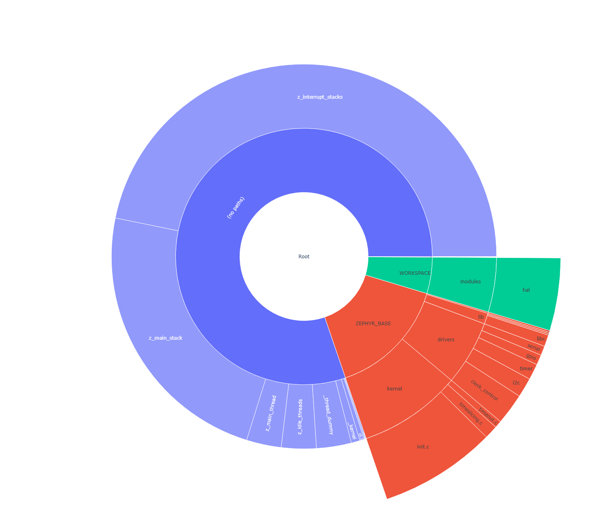
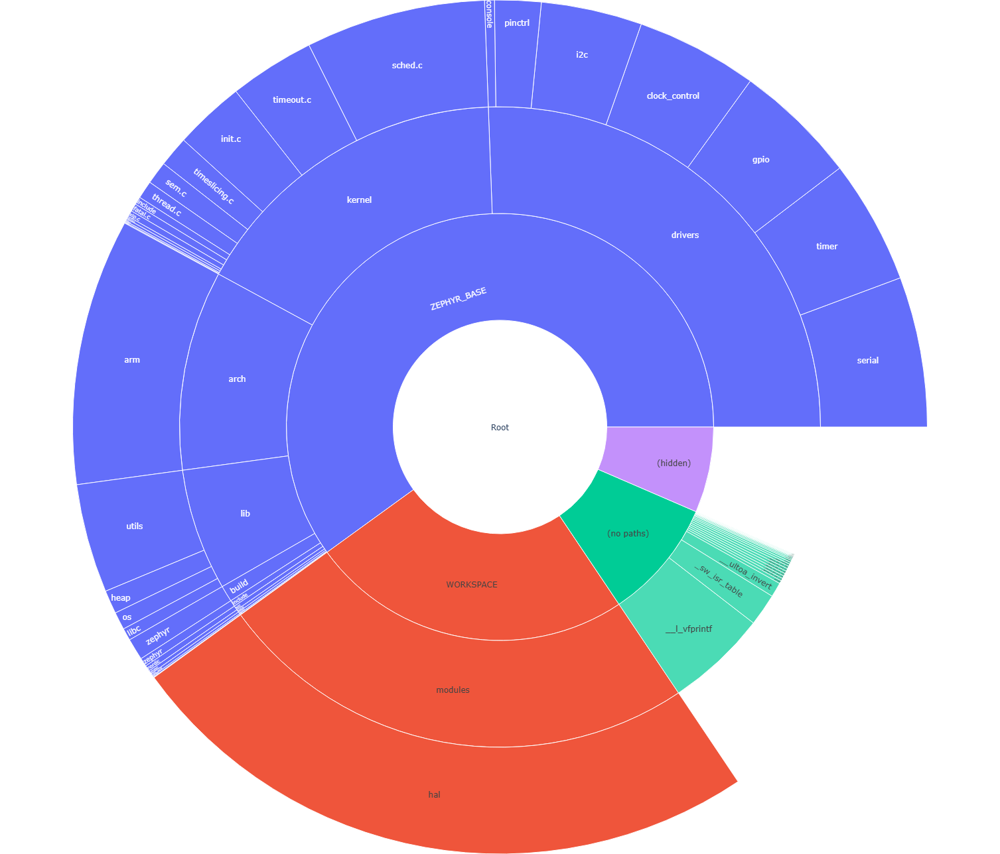

.. _useful_tools:

Useful Tools
############

.. _optimization_tools:

Optimization Tools
******************

The MCUXpresso SDK build system exposes a set of build targets to analyze
the RAM and ROM footprint of an application image and to inspect the
resulting data structures. An :ref:`HTML dashboard <dashboard>` can also
be generated for a more dynamic view of build artifacts and metrics.

All targets in this section are defined in
``cmake/extension/reports/CMakeLists.txt`` and are invoked through
``west build -t <target>`` against an existing build directory.

.. _footprint_tools:

Footprint and Memory Usage
==========================

The build system offers several targets to view and analyze RAM and ROM
usage in generated images. The tools run on the final image and give
information about size of symbols and code being used in both RAM and
ROM.

Some of the tools mentioned in this section are organizing their output
based on the physical organization of the symbols. As some symbols might
be external to the project's tree structure, or might lack metadata
needed to display them by name, the following top-level containers are
used to group such symbols:

* **(hidden)** - The RAM and ROM reports list all processing symbols
  with no matching mapped files in the Hidden category.

  This means that the file for the listed symbol was not added to the
  metadata file, was empty, or was undefined. The tool was unable to
  get the name of the function for the given symbol nor identify where
  it comes from.

* **(no paths)** - The RAM and ROM reports list all processing symbols
  with relative paths in the No paths category.

  This means that the listed symbols cannot be placed in the tree
  structure of the report at an absolute path under one specific file.
  The tool was able to get the name of the function, but it was unable
  to identify where it comes from.

  .. note::

     You can have multiple cases of the same function, and the No paths
     category will list the sum of these in one entry.

Build Target: ram_report
------------------------

List all compiled objects and their RAM usage in a tabular form with
bytes per symbol and the percentage it uses. The data is grouped based
on the file system location of the object in the tree and the file
containing the symbol.

Use the ``ram_report`` target with your build directory:

.. code-block:: bash

   west build -b <board> <application>
   west build -t ram_report

This will generate something similar to the output below:

.. code-block:: text

   Path                                                                     Size       %  Address    Section
   ==========================================================================================================
   Root                                                                     3264 100.00%  -
   ├── (hidden)                                                             3107  95.19%  -
   ├── (no paths)                                                             28   0.86%  -
   │   ├── SystemCoreClock                                                     4   0.12%  0x20000000 .data
   │   ├── s_lpuartHandle                                                     12   0.37%  0x20000084 .bss
   │   └── s_lpuartIsr                                                        12   0.37%  0x20000090 .bss
   └── SDK_BASE                                                               33   1.01%  -
       ├── components                                                         20   0.61%  -
       │   └── debug_console_lite                                             20   0.61%  -
       │       └── fsl_debug_console.c                                        20   0.61%  -
       │           └── s_debugConsole                                         20   0.61%  0x200000a4 .bss
       ├── drivers                                                             8   0.25%  -
       │   └── ostimer                                                         8   0.25%  -
       │       └── fsl_ostimer.c                                               8   0.25%  -
       │           ├── s_ostimerHandle                                         4   0.12%  0x2000009c .bss
       │           └── s_ostimerIsr                                            4   0.12%  0x200000a0 .bss
       └── examples                                                            1   0.03%  -
   ==========================================================================================================
                                                                            3264

Build Target: rom_report
------------------------

List all compiled objects and their ROM usage in a tabular form with
bytes per symbol and the percentage it uses. The data is grouped based
on the file system location of the object in the tree and the file
containing the symbol.

.. code-block:: bash

   west build -t rom_report

The output format mirrors ``ram_report`` but covers code and read-only
data sections.

Build Target: footprint
-----------------------

Convenience target that runs both ``ram_report`` and ``rom_report``
back-to-back and writes ``ram.json`` / ``rom.json`` into the build
directory.

.. code-block:: bash

   west build -t footprint

Use this when you need machine-readable JSON output (for example to
diff footprint between two builds with ``scripts/footprint/fpdiff.py``).

.. _footprint_tools_plot:

Build Targets: ram_plot / rom_plot
----------------------------------

Similar to the ``ram_report`` and ``rom_report`` build targets, these
targets generate memory usage reports in a sunburst chart as a visual
representation. A user can click on segments to navigate through the
directory structures, and hover over segments to get more details.

Running the targets will first generate the CLI report and then open a
browser window.

.. code-block:: bash

   west build -t ram_plot

And similarly for the ROM usage:

.. code-block:: bash

   west build -t rom_plot

Plot generation requires the ``plotly`` Python package:

.. code-block:: bash

   pip install plotly

Build Target: puncover
----------------------

This target uses a third-party tool called puncover which can be found
at https://github.com/HBehrens/puncover. When this target is built, it
will launch a local web server which will allow you to open a web
client and browse the files and view their ROM, RAM, and stack usage.

Before you can use this target, install the puncover Python module:

.. code-block:: bash

   pip3 install --user puncover

.. warning::

   This is a third-party tool that might or might not be working at any
   given time. Please check the GitHub issues, and report new problems
   to the project maintainer.

After you installed the Python module, use the ``puncover`` target with
your build directory:

.. code-block:: bash

   west build -t puncover

The ``puncover`` target will start a local web server on
``localhost:5000`` by default. The host IP and port the HTTP server
runs on can be changed by setting the environment variables
``PUNCOVER_HOST`` and ``PUNCOVER_PORT``.

.. _data_structure_tools:

Data Structures
===============

Build Target: pahole
--------------------

Poke-a-hole (pahole) is an object-file analysis tool to find the size
of the data structures, and the holes caused due to aligning the data
elements to the word-size of the CPU by the compiler.

Poke-a-hole (pahole) must be installed prior to using this target. It
can be obtained from
https://git.kernel.org/pub/scm/devel/pahole/pahole.git and is available
in the ``dwarves`` package on both Fedora and Ubuntu:

.. code-block:: bash

   sudo apt-get install dwarves

Alternatively, you can get it from Fedora:

.. code-block:: bash

   sudo dnf install dwarves

After you installed the package, use the ``pahole`` target with your
build directory:

.. code-block:: bash

   west build -t pahole

Pahole will generate something similar to the output below in the
console:

.. code-block:: c

   /* Used at: [...]/build/kobject_hash.c */
   /* <397> [...]/include/sys/dlist.h:36 */
   struct _dnode {
           union {
                   struct _dnode *    head;                 /*     0     4 */
                   struct _dnode *    next;                 /*     0     4 */
           };                                               /*     0     4 */
           union {
                   struct _dnode *    tail;                 /*     4     4 */
                   struct _dnode *    prev;                 /*     4     4 */
           };                                               /*     4     4 */

           /* size: 8, cachelines: 1, members: 2 */
           /* last cacheline: 8 bytes */
   };

.. _dashboard:

Dashboard
=========

An HTML dashboard can be generated that consolidates the various tool
outputs and artifacts into one simple view. In addition to a basic
summary of the build results, the following details are included:

* Full memory reports (RAM, ROM, and a combined view) in drill-down
  tree form as well as :ref:`sunburst plots <footprint_tools_plot>`
  (as per the ``footprint``, ``ram_plot``, and ``rom_plot`` build
  targets).
* Kconfig symbol values and sources, with an interactive search
  (driven by the ``.config-trace.pickle`` produced during configure).
* ELF section header listing for the application image.

Use the ``dashboard`` target with your build directory:

.. code-block:: bash

   west build -t dashboard

This will generate the following output file and open it in the default
browser:

.. code-block:: text

   build/dashboard/index.html

The dashboard is fully self-contained: every CSS, JavaScript, and font
asset is copied into ``build/dashboard/static/`` so the report can be
archived or shared without requiring network access.

See ``scripts/dashboard/README.md`` for the list of Python dependencies
and more details on the supported pages and customization.
