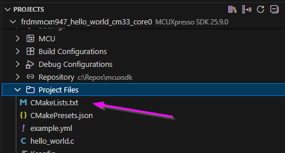
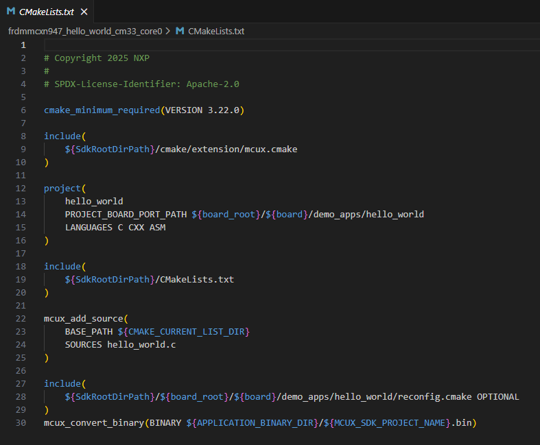
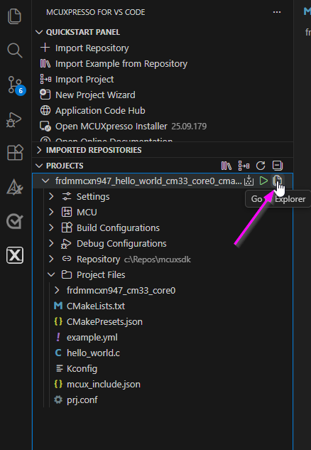
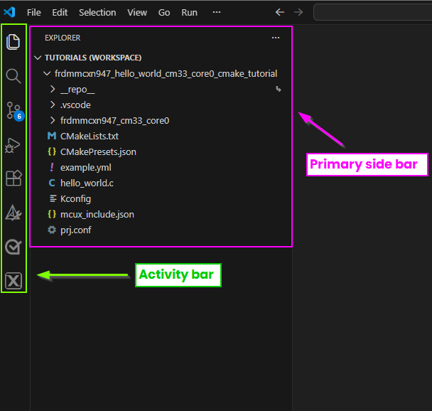
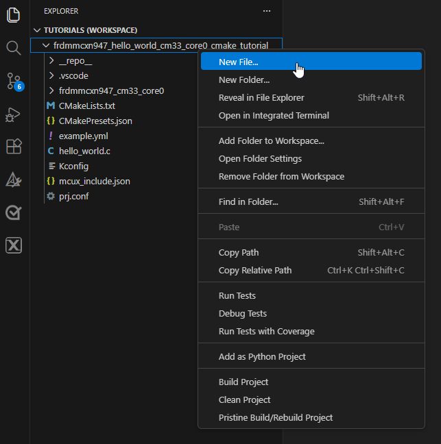
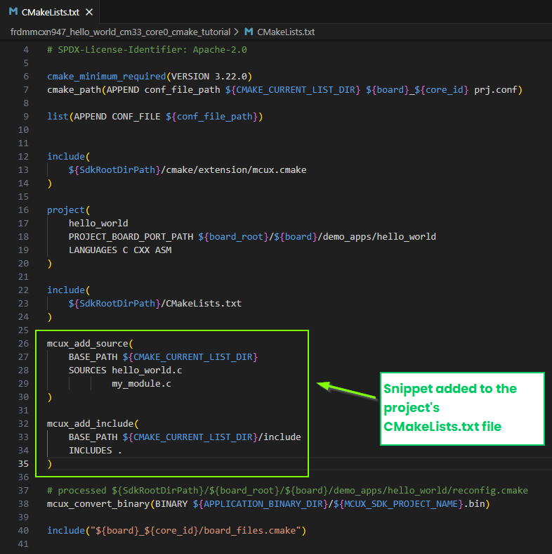
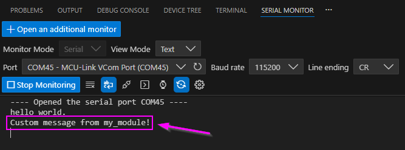

# MCUXpresso SDK Projects with NXP CMake Format
## User Guide / Walkthrough

### 1. Introduction
This section explains how to use MCUXpress Cmake extensions. How to add/remove and customize projects with NXP cmake format. This guide uses the `hello_world` demo application to demonstrate how use the cmake project format.

### 2. Prerequisites
- MCUXpresso SDK 25.09 or newer installed
- MCUXpresso SDK developer (Installed with MCUXpresso Installer)
- Basic understanding of CMake syntax

> FIXME:

### 3. Understanding NXP CMake Format
The NXP build system uses macros to simplify project configuration:
- include(mcux_config) → Loads board and SDK settings
- mcux_add_source(<file>) → Adds source files
- mcux_add_include(<path>) → Adds include directories
- mcux_add_component(<component>) → Adds SDK components (drivers, middleware)


Directory Structure Example:
boards/
  └── <board_name>/
       ├── demo_app/
       │    ├── source/
       │    │    └── main.c
       │    └── CMakeLists.txt
       └── CMakeLists.txt
> END FIXME

### 4. Import a project and examine the CMakeLists.txt file 
> Note: See [Run a demo using MCUXpresso for VS Code](run_a_demo_using_mcuxvsc.md) for project import walkthrough.
- Steps:
  - Import Hello_World for your device as a freestanding project
  - Expand the project from the **PROJECTS** view
  - Expand the **Project Files** directory
  - Open the **CMakeLists.txt** file
  
    

- In the next section we will modify the following CMakeLists.txt file to include sources added to the project.

  


### 5. Adding Source files to the project
In this step, we will turn our Hello_World project into Hello_Blinky. We can do this by adding source files explicitly using the NXP CMake extension **mcux_add_source()**. For completeness, we will create an include directory for header files and add those into the project.

- Steps:
    - Create a new source file. Easiest way to do this is from the **VS Code Explorer** view.
      - Click on the **Go To Explorer** icon on the project. This will open your projet's files in the primary side bar.  
        

      - You'll notice that your workspace now looks a bit different. Specifically, the primary side bar. This is because we have navigated into a focused view for projects in VS Code. You can later navigate back to the MCUXpresso extension by clicking on the MCUXpresso icon in the **Activity Bar**
        
        

      - From the Explorer view right-click on the project and select **New File**
          
         

      - Name the new file ***my_module.c***

        - Insert the following code snippet into ***my_module.c***
          
          ```C
          #include "my_module.h"
          #include "fsl_debug_console.h"

          void print_custom_message(void) {
              PRINTF("Custom message from my_module!\n");
          }
          ```
          > Notice that ***fsl_debug_console.h*** is referenced. This a component in the SDK that does not need to be explicitly added to the CMakeLists.txt file. For other components like middleware or drivers, see the kconfig section to learn how to integrate those from the MCUXpresso SDK.
    - Next, create an include folder to store header files.
      - Right-click on the project and select **New Folder**. Name the folder ***include***
      - Create the header **my_module.h** in this folder. 
        - Insert the following code for the header file:
          ```C
          #ifndef MY_MODULE_H_
          #define MY_MODULE_H_

          void print_custom_message(void);

          #endif /* MY_MODULE_H_ */
          ```
    - Now we can modify the CMakeLists.txt file to include these files in the build.
      - Open the project's CMakeLists.txt file and make the changes shown below.

        
      - Add the source file ***my_module.c*** to the CMakeLists.txt. Modify the **mcux_add_source** block. You can list several source files in this block, this is a list separated by whitespace. Be sure to use the keyword SOURCES. For this project, the snippet should have:
          ```
          mcux_add_source(
              BASE_PATH ${CMAKE_CURRENT_LIST_DIR}
              SOURCES hello_world.c
                      my_module.c
          )
          ```
      - Next add the **include** directory. In the CMakeLists.txt file add the following block:
          ```
          mcux_add_include(
              BASE_PATH ${CMAKE_CURRENT_LIST_DIR}/include
              INCLUDES .
          )
          ```

      - Save the changes.

      - Now, implement the functionality in the project. Open the ***hello_world.c*** file and add the make the changes as seen below.
        - Add
          ```
          #include "my_module.h"
          ```
        - Add
          ```
          /*function from my_module.c*/
          print_custom_message();
          ```
               

### 6. Build and Verify
> Note: See [Run a demo using MCUXpresso for VS Code](run_a_demo_using_mcuxvsc.md) for building and debugging projects.

Navigate back into the MCUXpresso for VS Code extension. Find the project in your **Projects** view. Build your the project and start a debug session. Open the Serial Monitor and observe the changes implemented.
  

>Note: If you are following this guide for another project that already contains build artifacts or CMake cache, then right-click on the project and select **Pristine Build/Rebuild Project**


### 7. Adding a Component from the SDK
Adding components to a project can be done with kconfig. In this section of the CMake project user guide we cover how components are exposed to CMake. Refer to the kconfig user guide for a practical example on working with kconfig.

Examples in the SDK contain the snippet:
```
include(
    ${SdkRootDirPath}/CMakeLists.txt
)
```
 This is the assembly point for all device/board, drivers, components, middlewares cmake data. That snippet makes all the components of the SDK available, but does not automatically compile every driver or middleware. The components that will actually be active in the depends on Kconfig provided by the device and board ports on a any given example in the sdk or those defined explicitly define by the user.

 To highlight the Kconfig interaction with CMake, we will add the ***blinky*** functionality into the Hello_World example in the previous steps. The GPIO driver, clocks, peripherals are all already enabled by default in the board port for Hello_world. We will keep these configurations and only reference the GPIO driver in the source code.

  - Steps:
    - Create a new source file. Name it ***hello_blinky.c***. Copy and paste the following code into this file:
      ```
      #include "fsl_gpio.h"
      #include "board.h"
      #include "clock_config.h"

      //Red LED 
      #define LED_GPIO      GPIO0
      #define LED_GPIO_PIN  10U

      void GPIO_DemoInit(void)
      {
          gpio_pin_config_t cfg = { kGPIO_DigitalOutput, 0 };
          GPIO_PinInit(LED_GPIO, LED_GPIO_PIN, &cfg);
      }

      void GPIO_DemoToggle(void)
      {
          GPIO_PortToggle(LED_GPIO, 1u << LED_GPIO_PIN);
      }
      ```
    - Create a header file in the ***include*** folder. Name the header file ***hello_blinky.h***.  Copy and paste the following code into this file:
      ```
      #ifndef HELLO_BLINKY_H_
      #define HELLO_BLINKY_H_

      void GPIO_DemoInit(void);
      void GPIO_DemoToggle(void);

      #endif /* HELLO_BLINKY_H_ */
      ```
    - Modify the main file(hello_world.c) to implement the functionality. Copy and paste the following into ***hello_world.c***:
      ```
      /*
      * Copyright (c) 2013 - 2015, Freescale Semiconductor, Inc.
      * Copyright 2016-2017, 2024 NXP
      * All rights reserved.
      *
      * SPDX-License-Identifier: BSD-3-Clause
      */

      #include "fsl_device_registers.h"
      #include "fsl_debug_console.h"
      #include "board.h"
      #include "app.h"
      #include "my_module.h"
      #include "hello_blinky.h"


      /*******************************************************************************
      * Definitions
      ******************************************************************************/

      /*******************************************************************************
      * Prototypes
      ******************************************************************************/
      extern void GPIO_DemoInit(void);
      extern void GPIO_DemoToggle(void);

      /*******************************************************************************
      * Variables
      ******************************************************************************/
      volatile uint32_t s_ticks = 0U;
      /*******************************************************************************
      * Code
      ******************************************************************************/

      void SysTick_Handler(void)
      {
          if (++s_ticks % 500U == 0U)
          {
              GPIO_DemoToggle();
          }
      }


      /*!
      * @brief Main function
      */
      int main(void)
      {
          char ch;

          /* Init board hardware. */
          BOARD_InitHardware();

          PRINTF("hello world.\r\n");

          /*function from my_module.c*/
          print_custom_message();

          
          GPIO_DemoInit();                       // configure LED pin
          SysTick_Config(SystemCoreClock/1000U); // 1 ms tick


          while (1)
          {
              ch = GETCHAR();
              PUTCHAR(ch);
          }
      }

      ```
    - Add the new sources to the projects CMakeLists.txt file. We have provided an annotated version of this project's CMakeLists.txt file that shoes how CMake and Kconfig interact:
      ```
      # Copyright 2025 NXP
      #
      # SPDX-License-Identifier: Apache-2.0

      # ────────────────────────────────────────────────────────────────────────────────
      # 1) Minimum CMake version and example-specific Kconfig fragment plumbing
      #    You assemble a per-core prj.conf and pass it through CONF_FILE.
      #    This is an *example-level* configuration layer; it will be merged with the
      #    device and board defaults during the Kconfig phase that runs inside `project(...)`.
      #    (Layering is described in the Example Development docs.)
      #    Ref: Example Development -> Kconfig/prj.conf merge and project customization
      #         (the project macro triggers Kconfig and merges prj.conf with board/device)
      #         [Docs] Build System / Example Development
      #         https://mcuxpresso.nxp.com/mcuxsdk/latest/html/develop/sdk/example_development.html
      #         https://mcuxpresso.nxp.com/mcuxsdk/latest/html/develop/build_system/Build_System.html
      # ────────────────────────────────────────────────────────────────────────────────
      cmake_minimum_required(VERSION 3.22.0)
      cmake_path(APPEND conf_file_path ${CMAKE_CURRENT_LIST_DIR} ${board}_${core_id} prj.conf)
      list(APPEND CONF_FILE ${conf_file_path})

      # ────────────────────────────────────────────────────────────────────────────────
      # 2) Load the SDK's CMake extension layer
      #    This sets up toolchain selection, board/device variables and other helpers.
      #    It *prepares* the environment so that the customized `project(...)` macro
      #    can run Kconfig in the next step.
      #    Ref: Build System Based on CMake (mcux.cmake responsibilities)
      #         https://mcuxpresso.nxp.com/mcuxsdk/latest/html/develop/build_system/Build_System.html
      # ────────────────────────────────────────────────────────────────────────────────
      include(
          ${SdkRootDirPath}/cmake/extension/mcux.cmake
      )

      # ────────────────────────────────────────────────────────────────────────────────
      # 3) Customized project(...) macro
      #    This is the critical call. In the MCUXpresso SDK, `project(...)` is extended
      #    to *execute the Kconfig process*, producing:
      #      • `.config` (final symbol values like CONFIG_MCUX_COMPONENT_driver.gpio=y)
      #      • config headers (macros usable by C code)
      #      • a record of which components are enabled/disabled
      #
      #    Because the board Kconfig contains:
      #        imply MCUX_COMPONENT_driver.gpio
      #    the Kconfig phase sets `CONFIG_MCUX_COMPONENT_driver.gpio=y` in `.config`.
      #
      #    The PROJECT_BOARD_PORT_PATH tells the build system where the board port files
      #    (like hardware_init.c, app.h, board fragments) live.
      #
      #    Ref: Build System Based on CMake (steps inside project)
      #         "Execute Kconfig process to get .config and config headers"
      #         https://mcuxpresso.nxp.com/mcuxsdk/latest/html/develop/build_system/Build_System.html
      # ────────────────────────────────────────────────────────────────────────────────
      project(
          hello_world
          PROJECT_BOARD_PORT_PATH ${board_root}/${board}/demo_apps/hello_world
          LANGUAGES C CXX ASM
      )

      # ────────────────────────────────────────────────────────────────────────────────
      # 4) SDK "assembly point"
      #    This include pulls in the SDK's *component CMake data* (devices/boards/drivers,
      #    components, middleware). Each component CMakeLists is wrapped in guards like:
      #
      #        if (CONFIG_MCUX_COMPONENT_driver.gpio)
      #          mcux_add_source(...)
      #          mcux_add_include(...)
      #        endif()
      #
      #    So, only components whose Kconfig symbols are set to `y` (from the `.config`
      #    generated in step 3) get added to the build. That's how GPIO ends up included
      #    without you touching prj.conf: your **board Kconfig implies it**, and the
      #    component guard evaluates true here.
      #
      #    Ref: Build System "assembly point" description; Software Component guard pattern
      #         https://mcuxpresso.nxp.com/mcuxsdk/latest/html/develop/build_system/Build_System.html
      #         https://mcuxpresso.nxp.com/mcuxsdk/25.03.00/html/develop/sdk/component_development.html
      # ────────────────────────────────────────────────────────────────────────────────
      include(
          ${SdkRootDirPath}/CMakeLists.txt
      )

      # ────────────────────────────────────────────────────────────────────────────────
      # 5) Your example sources
      #    These are always added on top of the SDK-selected components.
      # ────────────────────────────────────────────────────────────────────────────────
      mcux_add_source(
          BASE_PATH ${CMAKE_CURRENT_LIST_DIR}
          SOURCES hello_world.c
                  my_module.c
                  hello_blinky.c
      )

      # ────────────────────────────────────────────────────────────────────────────────
      # 6) Your include paths
      #    Note: you explicitly add `${SdkRootDirPath}/drivers` to INCLUDES to surface
      #    headers like `fsl_gpio.h`. This is not strictly required if the component
      #    itself already calls `mcux_add_include(INCLUDES .)` inside its guarded
      #    CMake file, but it doesn't hurt. The *selection* of the component’s sources
      #    still depends on the Kconfig symbol set during `project(...)`.
      #
      #    Ref: Software Component CMakeLists pattern (mcux_add_source / mcux_add_include)
      #         https://mcuxpresso.nxp.com/mcuxsdk/25.03.00/html/develop/sdk/component_development.html
      # ────────────────────────────────────────────────────────────────────────────────
      mcux_add_include(
          BASE_PATH ${CMAKE_CURRENT_LIST_DIR}/include
          INCLUDES .
      )

      # ────────────────────────────────────────────────────────────────────────────────
      # 7) Binary conversion & board-specific extras
      #    Normal post-build conversion and inclusion of any board files.
      #    The reconfig.cmake mechanism lets board/example fragments refine sources
      #    or configuration.
      #
      #    Ref: Example Development & Build System notes on reconfig.cmake
      #         https://mcuxpresso.nxp.com/mcuxsdk/latest/html/develop/sdk/example_development.html
      #         https://mcuxpresso.nxp.com/mcuxsdk/latest/html/develop/build_system/Build_System.html
      # ────────────────────────────────────────────────────────────────────────────────
      # processed ${SdkRootDirPath}/${board_root}/${board}/demo_apps/hello_world/reconfig.cmake
      mcux_convert_binary(BINARY ${APPLICATION_BINARY_DIR}/${MCUX_SDK_PROJECT_NAME}.bin)

      include("${board}_${core_id}/board_files.cmake")
      ```
  - Build the project and verify. The ***Hello World*** project that we used as a foundation should now print the standard hello world message, the message from the custom module that was created, and use the gpio driver to blink the on board LED.


