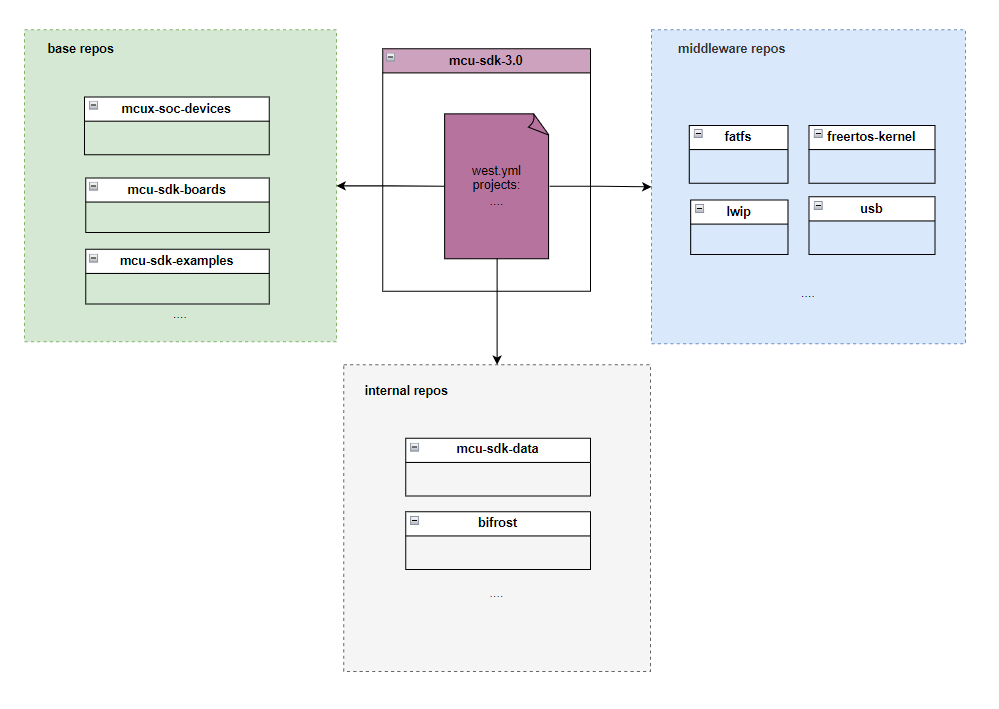

# Code Base

The source code, binaries, tools and documentation for the SDK are hosted in individual Git repositories and managed via west. The repositories are hosted on GitHub under the NXP Sites, including [nxp-mcuxpresso](https://github.com/nxp-mcuxpresso/), [NXP](https://github.com/NXP) and [nxp-zephyr](https://github.com/nxp-zephyr); the only exception is about the repos which are grouped to **bifrost**,they are internal to NXP developers and hosted on NXP internal git server.

## Repository Structure

The manifest repo, mcu-sdk-3.0, is a special repository that contains a list of repositories that are managed by west. It is used to manage all the repositories for SDK development with the west.yml manifest file. Repos managed by the manifest file is shown as below diagram:

The repo structure can be categorized into four parts:
- **manifest repo**. As shown in the above figure, the manifest repo, contains a west.yml manifest file to track all the other repos in the SDK. Besides the manifest file, the mcu-sdk-3.0 also tries to pull in all the fundamental files(we call it core) for community project to integrate, such as:
  - drivers
  - tools and scripts
  - entry for SDK build system
  - shared configurations across different architectures and socs
  - etc.
- **base repos**. Recorded in the submanifests/base.yml and loaded in the root west.yml manifest file. The base repos are the base repos which build the SDK, such as devices, examples and boards.
- **middleware repos**. Recorded in the submanifests/middleware subdirectory, categorized according to functionality, such as safety, motor control, wireless, connectivity and etc. They are also loaded in the root west.yml manifest file. 
- **internal repos**.Recorded in the submanifests/internal.yml and loaded in the root west.yml manifest file. They are grouped into the *bifrost* group and only visible to NXP internal developers.

## Getting SDK Repos
Internal developers please refer to the guide in [repo setup](../bifrost/readme.md#steps-to-try)
