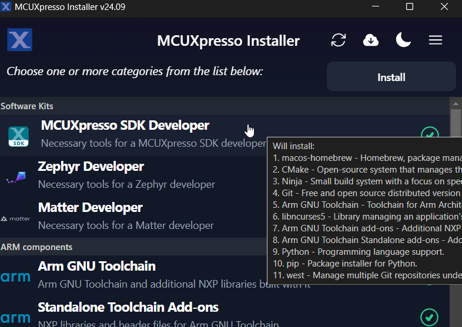

(gsd_tool_installation)=

# Installation

**NOTE**

If the installation instruction asks/selects whether to have the tool installation path added to the PATH variable, agree/select the choice. This option ensures that the tool can be used in any terminal in any path.  [Verify the installation](#tool-installation-check) after each tool installation.

## MCUXpresso Installer
The MCUXpresso Installer offers a quick and easy way to install the basic tools needed. The MCUXpresso Installer can be obtained from https://github.com/nxp-mcuxpresso/vscode-for-mcux/wiki/Dependency-Installation. The MCUXpresso Installer is an automated installation process, simply select MCUXpresso SDK Developer from the menu and click install. If you prefer to install the basic tools manually, refer to the next section. 



## Basic tools

### Git

Git is a free and open source distributed version control system. Git is designed to handle everything from small to large projects with speed and efficiency. To install Git, visit the official [Git website](https://git-scm.com/). Download the appropriate version(you may use the latest one) for your operating system (Windows, macOS, Linux). Then run the installer and follow the installation instructions.

User `git --version` to check the version if you have a version installed.

Then configure your username and email using the commands:

```bash
git config --global user.name "Your Name"
git config --global user.email "youremail@example.com"
```

### Python

Install python `3.10` or latest. Follow the [Python Download](https://wiki.python.org/moin/BeginnersGuide/Download) guide.

Use `python --version` to check the version if you have a version installed.

### West

Please use the west version equal or greater than `1.2.0`

```bash
# Note: you can add option '--default-timeout=1000' if you meet connection issue. Or you may set a different source using option '-i'.
# for example, in China you could try: pip install -U west -i https://pypi.tuna.tsinghua.edu.cn/simple
pip install -U west
```

## Build And Configuration System

### CMake

Use `cmake --version` to check the version if you have cmake installed.

### Ninja

Install [Ninja](https://ninja-build.org/). Use Ninja version 1.12.1 or latest.

Use `ninja --version` to check the version if you have Ninja installed.

### Kconfig

Kconfig is installed during the Python library installation.

### Ruby - Optional

**If you don't need GUI based IAR/MDK project, skip this step.**

Install ruby for GUI project generation and standalone project generation. Follow the guide [ruby environment setup](../develop/build_system/IDE_Project.md#ruby-environment-setup).

### Toolchain

#### IAR

Download and install IAR toolchain referring [IAR Embedded Workbench for ARM](https://www.iar.com/products/architectures/arm/iar-embedded-workbench-for-arm/).

#### MDK

Download and install MDK toolchain referring [MDK Installation](https://developer.arm.com/documentation/109350/v6/Installation?lang=en).

#### ARMGCC

Download and install ARMGCC toolchain referring [Arm GNU Toolchain Downloads](https://developer.arm.com/downloads/-/arm-gnu-toolchain-downloads).

#### ARMCLANG

Download and install armclang toolchain referring [Installing Arm Compiler for Embedded](https://developer.arm.com/documentation/100748/0618/Getting-Started/Installing-Arm-Compiler-for-Embedded).

#### Zephyr

Download and install Zephyr SDK referring [Zephyr SDK](https://docs.zephyrproject.org/latest/develop/toolchains/zephyr_sdk.html#).

#### Codewarrior

Download and install CodeWarrior toolchain referring [NXP CodeWarrior](https://www.nxp.com/design/design-center/software/development-software/codewarrior-development-tools:CW_HOME).

#### Xtensa

Download and install Xtensa toolchain referring [Tensilica Tools](https://tensilicatools.com/platforms/).

#### NXP S32 Compiler RISC-V Zen-V

Download and install the NXP S32Compiler RISC-V Zen-V compiler from [NXP Website](https://www.nxp.com.cn/search?keyword=NXP%2520S32Compiler%2520RISC-V&start=0).

Follow the installation instructions provided on the website. Ensure that the installation path is added to the PATH environment variable to use the toolchain from any terminal.


#### Environment Variables

After you have installed the toolchains, register them in the system environment variables. This will allow the west build to recognize them:

| Toolchain                    | Environment Variable   | Example                                  | Cmd Line Argument           |
| ---------------------------- | ---------------------- | ---------------------------------------- | :-------------------------- |
| IAR                          | IAR_DIR                | `C:\iar` for Windows<br />`/opt/iarsystems/bxarm-9.40.2` for Linux | --toolchain iar             |
| MDK                          | MDK_DIR                | `C:\Keil_v5` for Windows.<br />MDK IDE is not officially supported with Linux. | --toolchain mdk             |
| Armgcc                       | ARMGCC_DIR             | `C:\armgcc` for windows<br />`/usr` for Linux. Typically  `arm-none-eabi-*` is installed under `/usr/bin` | --toolchain armgcc(default) |
| Armclang                     | ARMCLANG_DIR           | `C:\ArmCompilerforEmbedded6.22` for Windows<br />`/opt/ArmCompilerforEmbedded6.21` for Linux | --toolchain mdk             |
| Zephyr                       | ZEPHYR_SDK_INSTALL_DIR | `c:\NXP\zephyr-sdk-<version>` for windows<br />`/opt/zephyr-sdk-<version>` for Linux | --toolchain zephyr          |
| CodeWarrior                  | CW_DIR                 | `C:\Freescale\CW MCU v11.2` for windows<br />CodeWarrior is not supported with Linux | --toolchain codewarrior     |
| Xtensa                       | XCC_DIR                | `C:\xtensa\XtDevTools\install\tools\RI-2023.11-win32\XtensaTools` for windows<br />`/opt/xtensa/XtDevTools/install/tools/RI-2023.11-Linux/XtensaTools` for Linux | --toolchain xtensa          |
|                              |                        |                                          |                             |
| NXP S32Compiler RISC-V Zen-V | RISCVLLVM_DIR          | `C:\riscv-llvm-win32_b298_b298_2024.08.12` for Windows<br />`/opt/riscv-llvm-Linux-x64_b298_b298_2024.08.12` for Linux | --toolchain riscvllvm       |

- The `<toolchain>_DIR` is the root installation folder.

- MDK IDE using armclang toolchain only officially supports Windows. In Linux, please directly use armclang toolchain by setting `ARMCLANG_DIR`. In Windows, since most Keil users will install MDK IDE instead of standalone armclang toolchain, the `MDK_DIR` has higher priority than `ARMCLANG_DIR`.

- For Xtensa toolchain, please set the `XTENSA_CORE` environment variable. Here's an example list:

  | Device Core      | `XTENSA_CORE`              |
  | ---------------- | -------------------------- |
  | RT500 fusion1    | `nxp_rt500_RI23_11_newlib` |
  | RT600 hifi4      | `nxp_rt600_RI23_11_newlib` |
  | RT700 hifi1      | `rt700_hifi1_RI23_11_nlib` |
  | RT700 hifi4      | `t700_hifi4_RI23_11_nlib`  |
  | i.MX8ULP fusion1 | `fusion_nxp02_dsp_prod`    |

- In Windows, the short path is used in environment variables. If any toolchain is using the long path, you can open a command window from the toolchain folder and use below command to get the short path: `for %i in (.) do echo %~fsi`

## Document Installation

It is only needed when you want to generate the HTML version of the document in your local environment

### make

Install make for windows using `choco`, other OS has make installed by default. Ensure you are running command in administrator mode.

```bash
choco install make
```

If you do not have `choco` installed, you can install it from [chocolatey](https://chocolatey.org/install)

### Doxygen

The doxygen installation is needed for documentation generation. The versions for the doxygen tools are as below:

- Doxygen version `1.8.13`
- Graphviz `2.43`
- Latexmk version `4.56`

For installation, you can refer to the guideline as below, which is referenced from the [Zephyr documentation generation guideline](https://docs.zephyrproject.org/latest/contribute/documentation/generation.html#installing-the-documentation-processors).

- Linux

  - On Ubuntu Linux:

    ```bash
    sudo apt-get install --no-install-recommends doxygen graphviz librsvg2-bin \
    texlive-latex-base texlive-latex-extra latexmk texlive-fonts-recommended imagemagick
    ```
  - On Fedora Linux:

    ```bash
    sudo dnf install doxygen graphviz texlive-latex latexmk \
    texlive-collection-fontsrecommended librsvg2-tools ImageMagick
    ```
  - On Clear Linux:

    ```bash
    sudo swupd bundle-add texlive graphviz ImageMagick
    ```
  - On Arch Linux:

    ```bash
    sudo pacman -S graphviz doxygen librsvg texlive-core texlive-bin \
    texlive-latexextra texlive-fontsextra imagemagick
    ```
- macOS
  Use ``brew`` and ``tlmgr`` to install the tools:

  ```bash
  brew install doxygen graphviz mactex librsvg imagemagick
  ```
  ```bash
  tlmgr install latexmk
  ```
  ```bash
  tlmgr install collection-fontsrecommended
  ```
- Windows
  Open a ``cmd.exe`` window as **Administrator** and run the following command:

  ```bash
  choco install doxygen.install graphviz strawberryperl miktex rsvg-convert imagemagick
  ```

## Tool installation check
Once installed, open a terminal or command prompt and type the associated command to verify the installation.

If you see the version number, you have successfully installed the tool. Else, check whether the tool's installation path is added into the PATH variable. You can add the installation path to the PATH with the commands below:

- Windows:
  Open command prompt or powershell, run below command to show the user PATH variable.
  ```bash
  reg query HKEY_CURRENT_USER\Environment /v PATH
  ```
  The tool installation path should be C:\Users\xxx\AppData\Local\Programs\Git\cmd. If the path is not seen in the output from above, append the path value to the PATH variable with the command below:

  ```bash
  reg add HKEY_CURRENT_USER\Environment /v PATH /d "%PATH%;C:\Users\xxx\AppData\Local\Programs\Git\cmd"
  ```
  Then close the command prompt or powershell and verify the tool command again.

- Linux:

  1. Open the `$HOME/.bashrc` file using a text editor, such as `vim`.
  2. Go to the end of the file.
  3. Add the line which appends the tool installation path to the PATH variable and export PATH at the end of the file. For example, export PATH="/Directory1:$PATH".
  4. Save and exit.
  5. Execute the script with `source .bashrc` or reboot the system to make the changes live. To verify the changes, run `echo $PATH`.

- macOS:
  1. Open the `$HOME/.bash_profile` file using a text editor, such as `nano`.
  2. Go to the end of the file.
  3. Add the line which appends the tool installation path to the PATH variable and export PATH at the end of the file. For example, export PATH="/Directory1:$PATH".
  4. Save and exit.
  5. Execute the script with `source .bash_profile` or reboot the system to make the changes live. To verify the changes, run `echo $PATH`.

# Get the MCUXpresso SDK Repo

To get the MCUXpresso SDK repository, use the `west` tool to clone the manifest repository and checkout all the west projects.

```bash
# Initialize west with the manifest repository
west init -m https://github.com/nxp-mcuxpresso/mcuxsdk-manifests/ mcuxpresso-sdk

# Update the west projects
cd mcuxpresso-sdk
west update

# Allow the usage of west extensions provided by MCUXpresso SDK
west config commands.allow_extensions true
```

# Install Python Dependency
To create a Python virtual environment in the west workspace core repo directory mcuxsdk, follow these steps:

1. Navigate to the core directory:
    ```bash
    cd mcuxsdk
    ```

2. [Optional] Create and activate the virtual environment:
    If you don't want to use the python virtual environment, skip this step. **We strongly suggest you use venv to avoid conflicts with other projects using python.**

    ```bash
    python -m venv .venv

    # For Linux/MacOS
    source .venv/bin/activate

    # For Windows
    .\.venv\Scripts\activate
    # If you are using powershell and see the issue that the activate script cannot be run.
    # You may fix the issue by opening the powershell as administrator and run below command:
    powershell Set-ExecutionPolicy RemoteSigned
    # then run above activate command again.

    ```
    Once activated, your shell will be prefixed with `(.venv)`. The virtual environment can be deactivated at any time by running `deactivate` command.

    **Remember to activate the virtual environment every time you start working in this directory.**
    If you are using some modern shell like `zsh`, there are some powerful plugins to help you auto switch venv among workspaces. For example, [zsh-autoswitch-virtualenv](https://github.com/MichaelAquilina/zsh-autoswitch-virtualenv).

3. Install the required Python packages:

    ```bash
    # Note: you can add option '--default-timeout=1000' if you meet connection issue. Or you may set a different source using option '-i'.
    # for example, in China you could try: pip3 install -r mcu-sdk-3.0/scripts/requirements.txt -i https://pypi.tuna.tsinghua.edu.cn/simple
    pip install -r scripts/requirements.txt
    ```

## Document Python dependencies

There are several Python packages needed for documentation generation, such as the Sphinx tool, which we used to do the generation process. Run the command below to install those Python dependencies.

  ```bash
  cd core/docs
  pip install -r requirements.txt
  ```
