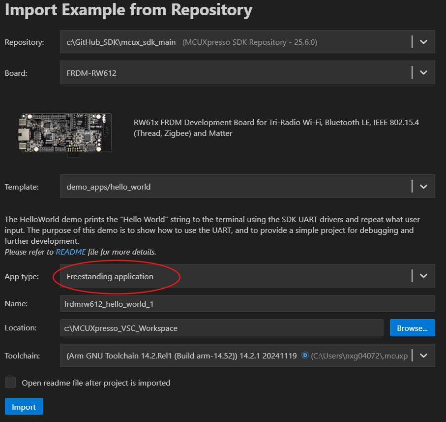
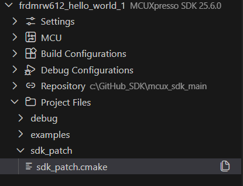

# How to manage Memory with MCUXpresso SDK CMake Projects

This section explains how to configure your project's memory management mechanishm including the linker file selection, linker's sections, run functions or files from SRAM and external memory considerations.

## Select your porject's linker file

1. Import a project example as "**Free standing application**"
   
2. Your imported project will appear in the left-side panel. I your project create a new folder called "sdk_patch" and within this folfer create a new file named "sdk_patch.cmake" as shown below:
   
3. In your project's CMakeList.txt, right before the last line, add an include for the sdk_patch.cmake:

   ```
   include(
       sdk_patch/sdk_patch.cmake
   )
   ```
4. When you import a project example, a linker file will be automatically selected based on your target device. However, if you need to change the linker file, you can do so by modifying the `sdk_patch.cmake` file. You need to remove the default linker file adding the following lines:

   ```
   mcux_remove_armgcc_linker_script(
       BASE_PATH ${SdkRootDirPath}
       TARGETS flash_debug flash_release
       LINKER ${device_root}/Wireless/RW/RW612/gcc/RW612_flash.ld
   )
   ```

> **Note: The linker scripts depends on your targed dive, you must need to locate it to correctly setup the the sdk_patch.cmake file. The linker are located at: /your_repo_path/mcuxsdk/devices/path_to_your_device/gcc**

5. Select the linker file you want to use at the `sdk_patch.cmake` file. For this example, we are setting to use the RW612_ram.ld instead of RW612_fash.ld

   ```
   mcux_add_armgcc_linker_script(
       TARGETS flash_debug flash_release
       LINKER ${device_root}/Wireless/RW/RW612/gcc/RW612_ram.ld
   )
   ```
6. You can also use your custom linker file using the previous steps described by setting the linker pat in the `sdk_patch.cmake` file. For example, if your custom linker `RW612_custom.ld` is at your root project folder you need to set it up as:

   ```
   mcux_add_armgcc_linker_script(
       TARGETS flash_debug flash_release
       LINKER RW612_custom.ld
   )
   ```
