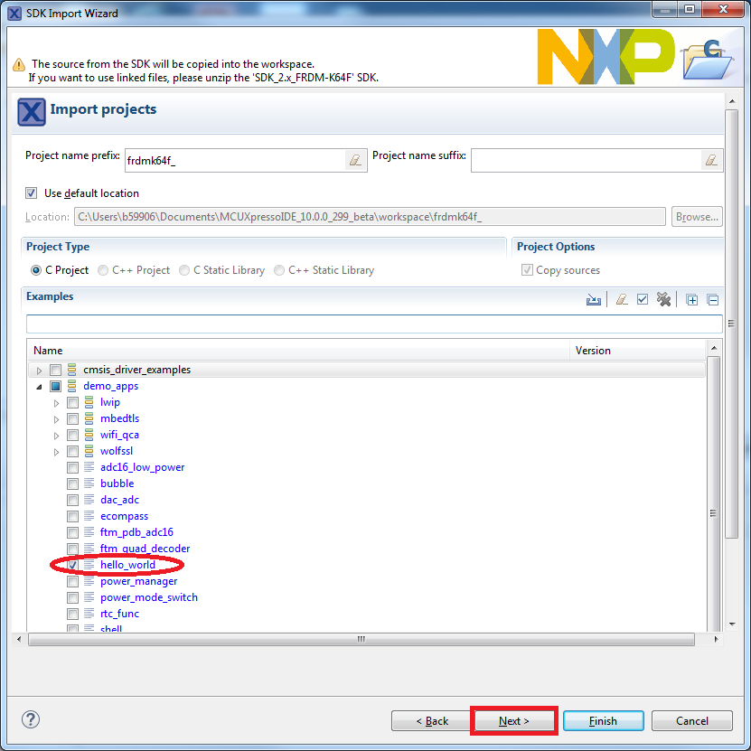

# Build an example application

To build an example application, follow these steps.

1.  Drag and drop the SDK zip file into the **Installed SDKs** view to install an SDK. In the window that appears, click **OK** and wait until the import has finished.

    

2.  On the **Quickstart Panel**, click **Import SDK example\(s\)…**.

    

3.  Expand the `demo_apps` folder and select `hello_world`.

4.  Click **Next.**

    

5.  Ensure **Redlib: Use floating-point version of printf** is selected if the example prints floating-point numbers on the terminalfor demo applications such as `adc_basic`, `adc_burst`, `adc_dma`, and `adc_interrupt`. Otherwise, it is not necessary to select this option. Then, click **Finish**.

