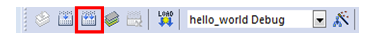

# Build an example application

1.  Open the desired example application workspace in:

    ```
    <install_dir>/boards/<board_name>/<example_type>/<application_name>/mdk
    ```

    The workspace file is named as `<demo_name>.uvmpw`. For this specific example, the actual path is:

2.  To build the demo project, select **Rebuild**, highlighted in red.

    

3.  The build completes without errors.

