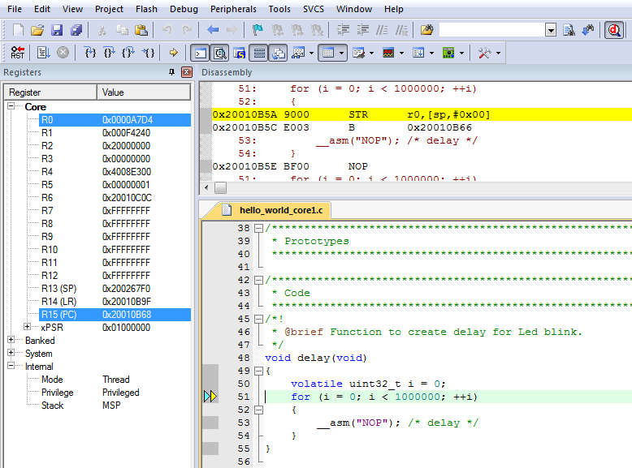

# Run a multicore example application

The primary core debugger flashes both the primary and the auxiliary core applications into the SoC flash memory. To download and run the multicore application, switch to the primary core application project and perform steps 1 – 5 as described in **Run an example application**. These steps are common for both single-core and dual-core applications in μVision.

Both the primary and the auxiliary image is loaded into the device flash memory. After clicking the “Run" button, the primary core application is executed. During the primary core code execution, the auxiliary core is released from the reset. The hello\_world multicore application is now running and a banner is displayed on the terminal. If this does not appear, check your terminal settings and connections.

An LED controlled by the auxiliary core starts flashing indicating that the auxiliary core has been released from the reset and is running correctly.

Attach the running application of the auxiliary core by opening the auxiliary core project in the second μVision instance and clicking the “Start/Stop Debug Session” button. After this, the second debug session is opened and the auxiliary core application can be debugged.

Arm describes multicore debugging using the NXP LPC54114 Cortex-M4/M0+ dual-core processor and Keil uVision IDE in Application Note 318 at [www.keil.com/appnotes/docs/apnt\_318.asp](http://www.keil.com/appnotes/docs/apnt_318.asp). The associated video can be found [here](https://www.youtube.com/watch?v=lMX-2lrv7Zs).

