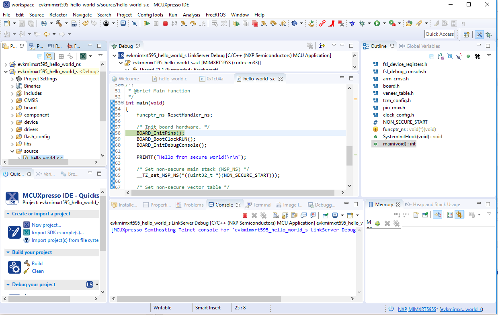

# Run a TrustZone example application

To download and run the application, perform all steps as described in **Run an example application**. These steps are common for single core, and TrustZone applications, ensuring `<board_name>_hello_world_s` is selected for debugging.

In the Quickstart Panel, click **Debug** to launch the second debug session.

Now, the TrustZone sessions should be opened. Click **Resume**. The `hello_world` TrustZone application then starts running, and the secure application starts the non-secure application during runtime.

