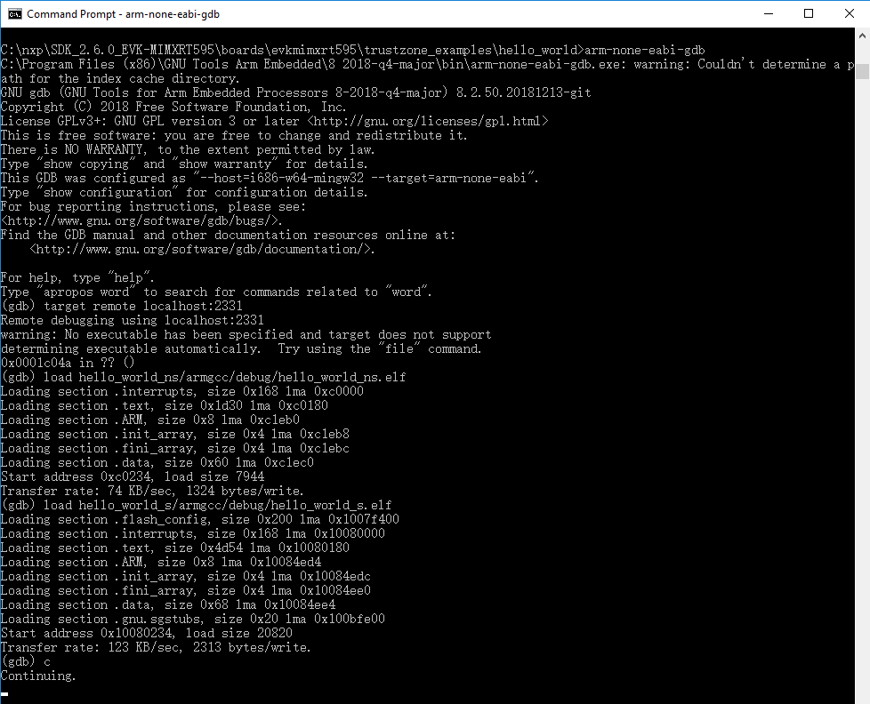
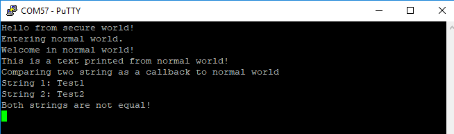

# Run a TrustZone example application

When running a TrustZone application, the same prerequisites for J-Link/J-Link OpenSDA firmware, and the serial console as for the single core application, apply, as described in **Run an example application**.

To download and run the TrustZone application, perform steps 1 to 10, as described in **Run an example application**. These steps are common for both single core and TrustZone applications in Arm GCC.

Then, run these commands:

1.  `arm-none-eabi-gdb.exe`
2.  `target remote localhost:2331`
3.  `monitor reset`
4.  `monitor halt`
5.  `monitor exec SetFlashDLNoRMWThreshold = 0x20000`
6.  `load <install_dir>/boards/evkmimxrt595/trustzone_examples/hello_world/hello_world_ns/armgcc/debug/hello_world_ns.elf`
7.  `load <install_dir>/boards/evkmimxrt595/trustzone_examples/hello_world/hello_world_s/armgcc/debug/hello_world_s.elf`
8.  `monitor reset`

The application is now downloaded and halted. Execute the `c` command to start the demo application.

