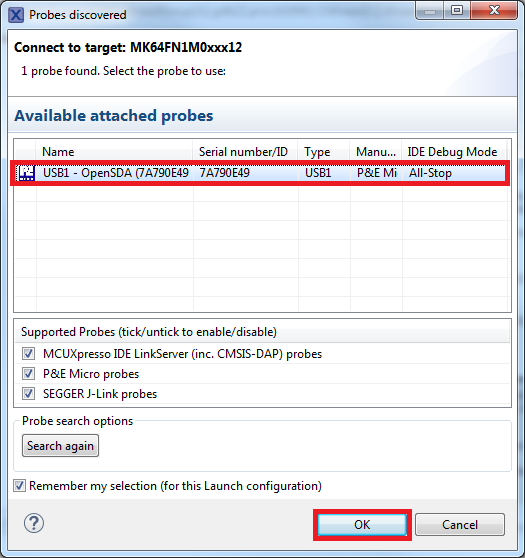
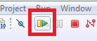

# Run an example application

For more information on debug probe support in the MCUXpresso IDE, see [community.nxp.com](https://community.nxp.com/message/630901).

To download and run the application, perform the following steps:

1.  Ensure the host driver for the debugger firmware has been installed. See [On-board debugger](on_board_debugger.md).
2.  Connect the development platform to your PC via a USB cable.
3.  Open the terminal application on the PC, such as PuTTY or TeraTerm, and connect to the debug serial port number \(to determine the COM port number, see [How to determine COM port](how_to_determine_com_port.md). Configure the terminal with these settings:

    1.  115200 or 9600 baud rate, depending on your board \(reference `BOARD_DEBUG_UART_BAUDRATE` variable in `board.h` file\)
    2.  No parity
    3.  8 data bits
    4.  1 stop bit
     configurations")

4.  On the **Quickstart Panel**, click **Debug** to launch the debug session.

5.  The first time you debug a project, the **Debug Emulator Selection** dialog is displayed, showing all supported probes that are attached to your computer. Select the probe through which you want to debug and click **OK**. \(For any future debug sessions, the stored probe selection is automatically used, unless the probe cannot be found.\)

    

6.  The application is downloaded to the target and automatically runs to `main()`.
7.  Start the application by clicking **Resume**.

    

The `hello_world` application is now running and a banner is displayed on the terminal. If not, check your terminal settings and connections.

