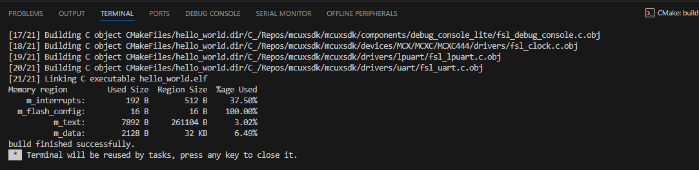

# Run a demo using MCUXpresso for VS Code
This section explains how to configure MCUXpresso for VS Code to build, run, and debug example applications. This guide uses the `hello_world` demo application as an example. However, these steps can be applied to any example application in the MCUXpresso SDK.

## Build an example application

 This section assumes that the user has already obtained the SDK as outlined in [Get MCUXpresso SDK Repo](#get-mcuxpresso-sdk-repo).

To build an example application:

1. Import the SDK into your workspace. Click **Import Repository** from the **QUICKSTART PANEL**.
    
    

    **Note:** You can import the SDK in several ways. Refer to [MCUXpresso for VS Code Wiki](https://github.com/nxp-mcuxpresso/vscode-for-mcux/wiki/Working-with-MCUXpresso-SDK) for details.

    Select **Local** if you've already obtained the SDK as seen in [Get MCUXpresso SDK Repo](../gsd/installation.md#get-the-mcuxpresso-sdk-repo). Select your location and click **Import**.

    

2. Click **Import Example from Repository** from the **QUICKSTART PANEL**.

    

    In the dropdown menu, select the MCUXpresso SDK, the Arm GNU Toolchain, your board, template, and application type. Click **Import**.

    

    **Note:** The MCUXpresso SDK projects can be imported as **Repository applications** or **Freestanding applications**. The difference between the two is the import location. Projects imported as Repository examples will be located inside the MCUXpresso SDK, whereas Freestanding examples can be imported to a user-defined location. Select between these by designating your selection in the **App type** dropdown menu. 

3. VS Code will prompt you to confirm if the imported files are trusted. Click **Yes**.

4. Navigate to the **PROJECTS** view. Find your project and click the **Build Project** icon.

    

    The integrated terminal will open at the bottom and will display the build output.

    

## Run an example application

**Note:** for full details on MCUXpresso for VS Code debug probe support, see [MCUXpresso for VS Code Wiki](https://github.com/nxp-mcuxpresso/vscode-for-mcux/wiki/DebugK).

1. Open the **Serial Monitor** from the VS Code's integrated terminal. Select the VCom Port for your device and set the baud rate to 115200.

    

2. Navigate to the **PROJECTS** view and click the play button to initiate a debug session.

    

    The debug session will begin. The debug controls are initially at the top.

    .

3. Click **Continue** on the debug controls to resume execution of the code. Observe the output on the **Serial Monitor**.

    