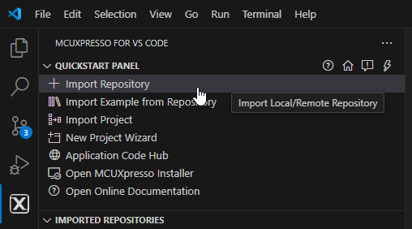
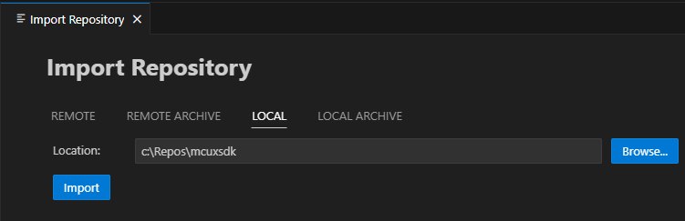
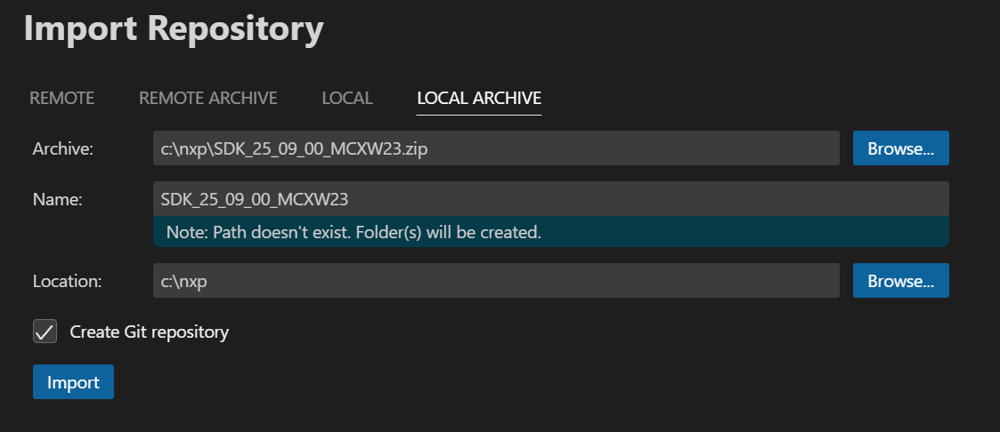
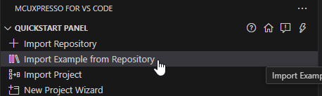
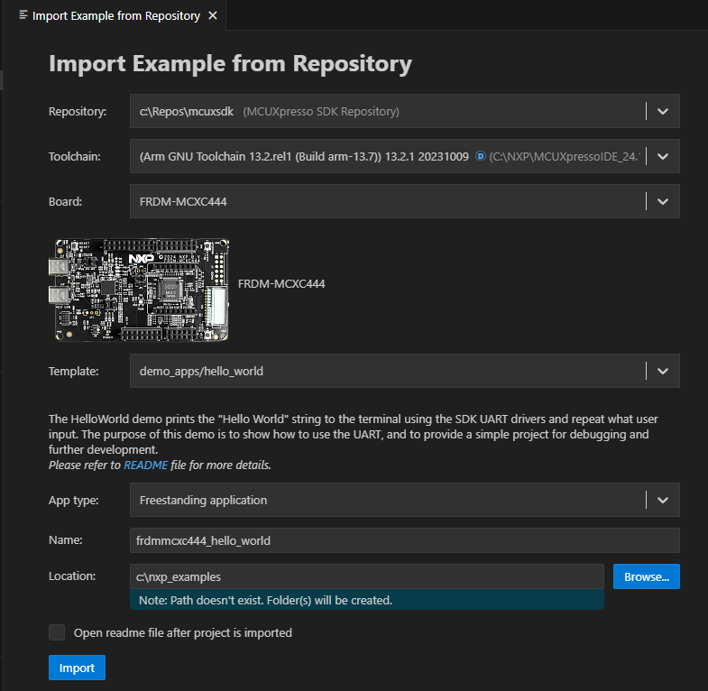
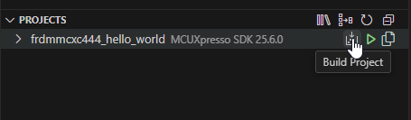
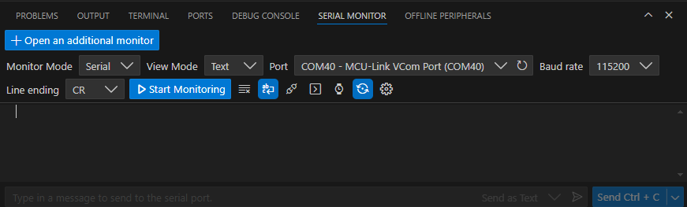
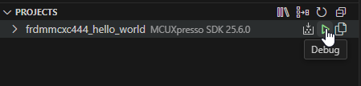
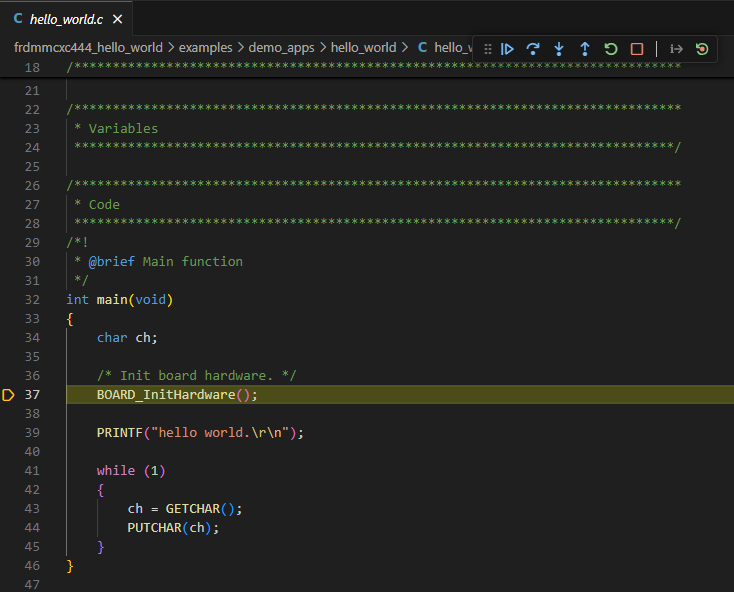
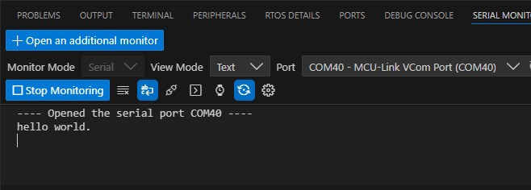

# MCUXpresso for VS Code Development

This guide covers using MCUXpresso for VS Code extension to build, debug, and develop SDK applications with an integrated development environment.

## Prerequisites

- SDK workspace initialized (GitHub Repository SDK or Repository-Layout SDK Package)
- Development tools installed per [Installation Guide](installation.md)
- Visual Studio Code installed
- MCUXpresso for VS Code extension installed

## Extension Installation

### Install MCUXpresso for VS Code

The MCUXpresso for VS Code extension provides integrated development capabilities for MCUXpresso SDK projects. Refer to the [MCUXpresso for VS Code Wiki](https://github.com/nxp-mcuxpresso/vscode-for-mcux/wiki/Working-with-MCUXpresso-SDK) for detailed installation and setup instructions.

## SDK Import and Setup

### Import Methods

The SDK can be imported in several ways. The MCUXpresso for VS Code extension supports both GitHub Repository SDK and Repository-Layout SDK Package distributions.

### Import GitHub Repository SDK

Click **Import Repository** from the **QUICKSTART PANEL**

**Note:** You can import the SDK in several ways. Refer to [MCUXpresso for VS Code Wiki](https://github.com/nxp-mcuxpresso/vscode-for-mcux/wiki/Working-with-MCUXpresso-SDK) for details.

Select **Local** if you've already obtained the SDK according to [setting up the repo](repo_setup.md). Select your location and click **Import**.

### Import Repository-Layout SDK Package

Click **Import Repository** from the **QUICKSTART PANEL**

Select **Local** if you've already unzipped the Repository-Layout SDK Package. Select your location and click **Import**.

Else if the SDK is ZIP archive, select **Local Archive**, browse to the downloaded SDK ZIP file, fill the link of expect location, then  click **Import**.

## Building Example Applications

### Import Example Project

1. Click **Import Example from Repository** from the **QUICKSTART PANEL**
    
    
    
2. Configure project settings:
   - **MCUXpresso SDK**: Select your imported SDK
   - **Arm GNU Toolchain**: Choose toolchain
   - **Board**: Select your target development board
   - **Template**: Choose example category
   - **Application**: Select specific example (e.g., hello_world)
   - **App type**: Choose between Repository applications or Freestanding applications

3. Click **Import**

     
    

### Application Types

**Repository Applications:**
- Located inside the MCUXpresso SDK
- Integrated with SDK workspace

**Freestanding Applications:**
- Imported to user-defined location
- Independent of SDK location

### Trust Confirmation

VS Code will prompt you to confirm if the imported files are trusted. Click **Yes** to proceed.

## Building Projects

### Build Process

1. Navigate to **PROJECTS** view
2. Find your project
3. Click the **Build Project** icon

The integrated terminal will display build output at the bottom of the VS Code window.

## Running and Debugging

### Serial Monitor Setup

1. Open **Serial Monitor** from VS Code's integrated terminal

    

2. Configure serial settings:
   - **VCom Port**: Select port for your device
   - **Baud Rate**: Set to 115200

### Debug Session

1. Navigate to **PROJECTS** view
2. Click the play button to initiate a debug session

    

The debug session will begin with debug controls initially at the top of the interface.

### Debug Controls

Use the debug controls to manage execution:
- **Continue**: Resume code execution
- **Step controls**: Navigate through code
- **Stop**: Terminate debug session
.    
    
### Monitor Output

Observe application output in the **Serial Monitor** to verify correct operation.

## Debug Probe Support

For comprehensive information on debug probe support and configuration, refer to the [MCUXpresso for VS Code Wiki DebugK section](https://github.com/nxp-mcuxpresso/vscode-for-mcux/wiki/DebugK).

## Project Configuration

### Workspace Management

The extension integrates with the MCUXpresso SDK workspace structure, providing access to:
- Example applications
- Board configurations
- Middleware components
- Build system integration

### Multi-Project Support

The PROJECTS view allows management of multiple imported projects within the same workspace.

## Troubleshooting

### Import Issues

**SDK not detected:**
- Verify SDK workspace is properly initialized
- Ensure all required repositories are updated
- Check SDK manifest files are present

**Project import failures:**
- Confirm board support exists for selected example
- Verify toolchain installation
- Check example compatibility with selected board

### Build Problems

**Build failures:**
- Check integrated terminal for error messages
- Verify all dependencies are installed
- Ensure toolchain is properly configured

### Debug Issues

**Debug session fails:**
- Verify board connection via USB
- Check debug probe drivers are installed
- Confirm build completed successfully

**Serial monitor problems:**
- Verify correct VCom port selection
- Check baud rate configuration (115200)
- Ensure board drivers are installed

## Integration with Command Line

MCUXpresso for VS Code integrates with the underlying west build system, allowing seamless integration with command line workflows described in [Command Line Development](run_project).

## Advanced Features

### Project Types

The extension supports both repository-based and freestanding project types, providing flexibility in project organization and SDK integration.

### Build System Integration

The extension leverages the MCUXpresso SDK build system, providing access to all build configurations and options available through command line tools.

## Next Steps

- Explore additional examples in the SDK
- Review [Command Line Development](run_project) for advanced build options
- Refer [MCUXpresso for VS Code Wiki](https://github.com/nxp-mcuxpresso/vscode-for-mcux/wiki) for detailed documentation
- Learn about [SDK Architecture](codebase.md) for better understanding of the development environment