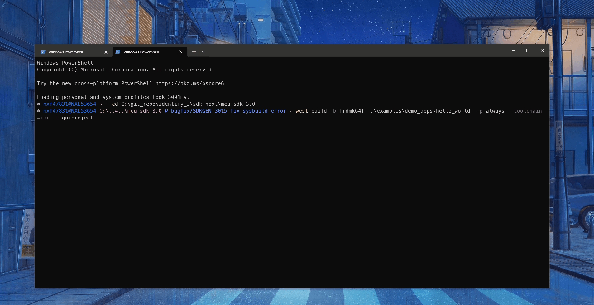

# Evaluate an Example Project

## Supported Boards

Use the west extension `west list_project` to understand the board support scope for a specified example. All supported build command will be listed in output:

```base
west list_project -p examples/demo_apps/hello_world [-t armgcc]

INFO: [   1][west build -p always examples/demo_apps/hello_world --toolchain armgcc --config release -b evk9mimx8ulp -Dcore_id=cm33]
INFO: [   2][west build -p always examples/demo_apps/hello_world --toolchain armgcc --config release -b evkbimxrt1050]
INFO: [   3][west build -p always examples/demo_apps/hello_world --toolchain armgcc --config release -b evkbmimxrt1060]
INFO: [   4][west build -p always examples/demo_apps/hello_world --toolchain armgcc --config release -b evkbmimxrt1170 -Dcore_id=cm4]
INFO: [   5][west build -p always examples/demo_apps/hello_world --toolchain armgcc --config release -b evkbmimxrt1170 -Dcore_id=cm7]
INFO: [   6][west build -p always examples/demo_apps/hello_world --toolchain armgcc --config release -b evkcmimxrt1060]
INFO: [   7][west build -p always examples/demo_apps/hello_world --toolchain armgcc --config release -b evkmcimx7ulp]
...

```

The supported toolchains and build targets for an example are decided by the example-self example.yml and board example.yml, please refer [Example Toolchains and Targets](../develop/sdk/example_development.md#example-toolchains-and-targets) for more details.

## Build the project

Use `west build -h` to see help information for west build command.
Compared to zephyr's west build, MCUXpresso SDK's west build command provides following additional options for mcux examples:

- `--toolchain`: specify the toolchain for this build, default `armgcc`.
- `--config`: value for `CMAKE_BUILD_TYPE`. If not provided, build system will get all the example supported build targets and use the first debug target as the default one. Please refer [Example Toolchains and Targets](../develop/sdk/example_development.md#example-toolchains-and-targets) for more details about example supported build targets.

Here are some typical usages for generating a SDK example:

```bash
# Generate example with default settings, default used device is the mainset MK22F51212
west build -b frdmk22f examples/demo_apps/hello_world

# Just print cmake commands, do not execute it
west build -b frdmk22f examples/demo_apps/hello_world --dry-run

# Generate example with other toolchain like iar, default armgcc
west build -b frdmk22f examples/demo_apps/hello_world --toolchain iar

# Generate example with other config type
west build -b frdmk22f examples/demo_apps/hello_world --config release

# Generate example with other devices with --device
west build -b frdmk22f examples/demo_apps/hello_world --device MK22F12810 --config release
```

For multicore devices, you shall specify the corresponding core id by passing the command line argument `-Dcore_id`. For example

```bash
west build -b evkbmimxrt1170 examples/demo_apps/hello_world --toolchain iar -Dcore_id=cm7 --config flexspi_nor_debug
```

For shield, please use the `--shield` to specify the shield to run, like

```bash
west build -b mimxrt700evk --shield a8974 examples examples/issdk_examples/sensors/fxls8974cf/fxls8974cf_poll -Dcore_id=cm33_core0
```

### Sysbuild(System build)

To support multicore project building, we ported Sysbuild from Zephyr. It supports combine multiple projects for compilation. You can build all projects by adding `--sysbuild` for main application. For example:

```bash
west build -b evkbmimxrt1170 --sysbuild ./examples/multicore_examples/hello_world/primary -Dcore_id=cm7  --config flexspi_nor_debug --toolchain=armgcc -p always
```
For more details, please refer to [System build](../develop/build_system/Sysbuild.md#sysbuild).

## Config a Project

Example in MCUXpresso SDK is configured and tested with pre-defined configuration. You can follow steps blow to change the configuration.

1. Run cmake configuration

```bash
west build -b evkbmimxrt1170 examples/demo_apps/hello_world -Dcore_id=cm7 --cmake-only -p
```

Please note the project will be built without `--cmake-only` parameter.

2. Run guiconfig target

```bash
west build -t guiconfig
```

Then you will get the Kconfig GUI launched, like


You can reconfigure the project by selecting/deselecting Kconfig options.

After saving and closing the Kconfig GUI, you can directly run `west build` to build with the new configuration.


## Flash

***Note***: Please refer [Flash and Debug The Example](../develop/sdk/example_development.md#flash-and-debug-the-example) to enable west flash/debug support.

Flash the hello_world example:

```bash
west flash -r linkserver
```

## Debug

Start a gdb interface by following command:

```bash
west debug -r linkserver
```
## Work with IDE Project

The above build functionalities are all with CLI. If you want to use the toolchain IDE to work to enjoy the better user experience especially for debugging or you are already used to develop with IDEs like  IAR, MDK, Xtensa and CodeWarrior in the embedded world, you can play with our [IDE project generation](../develop/build_system/IDE_Project.md) functionality.

This is the cmd to generate the evkbmimxrt1170 hello_world IAR IDE project files.

```bash
west build -b evkbmimxrt1170 examples/demo_apps/hello_world --toolchain iar -Dcore_id=cm7 --config flexspi_nor_debug -p always -t guiproject
```

By default, the IDE project files are generated in `mcuxsdk/build/<toolchain>` folder, you can open the project file with the IDE tool to work:



Note, please follow the [Installation](./installation.md) to setup the environment especially make sure that [ruby](./installation.md/ruby) has been installed.