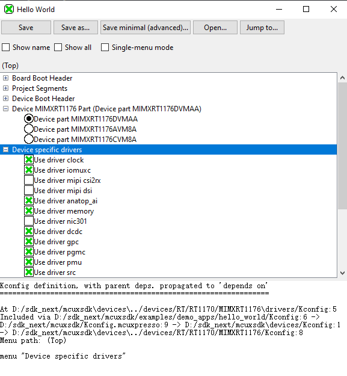

# Evaluate an Example Project

## Supported Boards

Use the west extension `west list_project` to understand the board support scope for a specified example. All supported build command will be listed in output:

```base
west list_project -p examples/demo_apps/hello_world [-t armgcc]

INFO: [   1][west build -p always examples/demo_apps/hello_world --toolchain armgcc --config release -b evk9mimx8ulp -Dcore_id=cm33]
INFO: [   2][west build -p always examples/demo_apps/hello_world --toolchain armgcc --config release -b evkbimxrt1050]
INFO: [   3][west build -p always examples/demo_apps/hello_world --toolchain armgcc --config release -b evkbmimxrt1060]
INFO: [   4][west build -p always examples/demo_apps/hello_world --toolchain armgcc --config release -b evkbmimxrt1170 -Dcore_id=cm4]
INFO: [   5][west build -p always examples/demo_apps/hello_world --toolchain armgcc --config release -b evkbmimxrt1170 -Dcore_id=cm7]
INFO: [   6][west build -p always examples/demo_apps/hello_world --toolchain armgcc --config release -b evkcmimxrt1060]
INFO: [   7][west build -p always examples/demo_apps/hello_world --toolchain armgcc --config release -b evkmcimx7ulp]
...

```

## Build the project

Use `west build -h` to see help information for west build command.
Compared to zephyr's west build, MCUXpresso SDK's west build command provides following additional options for mcux examples:

- --toolchain: specify the toolchain for this build, default armgcc.
- --config: value for CMAKE_BUILD_TYPE, default debug.

Here are some typical usage for generating a SDK example:

```bash
# Generate example with default settings
west build -b frdmk22f examples/demo_apps/hello_world

# Just print cmake commands, do not execute it
west build -b frdmk22f examples/demo_apps/hello_world --dry-run

# Generate other toolchain like iar, default armgcc
west build -b frdmk22f examples/demo_apps/hello_world --toolchain iar

# Generate config type, default debug
west build -b frdmk22f examples/demo_apps/hello_world --config release

```

For multicore devices, you shall specify the corresponding core id by passing the command line argument "-Dcore_id". For example

```bash
west build -b evkmimxrt1170 examples/demo_apps/hello_world --toolchain iar -Dcore_id=cm7 --config flexspi_nor_debug
```

For shield, please use the "--shield" to specify the shield to run, like

```bash
west build -b mimxrt700evk --shield a8974 examples examples/issdk_examples/sensors/fxls8974cf/fxls8974cf_poll -Dcore_id=cm33_core0
```

### Sysbuild(System build)

To support multicore project building, we ported Sysbuild from Zephyr. It supports combining multiple projects for compilation. You can build all projects by adding "--sysbuild" for main application. For example:

```bash
west build -b evkmimxrt1170 --sysbuild ./examples/middleware/multicore/multicore_examples/hello_world/primary -Dcore_id=cm7 --config flexspi_nor_debug -p always
```
For more details, please refer to [System build](../develop/build_system/Sysbuild.md#sysbuild).

## Config a project

Example in MCUXpresso SDK is configured and tested with pre-defined configuraiton. You can follow steps blow to change the configuration.

1. Run cmake configuration

```bash
west build -b frdmk22f examples/demo_apps/hello_world --cmake-only
```

Please note the project will be built without `--cmake-only` parameter.

2. Run guiconfig target

```bash
west build -t guiconfig
```

Then you will get the Kconfig GUI launched, like



You can reconfigure the project by selecting/deselecting Kconfig options.

After saving and closing the Kconfig GUI, you can directly run "west build" to build with the new configuration.


## Flash

***Note***: Please refer [West Flash and Debug Support](../develop/application/west.md#flash-and-debug) to enable west flash/debug support.

Flash the hello_world example:

```bash
west flash -r linkserver
```

## Debug

Start a gdb interface by following command:

```bash
west debug -r linkserver
```