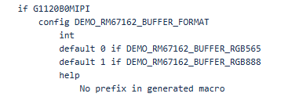
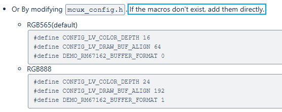

# Using Kconfig with MCUXpresso SDK CMake Projects
This section explains how to configure MCUXpresso for VS Code to build, run, and debug example applications. This guide uses the `hello_world` demo application as an example. However, these steps can be applied to any example application in the MCUXpresso SDK.

## RT700 example of using Kconfig
The RT700 LVGL project readme has been updated: https://bitbucket.sw.nxp.com/projects/MCUCORE/repos/mcuxsdk-examples/browse/_boards/mimxrt700evk/lvgl_examples/lvgl_examples_readme.md
 
The RT700 LVGL project is a typical use case that needs to support user configurations. It has several panels that can be selected by Kconfig. And for each panel, there is also panel specific settings. It has LVGL provided settings, and NXP defined settings. We can use this project to better understand the use of Kconfig:  
 
### How to discover the available Kconfig settings
I think Zephyr also has this problem, I am not very clear how Zephyr handle it.
Although generally the settings shown in GuiConfig are all configurable, I still suggest document the key settings like what LVGL example readme has done, because the settings are verified by us, they are the recommended way to use the features.
About how to select, although user can browse and select using menuconfig/guiconfig, the suggested way is passing settings “-DCONFIG_xxx=x” in west build command, because of this Kconfig pitfall: https://docs.zephyrproject.org/latest/build/kconfig/tips.html#stuck-symbols-in-menuconfig-and-guiconfig.
 
### How to set the values in a non-volatile file (Not erased every clean build, as they are in the build folder)
There is prj.conf for each project. Do you mean add more prj.conf, for example prj_panel_a.conf, prj_panel_b.conf?
 
## Non-Kconfig Projects
Another topic is configuration for non-Kconfig users (KEX package users), the only way is modifying mcux_config.h directly.
Currently the steps are described in readme. Without the Kconfig’s help, the steps are complex and not user friendly:
1.	Configuration dependency: When changing one variable in Kconfig, other variables can change accordingly. For example, to use pixel format XRGB8888 in LVGL, with Kconfig we only need to add ```-DCONFIG_LV_COLOR_DEPTH_32=y``` in build command, but without Kconfig, we need to modify several macros in mcux_config.h
    ```
    #define CONFIG_LV_COLOR_DEPTH 32 #define CONFIG_LV_DRAW_BUF_ALIGN 64 #define DEMO_RK055MHD091_USE_XRGB8888 1
    ```  
2.	mcux_config.h doesn’t contain all configuration macros: The mcux_config.h is generated by Kconfig, because of Kconfig’s behavior, if one Kconfig variable is not selected, the variables based on this variable will not be generated into mcux_config.h. One example:
  

**DEMO_RM67162_BUFFER_FORMAT** is for panel *G1120B0MIPI*. The default panel is not *G1120B0MIPI* panel, so the **DEMO_RM67162_BUFFER_FORMAT** is not contained in mcux_config.h.  

When user wants to use that panel, they need to add **DEMO_RM67162_BUFFER_FORMAT** in mcux_config.h. The challenge is, how could user know what macros need be added? Currently this is described in LVGL project readme:
 
   

## Project Configuration
This project supports different panels and pixel formats.  There are two methods to configure.
1. Configure by Kconfig.  Passing configuration flags during build: **west build ...**
2. Configure by modifying the macros in the configure file *mcux_config.h*
**_NOTE:_** The mcux_config.h is generated by Kconfig.  If Kconfig is used, don't modify mcux_config.h directly.  The manual changes will be overwritten by Kconfig.    
**_NOTE:_** When the macros to be modified don't exist in the mcux_config.h add them directly in mcux_config.h   