# Users Guide: How to use Kconfig with MCUXpresso SDK Projects
In this Guide, you will learn:
- How to verify Kconfig settings for an MCUXpresso SDK application
- How to change a reference value in an application using Kconfig symbols
- How to open the *guiconfig* tool, and explore or search for Kconfig settings and details
- How to save unique Kconfig settings for an application
- How to use Kconfig when adding a new SDK Component to an application

#  Configuration using Kconfig
The software used to build MCUXpresso SDK applications can be configured at build time to adapt for specific application and platform needs. Configuration is handled through **Kernel Config (Kconfig)**, which is the same configuration system used by the Linux kernel. The goal is to support configuration without having to change any source code.

Configuration options (often called symbols) are defined in Kconfig files, which also specify dependencies between symbols that determine what configurations are valid.  Kconfig definitions and settings come from many sources in the MCUXpresso SDK tree, including:

### KConfig Sources	
 Software Configured |        Location in SDK Folder | Priority (1=Highest)
|:--------------|:---------------|:-----:
|Application | example/demo_apps/shell/prj.conf|1
|Board-Application | examples_boards/frdmmcxn947/demo_apps/shell/cm33_core0/prj.conf|2
|Board | examples/_boards/frdmmcxn947/prj.conf|3
|SoC/Device |  devices/MCX/MCXN/MCXN947/prj.conf|4
|RTOS/Kernel |  rtos/freertos/freertos-kernel/Kconfig|5
|Drivers |  drivers/gpio/Kconfig|6
|Components |  components/debug_console/Kconfig|7
|Open-source/3rd-Party | middleware/mbedtls/Kconfig|8

The outputs from Kconfig are build-time generated files for the application.  One text file *.config* is the final merged Kconfig symbols from all Kconfig sources used by the application.  Another file *autoconf.h* is a C header file with macros that can be tested at build time.  This guide will demonstrate how these files are useful, to confirm the Kconfig settings used during the most recent build of the application.

Kconfigs can be defined as different types.  In this lab, we will explore 3 different types: boolean, integer, and choice Kconfigs.  The guide steps will modify the following Kconfigs, and demonstrate how they configure the application:
-	`CONFIG_SHELL_HEADER` : : (type boolean) selects to generate a header file to allow unique settings to be used for the shell application
-	`CONFIG_SHELL_HISTORY_COUNT` : (type integer) sets the number of executed shell commands saved to be recalled without retyping them
-	`CONFIG_MCUX_COMPONENT_utility.shell` : (type boolean) selects if MCUXpresso SDK’s Shell component is included in the application


For MCUXpresso SDK application development, typically Kconfig options are set at the application level.  This guide will give some simple examples to get familiar with how Kconfigs are modified for applications.  These sections include modifying the *prj.conf* file, which is the Kconfig file at the application level.  And also show how new SDK components can be added to projects where they were not included.

##  1. Changing a Kconfig symbol for an application
First we will import a MCUXpresso SDK sample application into VS Code, build it, explore the existing Kconfig symbols, and make a simple Kconfig change.  This section uses the *shell* application, and will modify the application Kconfig in the root of the imported project */demo_apps/shell/prj.conf*.

1.	Open VS Code.  In the Quickstart Panel, click **Import Example from Repository**.  

    **_NOTE:_** If needed, the steps to import an example, build, and debug it are included in [MCUXpresso SDK Lab MCXN947 Hello World](./MCUXpresso SDK-Lab-MCXN947-Hello-World).  


    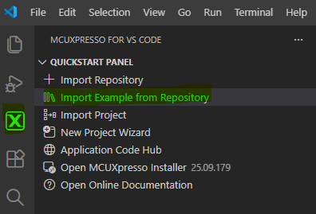
    <br/>

2.	Import the *Shell* example with the following settings:
    -	For the board, you can type **n947** to filter the board target **FRDM-MCXN947**.
    -	For the example template, type **shell** to filter the app **demo_apps/shell_cm33_core0**
    -	For Application type, select **Repository Application**
    -	Click **Import**

    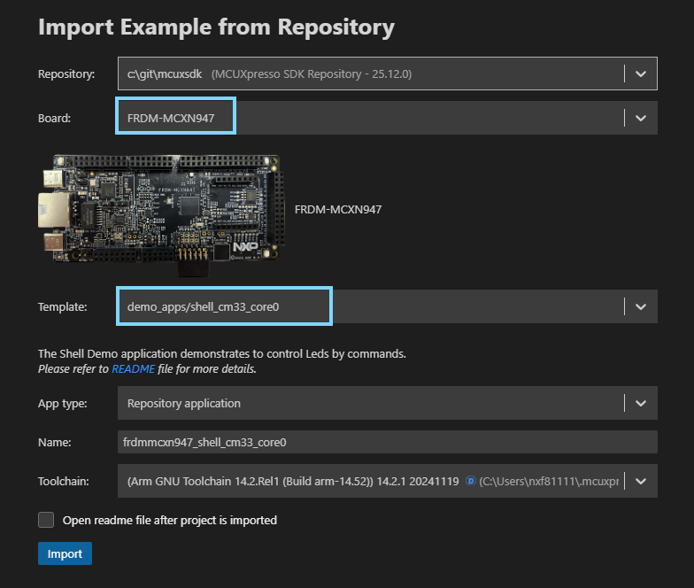 
        <br/>

3.	Build the *shell* project

    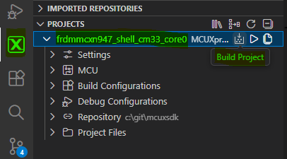
    <br/>

4.	If not already connected to the board, connect the USB Type-C cable to J17, to power and debug the board.  In VS Code, connect the Serial Monitor to the board’s COM port, and click **Start Monitoring**.

    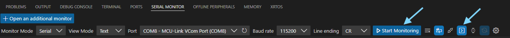
    <br/>

5.	When the build completes, take note of the memory sizes.  We will refer back to this memory usage in the later steps in this guide.  In VS Code, this is found in the **Terminal view** after the build completes.

    
    <br/>

6.	Debug the shell project.

    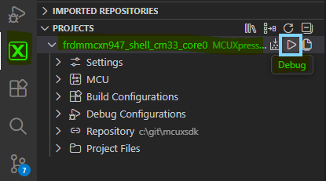
    <br/>

8.	**Continue** executing the application.

    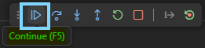
    <br/>

7.	In the Serial Monitor view, you will see the app prints a copyright followed by the SHELL terminal prompt:

    Shell output in Serial Monitor:
    ```
    Copyright  2024  NXP
    
    SHELL>> |
    ```
8.  Test the number of commands that the application recalls by default.  
- Type the following 6 commands. 
    ```
    help
    led 1 on
    led 2 on
    led 3 on
    led 1 off
    led 2 off    
    ```
The application will provide a list of valid commands and then turn on and off the RGB LED on the board.
- Use the up arrow to recall the prior executed commands.  The last 3 commands should be recalled. The first 3 are not saved.

9.	Stop the debugger

    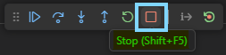  
    
    Now that we have the default *shell* sample working, we will explore some Kconfig settings, and make some simple changes.
    <br/>

10.	In the MCUXpresso PROJECTS section, open the *Project Files* view. Find the **debug folder** under the *shell* project.  This is a generated folder created when building the *shell* project.  Every MCUXpresso SDK application has a build folder after it is built.  The name is based on the selected Build COnfiguration, in this case *debug*. It contains all the generated files from the build tools, like the object code from the compiler, and the linker outputs.

    
    <br/>

11.	In the debug build folder, open the file **.config**.  

    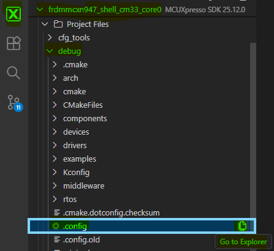
    <br/>

The *.config* file is the final merged Kconfig settings for the application, generated when the application is built.  It is a helpful resource to use to confirm the Kconfig settings used by the application.  The Kconfig settings can come from many different source files during the build.  They can also have dependencies on other Kconfigs.  Sometimes a Kconfig setting can be confusing when reviewing the sources.  Verifying the Kconfig in the *.config* file confirms the setting used during the build.  And this guide demonstrates, after making Kconfig changes, how it can be helpful to review the generated *.config* file to confirm what changes were picked up during the build.

Another good tip is to review the *.config* file to optimize your application.  You may find there are *features, drivers or components* enabled that you do not need in your application, and you can make changes to remove them.  Or the *.config* file may reveal settings that are not ideal for your application, and you can change them.

Because the *.config* file is generated during the build, it is important to understand what happens when changing this file.  Any modifications to this file can be reverted if the *.config* file is re-generated again during a build.  For Kconfig changes to be retained, it is best to make the change in a Kconfig source file.  In this section, we will demonstrate modifying the application’s *prj.conf* file, and then confirming the modification in the *.config* file.  

12.	In the *.config* file, search for symbols that includes **`utility.shell`**.  This is a boolean Kconfig, and shows as “=y”.  Booleans use `y` for Yes and `n` for No.  Here “=y” means the symbol is selected, or enabled.  Symbols that are not selected (or disabled) are commented out.  In this example *.config* file below, we see that `utility.shell` is selected by default in the *shell* sample, however `utility.shell.generated_config` is not selected. This will be important in our next steps.

    ```python
    CONFIG_MCUX_COMPONENT_utility.shell=y
    # CONFIG_MCUX_COMPONENT_utility.shell.generated_config is not set    
    ```

13.	Using the *Project Files* view introduced earlier, or using the VS Code *Explorer View* (highlighted), open the **prj.conf** file under the *shell* project.

    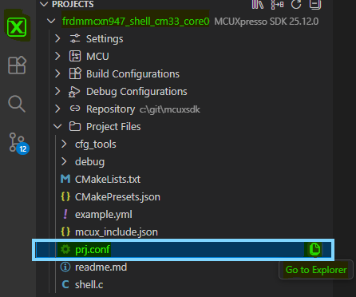
    <br/>

14.	Modify the ***prj.conf*** file, by **adding the line highlighted below** for `utility.shell.generated_config`.  This enables the creation of a Shell configuration header file. It provides more configuration parameters for the shell application.  Save the *prj.conf* file (Ctrl-S).

    ```python
    CONFIG_MCUX_COMPONENT_utility.shell.generated_config=y # Add this line
    ```

    Notice after saving this file, the build tools are run immediately.  It does not build the application image or run the C compiler.  But it does run the Kconfig tools, and re-generates the *.config* file with this change.  
    
    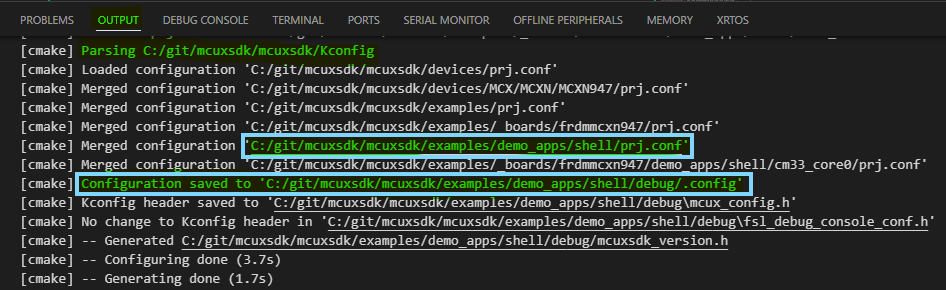
    <br/>

15.	Go back to the **.config** file already open in the editor.  Notice that `utility.shell.generated_config` is now included.
    ```python
    CONFIG_MCUX_COMPONENT_utility.shell.generated_config=y
    ```
    More important, there is a new section of kconfig symbols available for the shell configuration. These provide build time settings that can modify the application.

    Increase the captured shell command history by modifying the **CONFIG_SHELL_HISTORY_COUNT** from 3 to 5.

    ```python
    #
    # shell config
    #
    # CONFIG_SHELL_NON_BLOCKING_MODE is not set
    CONFIG_SHELL_AUTO_COMPLETE=y
    CONFIG_SHELL_BUFFER_SIZE=64
    CONFIG_SHELL_ECHO=y
    CONFIG_SHELL_HISTORY_COUNT=5
    CONFIG_SHELL_IGNORE_PARAMETER_COUNT=0xFF
    # CONFIG_SHELL_USE_COMMON_TASK is not set
    CONFIG_SHELL_TASK_PRIORITY=2
    CONFIG_SHELL_TASK_STACK_SIZE=1000
    CONFIG_SHELL_PRINT_COPYRIGHT=y
    # end of shell config
    ```

16.	**Rebuild the shell application**.  When the build finishes, the memory usage in the *Output view* shows a slight increase in the m_data size, since the mew configuration value added a larger buffer to store more shell command history *(+128 Bytes for 2 additional commands)*:

    ### shell.generated_config = n	
    | Memory region |        Size |  % Used 
    |:--------------|:-----------:|-----------:
    |m_data         |      4432 B |    1.39%


    ### shell.generated_config = y
    | Memory region |        Size |  % Used 
    |:--------------|:-----------:|-----------:
    |m_data         |      4560 B |    1.43%    

<br/>

17.	Rebuild and debug the *shell* application. With the Serial Monitor connected, you will find the app can recall 5 executed Shell commands.  

This section showed how Kconfig can modify the operation of the application without changing source code.  

##  2. *guiconfig* tool to explore Kconfig symbols 
In this section, we will introduce a tool integrated with MCUXpresso SDK called *guiconfig*.  This interactive tool was created by the Zephyr project to help explore and configure Kconfig symbols.  NXP has included this tool to assist developers using Kconfig to configure the cmake projects in the SDK. *Guiconfig* can be helpful to search for Kconfig symbols, see the different options, understand the dependencies with other symbols, and find where the symbols are located in the source files.  

MCUXpresso SDK offers two similar tools for this, the other is called *menuconfig*.  The difference is *menuconfig* is text-based for CLI, while *guiconfig* opens a new window and works with the mouse.  The MCUXpresso extension enables opening *guiconfig* for a project directly in VS Code.

20. To open *guiconfig*, click the MCUXpresso view, **Right-Click the *shell* project**, and select **Open MCUXpresso SDK Kernel Configuration**.  

    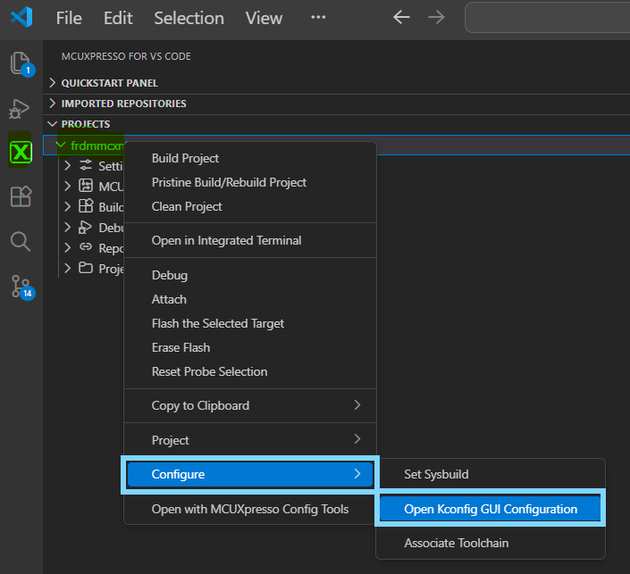
    <br/>

VS Code needs some time to open the tool.  Then the *guiconfig* window will open.

   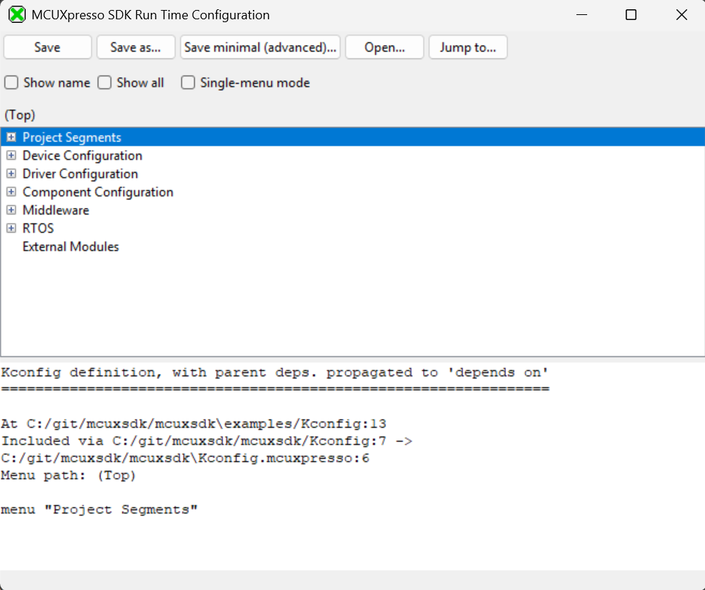
   <br/>

21.	Check the **“Show name” box**.  This adds a column on the right with the name of the Kconfig symbols. Expand the *Driver Configuration* group for some symbol names to be displayed.

    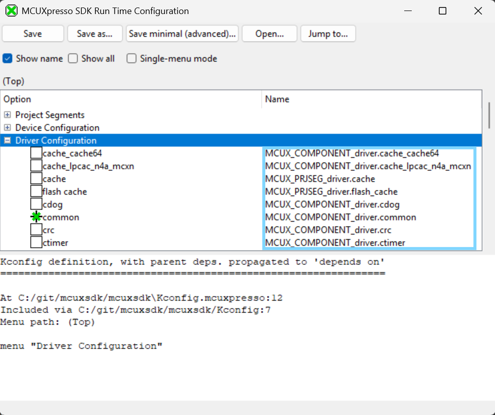
    <br/>

22.	To search for a Kconfig symbol, click the **Jump to button**.

    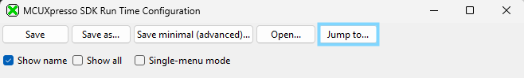
    <br/>

23.	Search for the word **SHELL**.  The results below are found.  

    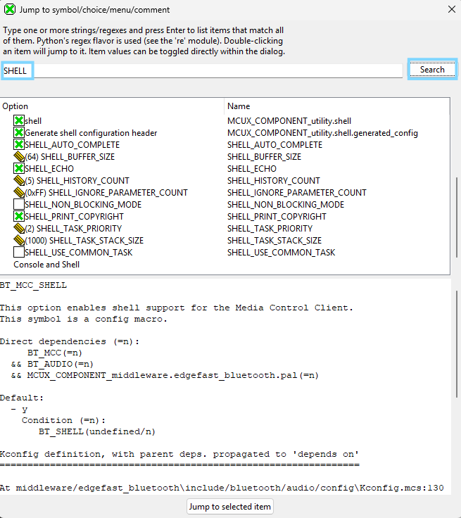
    <br/>

24.	To see a more intuitive view, **click on the “SHELL_BUFFER_SIZE”** then click "Jump to selected item"**.  

    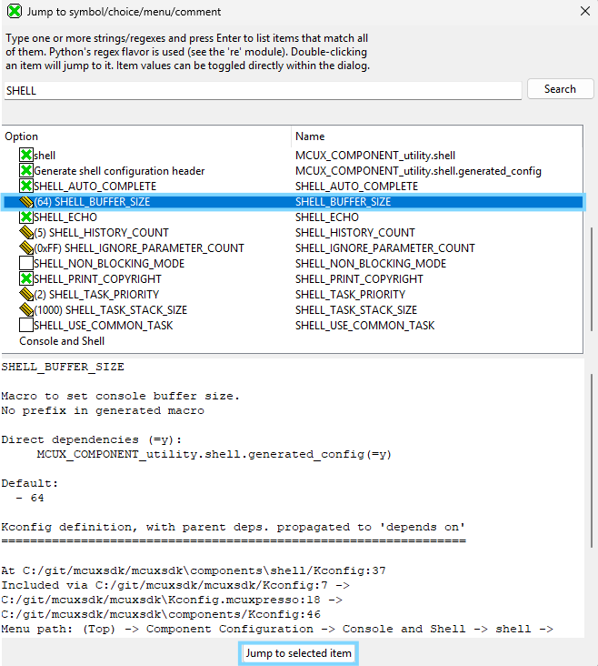
    <br/>

*Guiconfig* helps illustrate that Kconfigs are like a hierarchical menu.  You can use *guiconfig* (or *menuconfig*) to browse through the menu to find all the Kconfig settings, and make changes.  We also see here the `SHELL_BUFFER_SIZE` setting is an int Kconfig.  *Guiconfig* uses a *pencil* icon to indicate the value can be changed. The text in the lower window shows details about each symbol, like a description, and the source where this Kconfig is defined.

25.	Click the pencil next to the setting **SHELL_BUFFER_SIZE** and change the value to 128, then click the **Save button**, and close the *guiconfig* window. 

    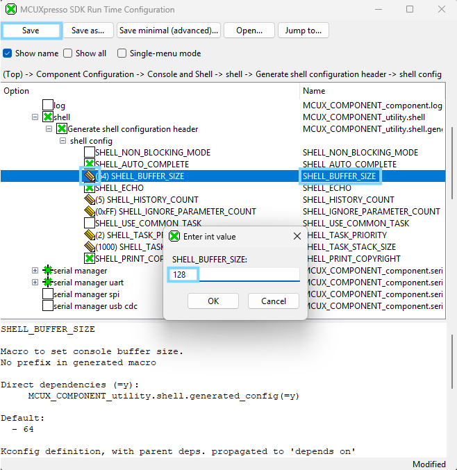
    <br/>

26.	Back in VS Code, return to the **.config** file already open in the editor.  Notice *guiconfig* made changes to the `SHELL_BUFFER_SIZE` settings.  

*Guiconfig* made this change in the *.config* file.  But remember, this is a generated file, and will not retain this change if it is rebuilt.  We could build the app with this change right now, and see the change’s effect on the app.  But to make this change permanent, we should add this Kconfig change to our app’s *prj.conf* file.

27.	Return to the **prj.conf** file already open in the editor.  **Add the highlighted line below** for `CONFIG_SHELL_BUFFER_SIZE`, and save the file.  

    ```python
    CONFIG_MCUX_COMPONENT_utility.shell.generated_config=y
    CONFIG_SHELL_HISTORY_COUNT=5
    CONFIG_SHELL_BUFFER_SIZE=128
    ```

28.	In the MCUXpresso view, rebuild the *shell* application.  At the end of the build, the memory usage shows a larger increase in m_data size after increasing the size of each buffer.  (5 x 64B = 320B )

    ### CONFIG_SHELL_BUFFER_SIZE = 64
    | Memory region |        Size |  % Used 
    |:--------------|:-----------:|-----------:
    |m_data         |      4560 B |    1.43%    
 

    ### CONFIG_SHELL_BUFFER_SIZE = 128	
    | Memory region |   Used Size |  %age Used 
    |---------------|------------:|-----------:
    |m_data         |      5008 B |    1.57%        

---

##  3. Adding SDK Component to a Project using Kconfig
A developer may want to add the functionality demonstrated in the Shell example to another project. This section illustrates how new components from the MCUXpresso SDK can be used in a project.

    **_NOTE:_** This example adds SDK components that leverage the same Peripheral and/or board configuration settings. A different use case would require the user to modify board settings using Config Tools to add and initialize new pins and peripherals.

The process for this section will start with a new project *gpio_led_output*. The project is nice example of driving GPIO, however it does not have any user interaction.  
After evaluating the Shell example, how can you add the Shell commands to the gpio example?

29. Import *GPIO LED Output* example project. Open VS Code. In the Quickstart Panel, click **Import Example from Repository**.  Following the same steps used in the first section.  
	Import the *gpio_led_output* example with the following settings:
    -	For the board, you can type **n947** to filter the board target **FRDM-MCXN947**.
    -	For the example template, type **gpio_led** to filter the app **driver_examples/gpio/gpio_led_output_cm33_core0**
    -	For Application type, select **Repository Application**
    -	Click **Import**

        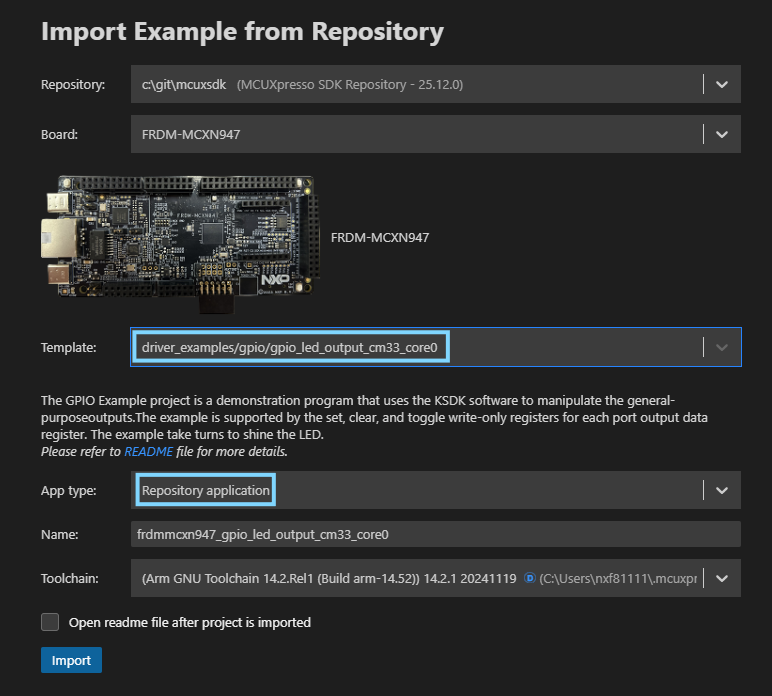 
        <br/>

30.	Build and Debug the *gpio_led_output* project using steps illustrated in the above sections. (Click Build/Debug icons)


31.	If not already connected to the board, connect the USB Type-C cable to J17, to power and debug the board.  In VS Code, connect the Serial Monitor to the board’s COM port, and click **Start Monitoring**.

    
    <br/>

32.	**Continue** executing the application.  The red LED D2 should be blinking.

    
    <br/>

At this point the GPIO LED Output project works, but does not have the Shell that you want to add.  
The next steps will add the content from the *shell.c* project source file into *gpio_led_output.c*  

**_REMINDER:_** *The shell project should be in your workspace from first part of guide. Making it easy to copy-paste*

33. Copy/Paste the required include files missing from shell.c into *gpio_led_output.c*
    ``` python
    #include <stdio.h>
    #include <string.h>
    #include <stdlib.h>
    #include "fsl_component_serial_manager.h"
    #include "fsl_shell.h"
    ```
34. Copy shell.c definitions, prototypcs and variables into *gpio_led_output.c*

    ```python
    /*******************************************************************************
    * Definitions
    ******************************************************************************/
    #define SHELL_Printf PRINTF
    /*******************************************************************************
    * Prototypes
    ******************************************************************************/

    static shell_status_t LedControl(shell_handle_t shellHandle, int32_t argc, char **argv);

    /*******************************************************************************
    * Variables
    ******************************************************************************/
    SHELL_COMMAND_DEFINE(led,
                     "\r\n\"led arg1 arg2\":\r\n Usage:\r\n    arg1: 1|2|3|4...         "
                     "   Led index\r\n    arg2: on|off                Led status\r\n",
                     LedControl,
                     2);

    SDK_ALIGN(static uint8_t s_shellHandleBuffer[SHELL_HANDLE_SIZE], 4);
    static shell_handle_t s_shellHandle;

    extern serial_handle_t g_serialHandle;
    ```

35. Add Code section from Shell.c that defines the menu options  
The primary content for the project is to propery setup the code for the Shell commands.  The modified shell.c commands will drive the LED initialized in the GPIO example.  

The following code will make these changes to the Shell commands:
- Simplify the Shell commands to control 1 LED
- Remove the #ifdefine conditional statements for case statements
- Replace Shell *PortToggle* command to use *PortClear*(On) and *PortSet* (Off) to control the LED.

```python
    /*******************************************************************************
    * Code
    ******************************************************************************/

    static shell_status_t LedControl(shell_handle_t shellHandle,    int32_t argc, char **argv)
    {
    int32_t kLedIndex = ((int32_t)atoi(argv[1]));
    char *kLedCommand = argv[2];

    /* Check second argument to control led */
    switch (kLedIndex)
    {
        case 1:
            if (strcmp(kLedCommand, "on") == 0)
            {
                GPIO_PortClear(BOARD_LED_GPIO, 1u << BOARD_LED_GPIO_PIN);
            }
            else if (strcmp(kLedCommand, "off") == 0)
            {
                GPIO_PortSet(BOARD_LED_GPIO, 1u << BOARD_LED_GPIO_PIN);
            else
            {
                SHELL_Printf("Control conmmand is wrong!\r\n");
            }
            break;
        default:
            SHELL_Printf("LED index is wrong\r\n");
            break;
        }
        return kStatus_SHELL_Success;
    }
```

36. Modify the code in main() to include the desired shell functionality. 
The GPIO code for initialization and control remains, and only the Shell functionality is added.

The following code will make these changes:
- Notify user that this app now has SHELL for LED control
- Maintain the LED initialization from the GPIO app. Not use *Led_Init()* from Shell
- Add *SHELL_Task()* to the while loop to wait for user commands

    ```python 
    /* Define the init structure for the output LED pin*/
    gpio_pin_config_t led_config = {
        kGPIO_DigitalOutput,
        0,
    };

    /* Board pin, clock, debug console init */
    BOARD_InitHardware();

    PRINTF("MCUX SDK version: %s\r\n", MCUXSDK_VERSION_FULL_STR);

    /* Print a note to terminal. */
    PRINTF("\r\n GPIO Driver example\r\n");
    PRINTF("\r\n The LED is now controlled by SHELL.\r\n");

    /* Init output LED GPIO. */
    GPIO_PinInit(BOARD_LED_GPIO, BOARD_LED_GPIO_PIN, &led_config);

    /* Init SHELL */
    s_shellHandle = &s_shellHandleBuffer[0];

    SHELL_Init(s_shellHandle, g_serialHandle, "SHELL>> ");
    /* Add new command to commands list */
    SHELL_RegisterCommand(s_shellHandle, SHELL_COMMAND(led));

    while (1)
    {
    #if !(defined(SHELL_NON_BLOCKING_MODE) && (SHELL_NON_BLOCKING_MODE > 0U))
        SHELL_Task(s_shellHandle);
    #endif
    }
    ```

37. Build the modified *gpio_led_output* project and notice it fails to locate content referenced from the code copied from the Shell project.  
The VS Code Terminal Output will have a build message similar to:
    ```
    fatal error: fsl_component_serial_manager.h: No such file or directory
   17 | #include "fsl_component_serial_manager.h"
    ```
These errors are because the build system is not configured for the Shell component.
We will use guiconfig to properly add Shell to the targeted project.

38. Add Shell Component using Kconfig Guiconfig tool
Using steps outlined in first section of guide, use guiconfig to Jump to "Shell".

    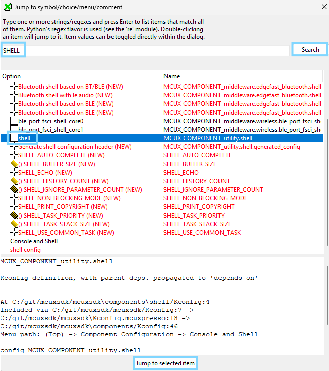
    <br/>

39. Modify guiconfig to include shell and the shell header
    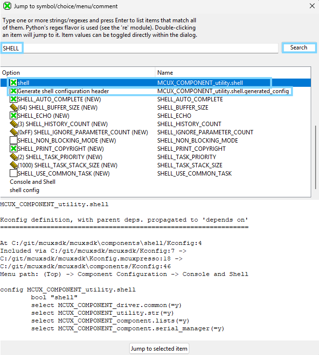
    <br/>

40. Verify changes were added to the .config file for new project.
    The following definitions can be found in the .config
    ```python
    CONFIG_MCUX_COMPONENT_utility.shell=y
    CONFIG_MCUX_COMPONENT_utility.shell.generated_config=y
    ```
    Now verify that these are included in the *prj.conf* file.  Remember that only changes captured in this file will be retained with a Pristine or Rebuild.

41. Build the Project with the Shell Kconfig settings. You will notice it STILL FAILS to build! What could be the cause?  

A quick way to identify differences between 2 projects is to explore the differences between the .config files.  VS Code provides an easy way for you to highlight the remaining difference that may be causing build failure.

    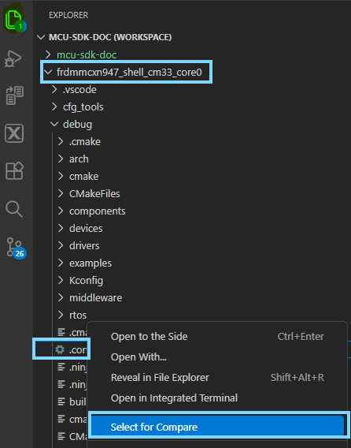
    <br/>

    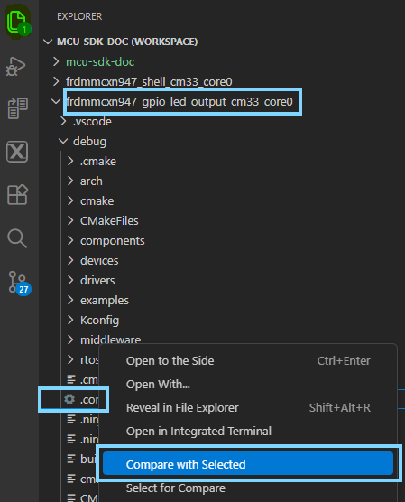
    <br/>

Once the second .config is chosen to be compared to the first, VS Code provides a Diff view that highlights areas of differences in red.
From this you will notice 2 issues.  Both are the result of the projects using different versions of a component the full vs. lite  
The first shows *gpio_led_output* uses assert.lite:
    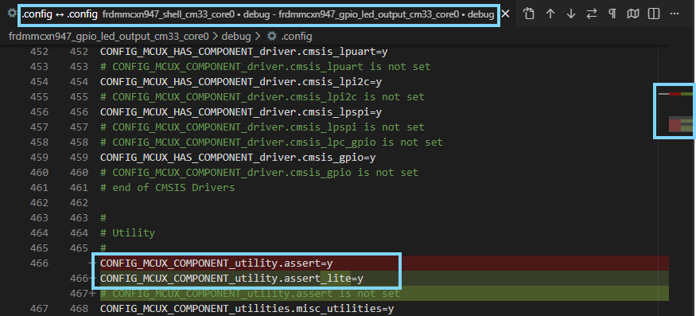
    <br/>

The second shows *gpio_led_output* uses debug_console.lite:  
    
    <br/>

The quickest way to resolve these differences?
Add these requirements to the **prj.conf** file in the workspace for the *gpio_led_output*.

42. Open the **prj.conf** file for the *gpio_led_output* project to add these required Kconfig symbols:
    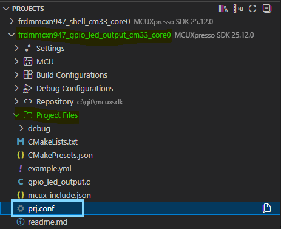
    <br/>

43. Add the following Kconfig Symbols to the target *gpio_led_output* project.
    ```python
    CONFIG_MCUX_COMPONENT_utility.shell=y
    CONFIG_MCUX_COMPONENT_utility.debug_console=y
    CONFIG_DEBUG_CONSOLE_RX_ENABLE=n
    CONFIG_MCUX_COMPONENT_utility.assert=y
    CONFIG_MCUX_COMPONENT_utility.shell.generated_config=y
    ```
    **_NOTE:_** You may have checked the prj.conf of the shell project. You will see these Symbols are defined for the project. In future cases, it is good to review the prj.conf AND .config to see what Kconfig values may be required for reference code to build properly.

44. Build and Debug the project. The build will complete succesfully.
Now the Serial Monitor will display the newly added Shell terminal.  
You may enter the same commands from the Shell example. However, now the valid use case is only for `led on 1` due to the simplified commands.

# Additional Resources
-	[Configuration System Based on Kconfig](https://mcuxpresso.nxp.com/mcuxsdk/latest/html/develop/build_system/Configuration_System.html#configuration-system-based-on-kconfig)
-	[Kconfig interactive tools: guiconfig and menuconfig ](https://docs.MCUXpresso SDKproject.org/latest/build/kconfig/menuconfig.html)
-	[MCUXpresso SDK Customized Kconfig Rules](https://mcuxpresso.nxp.com/mcuxsdk/latest/html/develop/build_system/Configuration_System.html#mcuxpresso-sdk-customized-kconfig-rules)
-   [MCUXpresso FAQs on Kconfig](https://mcuxpresso.nxp.com/mcuxsdk/latest/html/develop/build_system/Frequently_Asked_Questions.html#kconfig)