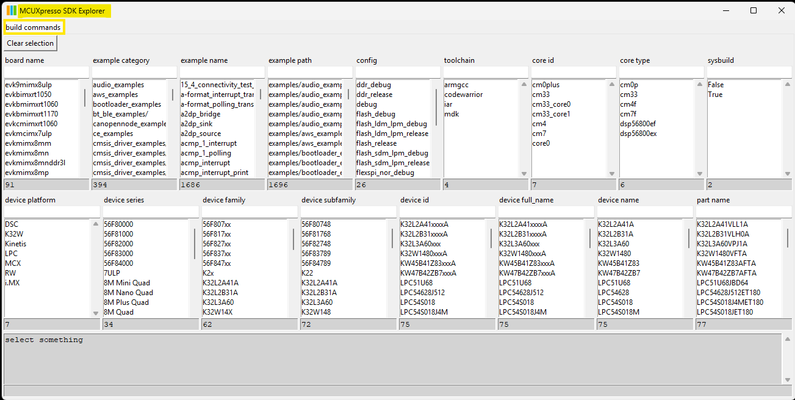

# Users Guide: How Kconfig is used in MCUXpresso SDK Projects
   Explain what this document will provide to the reader  

---
## 1 What is Kconfig
   Kconfig is a **selection-based configuration system** originally developed for the Linux kernel. In MCUXpresso SDK, it's used to:

   - Select software components
   - Resolve dependencies
   - Enable/disable features
   - Customize build-time configurations

   It complements **CMake** in the SDK's build system, allowing dynamic configuration of projects at runtime.

---
## 2 Why was Kconfig introduced
   High level message on the benefits of changing to Kconfig vs. alternative/prior methods  
   1. **Component Selection with Dependency Resolution**  
   Automatically includes required components when you enable a feature.

   2. **Feature Customization**  
   Toggle features on/off (e.g., enabling FreeRTOS heap types, peripheral drivers).

   3. **Centralized Configuration**  
   All settings are managed via `.config` and header files generated from Kconfig.

   4. **GUI and CLI Interfaces**  
   Use either a terminal-based (`menuconfig`) or graphical (`guiconfig`) interface to configure your project.[2](https://community.nxp.com/t5/MCUXpresso-Training-Hub/MCUXpresso-SDK-Kconfig-Usage/ta-p/2026947)

   5. **Integration with CMake**  
   Seamlessly works with CMake to generate build files and configuration headers.


---
## 3 How do you know if a project has Kconfig
   Do all projects support Kconfig?
   - **`Kconfig`**: Defines available options.  
   - **`prj.conf`**: Pre-set values for Kconfig symbols.  
   - **`.config`**: Generated output used during build.  
   - **Config headers**: Used in source code for conditional compilation.[1](https://mcuxpresso.nxp.com/mcuxsdk/25.09.00-pvw1/html/develop/build_system/Configuration_System.html)


   ### 3.1 PRJ.CONF Priority Paths
   These files are automatically loaded in order of increasing priority:
   1. `devices/prj.conf`
   2. `devices/<soc_series>/<device>/<core_id>/prj.conf`
   3. `examples/_boards/<board>/<core_id>/prj.conf`
   4. `examples/<example_category>/<example>/prj.conf`

   You can also override with:
   - `CUSTOM_PRJ_CONF_PATH` in `CMakeLists.txt`
   - `-DCONF_FILE=<custom_config>` in the build command[2](https://community.nxp.com/t5/MCUXpresso-Training-Hub/MCUXpresso-SDK-Kconfig-Usage/ta-p/2026947)

---
## 4 Tools that help with Kconfig
I think Zephyr also has this problem, I am not very clear how Zephyr handle it.
Although generally the settings shown in GuiConfig are all configurable, I still suggest document the key settings like what LVGL example readme has done, because the settings are verified by us, they are the recommended way to use the features.
About how to select, although user can browse and select using menuconfig/guiconfig, the suggested way is passing settings “-DCONFIG_xxx=x” in west build command, because of this Kconfig pitfall: https://docs.zephyrproject.org/latest/build/kconfig/tips.html#stuck-symbols-in-menuconfig-and-guiconfig.

   ### 4.1 GuiConfig
   Use **VS Code integration** to launch Kconfig GUI directly from the IDE.  

   ### 4.2 Menuconfig
   Use terminal to launch menuconfig for a project

   ### 4.3 West Explorer
   The visibility into the location and use of Kconfig variables can be dificult to organize for a given project.  
   The MCUXpresso SDK Explorer has a Kconfig wiew that parses all Kconfig information.  
   This allows you to see where a value originates and where it is referenced.  
   This can help you better work with the Kconfig described above.  
   

   ### 4.4 Command Line utilities

---
## 5 Walkthrough Actual SDK Project with Kconfig
   - Use project that has benefits of Kconfig
   - Show the same scenarios with and without Kconfig
   - Use tools to explore and understand configuration
   - Show examples of where to SAVE configuration
      There is prj.conf for each project. Do you mean add more prj.conf, for example prj_panel_a.conf, prj_panel_b.conf?
   - Explain what determines projects level of Kconfig  

   ### 5.1 RT700 example of using Kconfig
   The RT700 LVGL project readme has been updated: https://bitbucket.sw.nxp.com/projects/MCUCORE/repos/mcuxsdk-examples/browse/_boards/mimxrt700evk/lvgl_examples/lvgl_examples_readme.md  
 
   The RT700 LVGL project is a typical use case that needs to support user configurations. It has several panels that can be selected by Kconfig. And for each panel, there is also panel specific settings. It has LVGL provided settings, and NXP defined settings. We can use this project to better understand the use of Kconfig:

   Another topic is configuration for non-Kconfig users (KEX package users), the only way is modifying mcux_config.h directly.  
   Currently the steps are described in readme. Without the Kconfig’s help, the steps are complex and not user friendly:  
      1.	Configuration dependency: When changing one variable in Kconfig, other variables can change accordingly. For example, to use pixel format XRGB8888 in LVGL, with Kconfig we only need to add
      `-DCONFIG_LV_COLOR_DEPTH_32=y` in build command, but without Kconfig, we need to modify several macros in mcux_config.h

      ```
      #define CONFIG_LV_COLOR_DEPTH 32 #define CONFIG_LV_DRAW_BUF_ALIGN 64 #define DEMO_RK055MHD091_USE_XRGB8888 1
      ```  
      2.	mcux_config.h doesn’t contain all configuration macros: The mcux_config.h is generated by Kconfig, because of Kconfig’s behavior, if one Kconfig variable is not selected, the variables based on this variable will not be generated into mcux_config.h. One example:
        

**DEMO_RM67162_BUFFER_FORMAT** is for panel *G1120B0MIPI*. The default panel is not *G1120B0MIPI* panel, so the **DEMO_RM67162_BUFFER_FORMAT** is not contained in mcux_config.h.  

When user wants to use that panel, they need to add **DEMO_RM67162_BUFFER_FORMAT** in mcux_config.h. The challenge is, how could user know what macros need be added? Currently this is described in LVGL project readme:
 
   

   ### 5.2 Project Configuration
   This project supports different panels and pixel formats.  There are two methods to configure.
   1. Configure by Kconfig.  Passing configuration flags during build: **west build ...**
   2. Configure by modifying the macros in the configure file *mcux_config.h*  
   **_NOTE:_** The mcux_config.h is generated by Kconfig.  If Kconfig is used, don't modify mcux_config.h directly.  The manual changes will be overwritten by Kconfig.    
   **_NOTE:_** When the macros to be modified don't exist in the mcux_config.h add them directly in mcux_config.h   

   ### 5.3 Other Topics of Working with a Project
   - After modifying settings, inspect `.config` to verify changes.
   - Use `--log-level=debug` during build to trace configuration sources.[3](https://mcuxpresso.nxp.com/mcuxsdk/25.09.00/html/develop/build_system/Frequently_Asked_Questions.html)

---
## 6 Conclusion & What Next
   Repeat the goal of the document
   Introduce next steps for the reader.
   Highlight sections of the SDK documentation.  What it details
   Highlight other resources to learn more.

