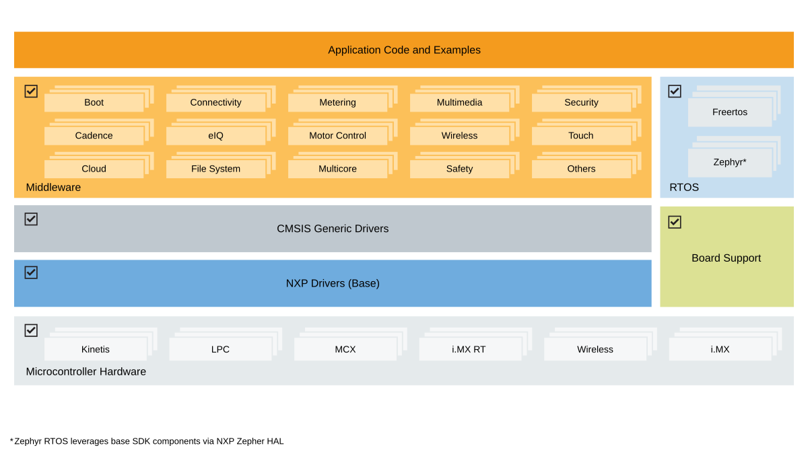

# MCUXpresso Software Development Kit (SDK)

The MCUXpresso SDK is a comprehensive software enablement package designed to
simplify and accelerate application development with Arm® Cortex®-M based
devices from NXP, including its general purpose, crossover and
wireless-enabled MCUs. It includes production-grade software with integrated
enabling software technologies (stacks and middleware), reference examples,
and more.



## Features

### Comprehensive Driver Library
- Flexible peripheral drivers for rapid development
- Optimized for performance and code size

### RTOS Integration
- FreeRTOS support with optimized configurations
- Real-time application frameworks
- Task management and scheduling examples

### Middleware Components
- Connectivity stacks (USB, Ethernet, wireless, communication protocols)
- AI inference engines and neural network libraries
- Audio processing and voice recognition libraries
- Security frameworks and cryptographic libraries
- Graphics and user interface components
- Motor control and real-time control libraries
- File systems and storage solutions
- Partner middleware can be added using CMake and west manifests

### Extensive Examples
- Basic peripheral use cases to full technology demonstrations
- Board-specific reference implementations
- Out-of-box Demo Applications
- Middleware component examples and integrations

## Distribution Formats

MCUXpresso SDK is available in two main formats:

### GitHub Repository SDK
Git-based distribution hosted on GitHub for modular development, continuous
updates, and collaborative workflows. The SDK uses multiple repositories
managed by the Zephyr west tool to provide flexible, component-based
development. See [Getting Started](../gsd/install/index.rst) for setup
instructions.

### SDK Package
Downloadable packages from [SDK Builder](https://mcuxpresso.nxp.com/) for
offline development. Starting with release 25.12.00, two package versions are
available:

- **Classic SDK Package**: Traditional board-specific packages with
  pre-configured IDE projects for MCUXpresso IDE, IAR, Keil, and other
  toolchains.
- **Repository-Layout SDK Package**: Board-specific packages that maintain the
  same structure and build system as the GitHub Repository SDK, providing
  offline access to the repository-based development experience. Available
  when selecting the ARMGCC toolchain.

```{note}
From version 25.12.00 onward, selecting ARMGCC downloads the
Repository-Layout version; all other toolchains remain in the Classic
version.
```

## Delivery and Release

NXP integrates Coverity® Static Analysis and Black Duck Software Composition
Analysis into the SDK development process to deliver secure, high-quality
software.

- **Annual releases (June)** for popular products, with Long Term Support
  (LTS) on GitHub — back-ported security (SVE/PSIRT) and severe bug fixes for
  two years.
- **Quarterly releases** for NPI and recent products.
- SBOMs provided for all GitHub SDK repositories.

| Release | Release Name | Maintenance |
|:-------:|:------------:|:-----------:|
| LTS     | 26.06.00-LTS | 2 years until June 2028 |
| Quarterly | 26.09.00 | None, rebase to mainline |
| LTS     | 27.06.00-LTS | 2 years until June 2029 |

Supported platforms are listed at
[mcuxpresso.nxp.com/sdk-versions](https://mcuxpresso.nxp.com/sdk-versions).

## Toolchain Support

All driver examples and most application examples are provided for the
following toolchains:

| Toolchain | GitHub | Archive/Zip | Generated (west) | Getting Started |
|:---------:|:------:|:-----------:|:----------------:|:---------------:|
| MCUXpresso IDE | ❌ | ✅ eclipse | ❌ | [Link](../gsd/package/run_a_demo_using_mcuxpresso_ide.md) |
| MCUXpresso for VS Code | ✅ | ✅ CMake | N.A. | [Link](../gsd/run_a_demo_using_mcuxvsc.md) |
| IAR Embedded Workbench | ✅ | ✅ EWARM | ✅ EWARM | [Link](../gsd/package/run_a_demo_application_using_iar.md) |
| Keil™ MDK-Arm | ❌ | ✅ uVision | ✅ uVision | [Link](../gsd/package/run_a_demo_using_keil__mdk_vision.md) |
| CLI GNU toolchain | ✅ | ✅ CMake | N.A. | [Link](../gsd/run_project.md) |

Archive/Zip packages can be downloaded from
[SDK Builder](https://mcuxpresso.nxp.com) or imported directly in VS Code and
MCUXpresso IDE using the
[Import Wizard](../gsd/install/ide_import_wizard.md). 

IAR and Keil projects can
be generated from the GitHub SDK CMake examples using a
[west build command](../gsd/cli.md).

## Repository Architecture

The SDK uses a multi-repository structure on GitHub managed by the
[Zephyr West Tool](https://docs.zephyrproject.org/latest/guides/west/index.html),
enabling:

- **Modular Organization**: Drivers, RTOS, middleware, and examples in
  separate repositories
- **Customizable Manifests**: Targeted setups for specific requirements
- **Selective Downloads**: Include only needed components
- **Independent Updates**: Component-level version control
- **Scalable Integration**: Easy addition of new repository components

## Support and Resources

### Community Support
- Open GitHub issues and discussions for questions and contributions
- [MCUXpresso SDK Community Forum](https://community.nxp.com/t5/MCUXpresso-SDK/bd-p/mcuxpresso-sdk)
- [MCUXpresso Software and Tools Forum](https://community.nxp.com/t5/MCUXpresso-Software-and-Tools/ct-p/mcuxpresso)

### Documentation
- Comprehensive guides and API documentation [online](https://mcuxpresso.nxp.com/mcuxsdk/latest/html/index.html)

### Technical Support
- [NXP Support](https://www.nxp.com/support/support:SUPPORTHOME) for
  commercial development assistance

### SDK Product Page
- [MCUXpresso SDK on NXP.com](https://www.nxp.com/design/design-center/software/development-software/mcuxpresso-software-and-tools-/mcuxpresso-software-development-kit-sdk:MCUXpresso-SDK)

### Trainings
- [MCUXpresso Training Hub](https://community.nxp.com/t5/MCUXpresso-Training-Hub/tkb-p/MCUXpresso-Training)
- [MCUXpresso SDK Curriculum](https://community.nxp.com/t5/MCUXpresso-General/bd-p/mcuxpresso)
