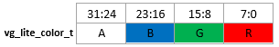

# Common parameter types

The VGLite graphics API uses a naming convention scheme wherein definitions are preceded by `vg_lite.`

Below is the list of types and structures in the driver implementation.

|Name|Typedef|Value|
|----|-------|-----|
|vg\_lite\_bool\_t|int|A signed 32-bit integer 0: FALSE; 1: TRUE.|
|vg\_lite\_int8\_t|char|A signed 8-bit integer|
|vg\_lite\_uint8\_t|unsigned char|An unsigned 8-bit integer|
|vg\_lite\_int16\_t|short|A signed 16-bit integer|
|vg\_lite\_uint16\_t|unsigned short|An unsigned 16-bit integer|
|vg\_lite\_int32\_t|int|A signed 32-bit integer|
|vg\_lite\_uint32\_t|unsigned int|An unsigned 32-bit integer|
|vg\_lite\_uint64\_t|unsigned long long|An unsigned 64-bit integer|
|vg\_lite\_float\_t|float|A 32-bit single precision floating point number|
|vg\_lite\_double\_t|double|A 64-bit double precision floating point number|
|vg\_lite\_char\_t|char|A signed 8-bit integer|
|vg\_lite\_string|char\*|A pointer to a character string|
|vg\_lite\_pointer|void\*|A generic address pointer \(void \*\). On 32-bit OS, it is a 32-bit address pointer. On 64-bit OS, it is a 64-bit address pointer.|
|vg\_lite\_void|void|The void type|
|vg\_lite\_color\_t|vg\_lite\_uint32\_t|A 32-bit color value   The color value specifies the color used in various functions.   The color is formed using 8-bit RGBA channels.   The red channel is in the lower 8-bit of the color value, followed by the green and blue channels.   The alpha channel is in the upper 8-bit of the color value.    For L8 target formats, the RGB color is converted to L8 by using the default ITU-R BT.709 conversion rules.|
|VG\_LITE\_S8|enum vg\_lite\_format\_t|A signed 8-bit integer coordinate|
|VG\_LITE\_S16|enum vg\_lite\_format\_t|A signed 16 bit integer coordinate|
|VG\_LITE\_S32|enum vg\_lite\_format\_t|A signed 32-bit integer coordinate|
|VG\_LITE\_FP32|enum vg\_lite\_format\_t|A 32-bit floating point coordinate|

**Parent topic:**[Common parameters and error values](../topics/common_parameters_and_error_values.md)

