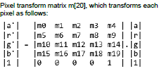

# Matrix control float parameter type

|Name|Typedef|Value|
|------|---------|-------|
|`vg_lite_float_t`|float|A single-precision floating-point number|
|`vg_lite_pixel_matrix_t` \[20\]|vg\_lite\_float\_t||

**Parent topic:**[Matrices](../topics/matrices.md)

