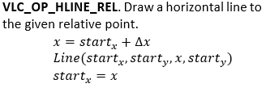

# Vector path opcodes for plotting paths

The following opcodes are path drawing commands available for vector path data.

A path operation is submitted to the GPU as \[Opcode \| Coordinates\]. The operation code is stored as a VG\_LITE\_S8 while the coordinates are specified via [vg\_lite\_format\_t](common_parameter_types.md).

|Opcode|Arguments|Description|
|--------|-----------|-------------|
|0x00|None|**VLC\_OP\_END**. Finish tessellation. Close any open path.|
|0x01|None|**VLC\_OP\_CLOSE**. For VGLite driver internal use only. Application should not use this OP directly.|
|0x02|\(x, y\)| |
|0x03|\(∆x, ∆y\)| |
|0x04|\(x, y\)| |
|0x05|\(∆x, ∆y\)||
|0x06|\(cx, cy\) \(x, y\)||
|0x07|\(∆cx, ∆cy\) \(∆x, ∆y\)||
|0x08|\(cx-1, cy1\) \(cx2, cy2\) \(x, y\)| |
|0x09|\(∆cx-1, ∆cy1\) \(∆cx2, ∆cy2\) \(∆x, ∆y\)||
|0x0A|None|**VLC\_OP\_BREAK**. Indicates 64-bit path data \(including the opcode\) is a no-op.|
|0x0B|\(x\)| |
|0x0C|\(∆x\)||
|0x0D|\(y\)||
|0x0E|\(∆y\)||
|0x0F|\(x,y\)||
|0x10|\(∆x,∆y\)||
|0x11|\(cx2,cy2\) \(x,y\)| |
|0x12|\(∆cx2,∆cy2\) \(∆x,∆y\)| |
|0x13|\(rh,rv,rot,x,y\)||
|0x14|\(rh,rv,rot,x,y\)||
|0x15|\(rh,rv,rot,x,y\)||
|0x16|\(rh,rv,rot,x,y\)||
|0x17|\(rh,rv,rot,x,y\)||
|0x18|\(rh,rv,rot,x,y\)||
|0x19|\(rh,rv,rot,x,y\)||
|0x1A|\(rh,rv,rot,x,y\)||

**Parent topic:**[Vector path control](../topics/vector_path_control.md)

