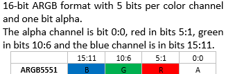
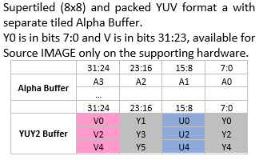

# vg\_lite\_buffer\_format\_t enumeration

This enumeration specifies the color format to use for a buffer. This applies to both image and Render Target. Formats include supported swizzles for RGB. For YUV swizzles, use the related values and parameters in `vg_lite_swizzle_t.`

The application shall use the [vg\_lite\_query\_feature](vg_lite_query_feature_function.md) API to determine support for some hardware-specific formats. For example, related `vg_lite_feature_t` enum values include `gcFEATURE_BIT_VG_RGBA2_FORMAT` and `gcFEATURE_BIT_VG_IM_INDEX_FORMAT`.

*\(Alignment columns refined March and Sept 2023\)*

Used in structure: `vg_lite_buffer_t`.

See also `vg_lite_blit`, `vg_lite_clear`, `vg_lite_draw`.

**Attention:** **OpenVG VGImageFormat Note**: The bits for each color channel are stored within a machine word from MSB to LSB in the order indicated by the pixel format name. This is the opposite of the original `VG_LITE_*` formats that are ordered from LSB to MSB. The formats with the same organization are listed in the same row as their `VG_Lite` counterparts.

**Attention:** **Original VGLite API Image Format Note**: The bits for each color channel are stored within a machine word from LSB to MSB in the order indicated by the pixel format name. This is the opposite of the `OPENVG VG_*` formats that are ordered from MSB to LSB.

The following codes, as also used in OpenVG 1.1 Specification Table 11, are used for format description:

-   A - Alpha channel
-   B - Blue color channel
-   G - Green color channel
-   R - Red color channel
-   X - Uninterpreted padding byte or bit
-   L - Grayscale
-   BW - 1-bit black and white
-   l - Linear color space
-   s - Non-linear \(sRGB\) color space
-   PRE - Alpha values are premultiplied

|vg\_lite\_buffer\_format\_t String Value|Description|Supported as source|Supported as destination|Start address/ Stride alignment: bytes|
|----------------------------------------|-----------|-------------------|------------------------|--------------------------------------|
|`VG_LITE_ABGR8888` `VG_sRGBA_8888` `VG_sRGBA_8888_PRE` `VG_lRGBA_8888` `VG_lRGBA_8888_PRE`| |Yes|Yes|Start 4B / Stride 64B|
|`VG_LITE_ARGB8888` `VG_sBGRA_8888` `VG_sBGRA_8888_PRE` `VG_lBGRA_8888` `VG_lBGRA_8888_PRE`| |Yes |Yes|Start 4B / Stride 64B|
|`VG_LITE_BGRA8888` `VG_sARGB_8888` `VG_sARGB_8888_PRE` `VG_lARGB_8888` `VG_lARGB_8888_PRE`| |Yes |Yes|Start 4B / Stride 64B|
|`VG_LITE_RGBA8888` `VG_sABGR_8888` `VG_sABGR_8888_PRE` `VG_lABGR_8888` `VG_lABGR_8888_PRE`| |Yes|Yes |Start 4B / Stride 64B|
|`VG_LITE_BGRX8888` `VG_sXRGB_8888` `VG_lXRGB_8888`||Yes|Yes|Start 4B / Stride 64B|
|`VG_LITE_RGBX8888` `VG_sXBGR_8888` `VG_lXBGR_8888`||Yes|Yes|Start 4B / Stride 64B|
|`VG_LITE_XBGR8888` `RGBX` `VG_sRGBX_8888` `VG_lRGBX_8888`| |Yes |Yes |Start 4B / Stride 64B|
|`VG_LITE_XRGB8888` `VG_sBGRX_8888` `VG_lBGRX_8888`| |Yes|Yes|Start 4B / Stride 64B|
|`VG_LITE_ABGR1555` `VG_sRGBA_5551`| |Yes|Yes|Start 4B / Stride 32B|
|`VG_LITE_ARGB1555` `VG_sBGRA_5551`| |Yes|Yes|Start 4B / Stride 32B|
|`VG_LITE_BGRA5551` `VG_sARGB_1555`| |Yes|Yes |Start 4B / Stride 32B|
|`VG_LITE_RGBA5551` `VG_sABGR_1555`| |Yes|Yes|Start 4B / Stride 32B|
|`VG_LITE_BGR565` `VG_sRGB_565`| |Yes|Yes|Start 4B / Stride 32B|
|`VG_LITE_RGB565` `VG_sBGR_565`| |Yes|Yes|Start 4B / Stride 32B|
|`VG_LITE_ABGR4444` `VG_sRGBA_4444`||Yes|Yes|Start 4B / Stride 32B|
|`VG_LITE_ARGB4444` `VG_sBGRA_4444`||Yes |Yes|Start 4B / Stride 32B|
|`VG_LITE_BGRA4444` `VG_sARGB_4444`||Yes|Yes|Start 4B / Stride 32B|
|`VG_LITE_RGBA4444` `VG_sABGR_4444`||Yes|Yes|Start 4B / Stride 32B|
|`VG_LITE_YUY2` `VG_LITE_YUYV`||Yes|No|Start 4B / Stride 32B|
|`VG_LITE_A4` `VG_A_4`| |Yes|No|Start 4B / Stride 8B|
|`VG_LITE_A8` `VG_A_8`|  |Yes|Yes|Start 4B / Stride 16B|
|`VG_LITE_L8` `VG_sL_8` `VG_lL_8`||Yes|Yes|Start 4B / Stride 16B|

|Hardware-dependent formats for vg\_lite\_buffer\_format\_t|Description|Supported as source|Supported as destination|Alignment \(bytes\)|
|----------------------------------------------------------|-----------|-------------------|------------------------|-------------------|
|`VG_LITE_ABGR2222`| |Yes|Yes|Start 4B / Stride 16B|
|`VG_LITE_ARGB2222`| |Yes|Yes|Start 4B / Stride 16B|
|`VG_LITE_BGRA2222`| |Yes|Yes|Start 4B / Stride 16B|
|`VG_LITE_RGBA2222`| |Yes|No|8B|
|`VG_LITE_INDEX_1`|1-bit index format|Yes|No|8B|
|`VG_LITE_INDEX_2`|2-bit index format|Yes|No|both 8B|
|`VG_LITE_INDEX_4`|4-bit index format|Yes|No|both 8B|
|`VG_LITE_INDEX_8`|8-bit index format|Yes|No|both 16B|
|`VG_LITE_NV12_TILED`| |Yes|No|Y: both 16 Bytes UV: both 8 Bytes|
|`VG_LITE_ANV12_TILED`||Yes|No|A, Y: both 16 Bytes UV: both 8 Bytes|
|`VG_LITE_AYUY2_TILED`||Yes|No|both 32B|
|`VG_LITE_RGB888`| |Yes|Yes|Start 4B / Stride 32B|
|`VG_LITE_BGR888`| ||Yes|Yes|Start 4B / Stride 32B|
|`VG_LITE_ARGB8565`|||Yes|Yes|Start 4B / Stride 32B|
|`VG_LITE_BGRA5658`||Yes|Yes|Start 4B / Stride 32B|
|`VG_LITE_ABGR8565`||Yes|Yes|Start 4B / Stride 32B|
|`VG_LITE_RGBA5658`||Yes|Yes|Start 4B / Stride 32B|

**Parent topic:**[Pixel buffer enumerations](../topics/pixel_buffer_enumerations.md)

