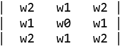
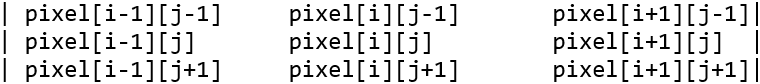
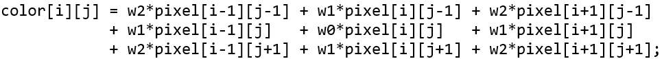
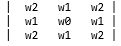

# `vg_lite_gaussian_filter` function 

**Description:**

This function sets 3x3 gaussian blur weighted values to filter an image pixel. *\(from March 2023\)*

The parameters w0, w1, w2 define a 3x3 gaussian blur weight matrix as:



The sum of the 9 kernel weights must be 1.0 to avoid convolution overflow \( w0 + 4\*w1 + 4\*w2 = 1.0 \).

The 3x3 weight matrix applies to a 3x3 pixel block:



With the following dot product equation:



Applications can use `VGLite API vg_lite_query_feature` \(`gcFEATURE_BIT_VG_GAUSSIAN_BLUR`\) to determine HW support for gaussian blur.

**Syntax:**

```
vg_lite_error_t vg_lite_gaussian_filter (
    vg_lite_float_t               w0
    vg_lite_float_t               w1
    vg_lite_float_t               w2
);

```

**Parameters:**


|Parameter|Description|
|---------|-----------|
|`w0, w1, w2`|w0, w1, w2 define a 3x3 gaussian blur weighted matrix as: 


**Returns:**

`VG_LITE_SUCCESS` if successful. Otherwise, `VG_LITE_NOT_SUPPORT` if gaussian blur is not supported in hardware.

**Parent topic:**[Blit functions](../topics/blit_functions.md)

