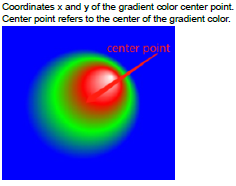
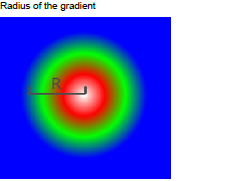
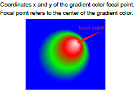

# `vg_lite_radial_gradient_parameter_t` structure

This structure defines the gradient radius and the X and Y coordinates for the center and focal points of the gradient *\(from November 2020, requires GC355 or GC555 hardware\)*.

Used in radial gradient structure: `vg_lite_radial_gradient_t`.

|vg\_lite\_radial\_gradient\_parameter\_t member|Type|Description|
|-------------------------------------------------|------|-------------|
|`cx`|`vg_lite_float_t`||
|`cy`|`vg_lite_float_t`|
|`r`|`vg_lite_float_t`| |
|`fx`|`vg_lite_float_t`||
|`fy`|`vg_lite_float_t`|

**Parent topic:**[Draw and gradient structures](../topics/draw_and_gradient_structures.md)

