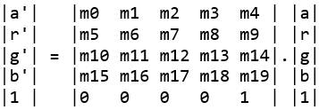

# `vg_lite_set_pixel_matrix` function 

**Description:**

This function sets up a pixel transform matrix m\[20\] which transforms each pixel as follows:



The pixel transform for the A, R, G, B channels can be enabled/disabled individually with the channel parameter.

Applications can use VGLite API `vg_lite_query_feature` \(`gcFEATURE_BIT_VG_PIXEL_MATRIX`\) to determine HW support for gaussian blur.

**Syntax:**

```
vg_lite_error_t vg_lite_set_pixel_matrix (
    vg_lite_pixel_matrix_t           matrix,
    vg_lite_pixel_channel_enable_t   *channel
);
```

**Parameters:**

|Name|Description|
|----|-----------|
|`*matrix`|Specifies the `vg_lite_pixel_matrix_t` pixel transform matrix that will be loaded.|
|`*channel`|Pointer to the `vg_lite_pixel_channel_enable_t` structure used to enable/disable individual channels.|

**Returns:**

Returns `VG_LITE_SUCCESS` if the function is successful. See [vg\_lite\_error\_t](vg_lite_error_t_enumeration.md) enum for other return codes.

**Parent topic:**[Matrix control functions](../topics/matrix_control_functions.md)

