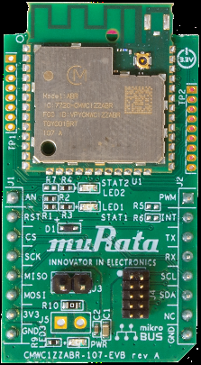

# Assembly instructions

Mount the CMWC1ZZABR-107-EVB adapter to the mikroBUS connector on your board. Make sure that the pin labeling matches the pin orientation between the boards.

|

|

| 

|

**Parent topic:**[Hardware overview](../topics/hardware_overview.md)

