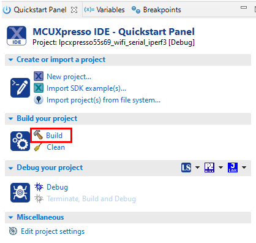
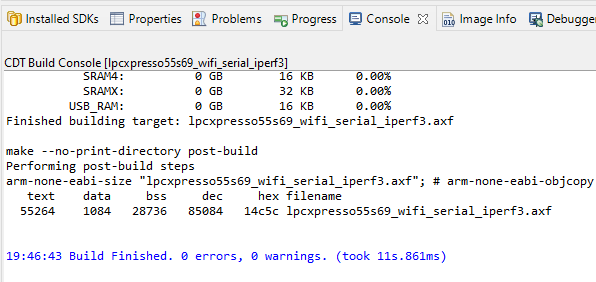

# Build application

1.  Select a project folder
2.  Click the **Build** link in the **Quickstart Panel**.

    |

|

3.  Wait until the project is built.
4.  Verify that the build finished without any errors.

    |

|

**Parent topic:**[Run Wi-Fi demo application](../topics/run_wi-fi_demo_application.md)

