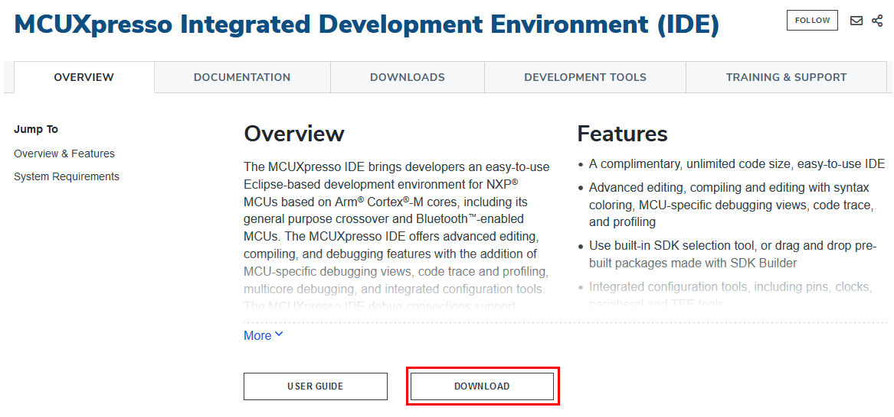

# Download and Install MCUXpresso IDE

1.  Open [http://www.nxp.com/mcuxpresso/ide](http://www.nxp.com/mcuxpresso/ide).
2.  Click the **Download** button.

    |

|

3.  Follow the wizard and install the MCUXpresso IDE application.

**Parent topic:**[Software installation](../topics/software_installation.md)

