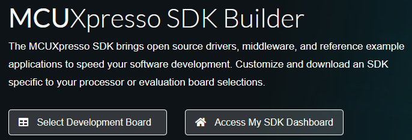
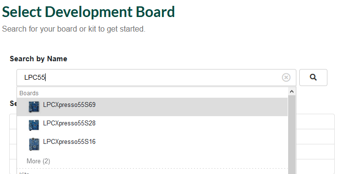
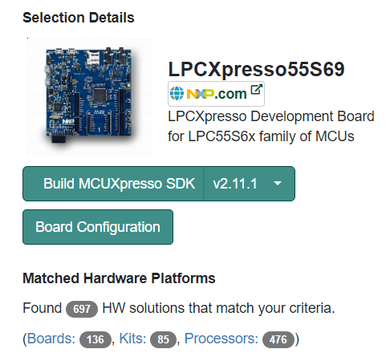
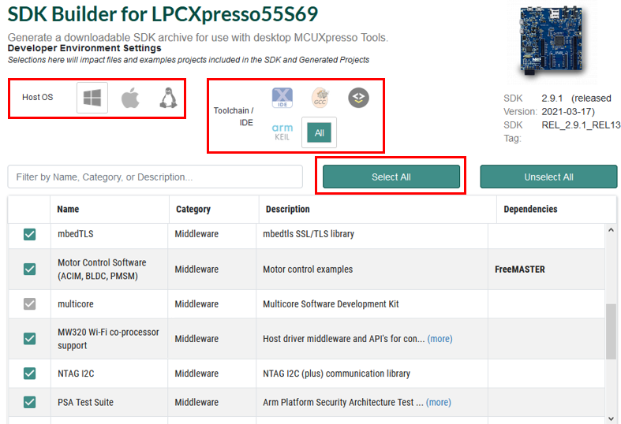
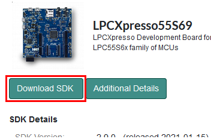

# Download and Install MCUXpresso SDK

1.  Open [https://mcuxpresso.nxp.com/en/welcome](https://mcuxpresso.nxp.com/en/welcome).
2.  Select a development board, as shown in [Figure 1](download_and_install_mcuxpresso_sdk.md#SDKBUILDER).

    |

|

3.  Select a board from the drop-down list, as shown in [Figure 2](download_and_install_mcuxpresso_sdk.md#SEDEBO).

    |

|

4.  Click **Build MCUXpresso SDK**, as shown in [Figure 3](download_and_install_mcuxpresso_sdk.md#BUMCXSDK).

    |

|

5.  Select the Host Operating System.
6.  Select the Toolchain/IDE.
7.  Click the **Select All** button to select the components.

    |

|

8.  After selecting the desired components, click the **Download SDK** button.

    |

|

9.  Wait until the build finishes and the download the SDK zip file.

**Parent topic:**[Software installation](../topics/software_installation.md)

