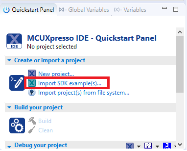
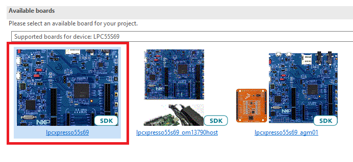
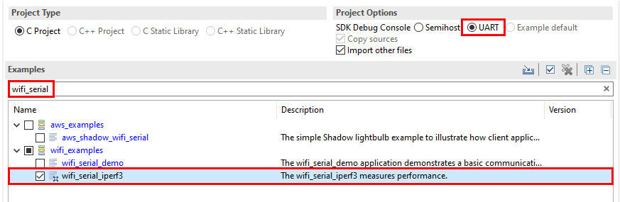
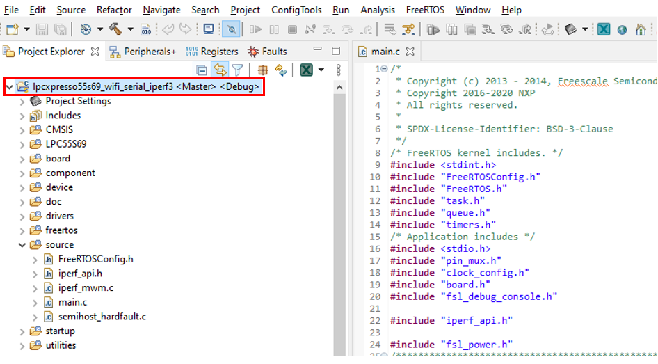

# Import a Wi-Fi demo application

1.  On the **Quickstart Panel** and click the **Import SDK example\(s\)** link.

    |

|

2.  Select the **LPCXpresso55xx** evaluation board and click **Next**.

    |

|

3.  Locate *wifi\_examples* under**Examples**.
4.  Select the *wifi\_serial\_iperf3* demo.
5.  Select **UART** for the **SDK Debug Console**.

    |

|

6.  Click **Finish**.
7.  Verify that the demo is loaded in the workspace.

    |

|

**Parent topic:**[Run a Wi-Fi demo](../topics/run_a_wi-fi_demo.md)

