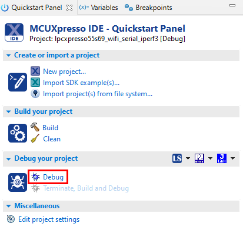
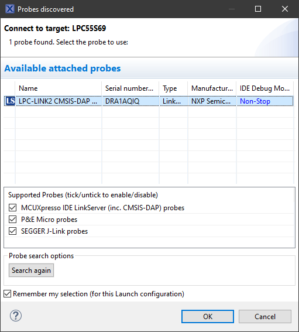
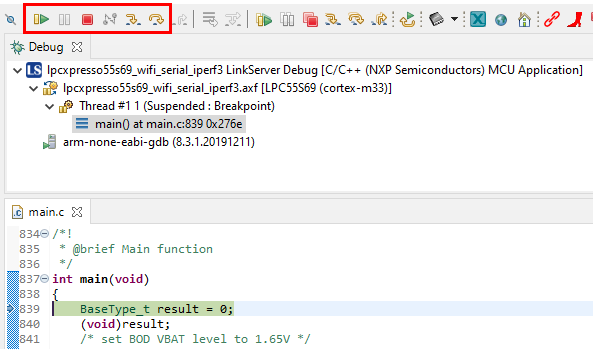

# Program application to EVK

1.  Click the **Debug** link in the **Quickstart Panel**.

    |

|

2.  Select a debugging probe.
3.  Click **OK**.

    |

|

4.  Verify the application stops at main\(void\) function.
5.  Click **Terminate,** to close the debugging session, and run the application. If preferred, you can debug the application.

    |

|

**Parent topic:**[Run Wi-Fi demo application](../topics/run_wi-fi_demo_application.md)

