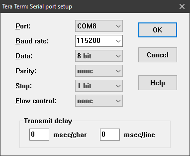
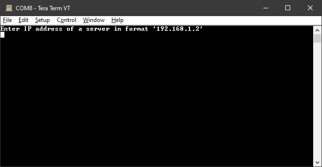
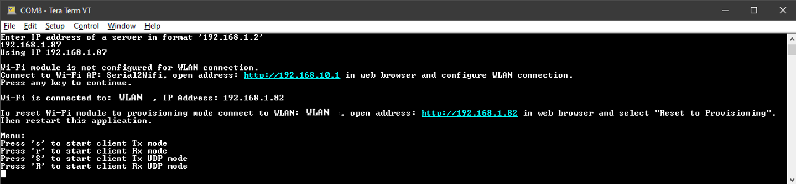

# Run iPerf3 application

1.  Open a terminal emulator application such as TeraTerm or puTTY.
2.  Configure a connection with the COM port of your board using the following settings:

    -   115200 baud rate
    -   8-bit data, no parity,
    -   1-bit stop, no flow control
    |

|

3.  Press the reset button on the evaluation board or restart the debugging session. The following message appears on your terminal.

    |

|

4.  Enter the IP address of the iPerf3 server. It is the IP address of the PC connected to the board.
5.  After entering the IP address, the demo boots in provisioning mode.

    |

|

6.  Use your smartphone or PC to connect to the uAP created by the application.
    -   SSID: Serial2Wifi
    -   Password: nxp12345
7.  After successfully connected to the uAP network, open address: [http://192.168.10.1](http://192.168.10.1) in a web browser.
8.  Select **Provisioning**.
9.  Select the WLAN you want to connect to and provide network credentials.

    **NOTE** The Wi-Fi module stores the WLAN credentials and it will use them automatically for next connection.

10. Press any key on the terminal application to see the menu of the application.

    |

|

11. Press s, r, S, R to run iPerf tests using different settings.

**Parent topic:**[Run Wi-Fi demo application](../topics/run_wi-fi_demo_application.md)

