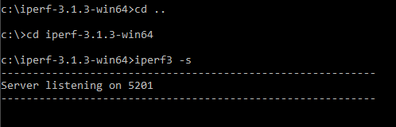

# Run iPerf3 server

1.  Download and install iPerf3 from [https://iperf.fr/iperf-download.php](https://iperf.fr/iperf-download.php).
2.  Open command line.
3.  Type the command **iperf3 -s** to start the iPerf3 TCP server.

    

**Parent topic:**[Run Wi-Fi demo application](../topics/run_wi-fi_demo_application.md)

