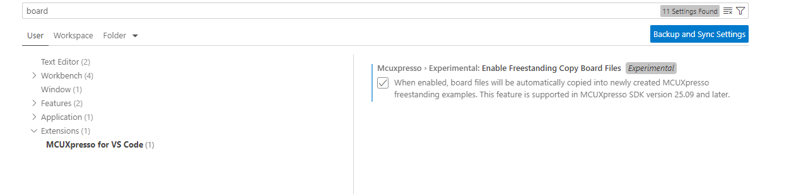

# Health care iot peripheral freestanding application creation issue 

The CMakeList.txt file to ensure correct application files work with different health_care_iot_peripheral applications (bm/freertos/threadx).
The project now includes a hciot_peripheral.cmake file that contains common application files. This modification creates problems when you build a freestanding application without the –bf option.
- without –bf option:
    - The application related files are no longer part of the project creation. The project uses the files part of the repo
    - This can be resolved by using the –bf option. 
- with --bf option:
    - the application files are placed in the <board> directory and in the root project directory. And you will find 2x main.c (with different content), one in the project root and one in the <board> directory. 
        - Only the version in the <board> directory is correct, and you can safely remove the main.c in the project root directory.
    - Compilation if failing in case of the threadx variant 
        - Safety.c is present twice in the project. The version in the project root directory is the correct version, You need to remove the safety.c in the <board> directory. 
        - Together with the removal of the safety.c file in the <board> directory you also need to modify the <board>/board_files.cmake and remove safety.c from the mcu_add_source() (line 110).

The MCUXpresso plugin for VS Code allows you to create a freestanding application that includes board files. Configure this feature in the MCUXpresso for VS Code settings.

