# MCUXpresso SDK Migration Guide

## Introduction
Starting with version **25.12.00**, the KEX package—a pre-built SDK distribution format—will discontinue support for the ARMGCC toolchain. Instead, ARMGCC will be provided through the repository ZIP package, aligning with the goal of unifying **CMake + Kconfig** support between the SDK package and the GitHub repository. When users select ARMGCC in SDK Builder, the system will generate the repository ZIP package rather than KEX. Additionally, because VS Code integration depends on ARMGCC, support for the KEX package in VS Code will end with version 25.12.00. To continue using VS Code, users should import the repository ZIP package from this version onward.

## Overview of Changes
- MCUXpresso IDE uses its own project format, while VS Code and GitHub workflows rely on CMake.
- The CMakeLists.txt and directory structure remain consistent across MCUXpresso IDE-supported SDKs and GitHub repositories.
- Migration focuses on environment setup rather than project restructuring.
- **Upcoming Change:** ARMGCC toolchain will no longer be included in the KEX package starting with version 25.12.00. Instead, ARMGCC will be delivered through the repository ZIP package to ensure unified CMake + Kconfig support.

## Migration Steps
Below are the steps to build and run an example application in VS Code:

# Using SDK Release 25.12.00
This guide will focus on those who use the repository ZIP package with ARMGCC toolchain in VS Code or command-line environments.

##  Installing the SDK Repository

 There are two ways to obtain the SDK repository:
 ### Option 1: Download from SDK Builder
 1. Navigate to [NXP's SDK Builder](https://mcuxpresso.nxp.com/en/builder)
 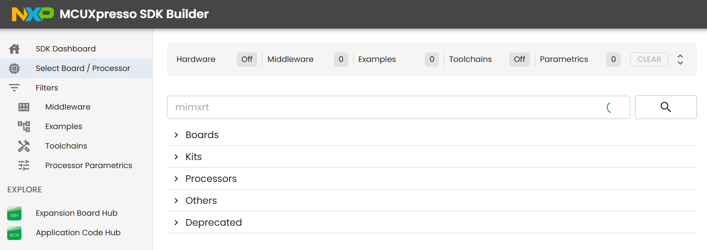
 2. Select your board
 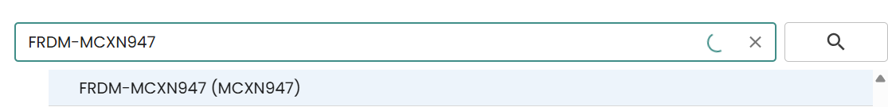
 3. Choose **ARM GCC / VS Code** package format (not KEX)
 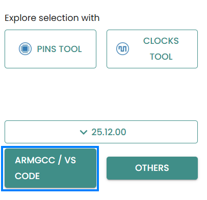
 4. Select Build SDK
 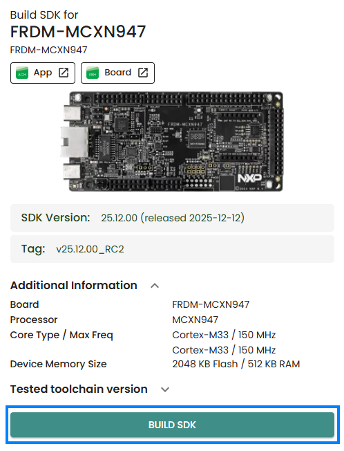
 5. Download the ZIP file and extract it to your desired location
 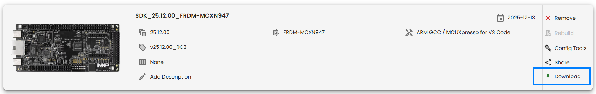
To import into VS Code skip to section [Importing the Repository](#importing-the-repository).

 ## Option 2: Clone from GitHub through VS Code
 1. Open VS Code and click on the MCUXpresso icon in the Activity Bar to open the MCUXpresso panel.
 
 2. Click **Import Repository** and select the **Remote Archive** tab.
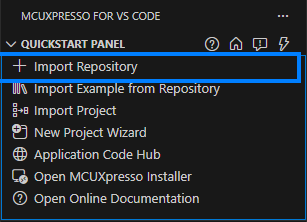
 3. Select the repository ZIP package you wish to clone and follow the prompts to complete the import process.
 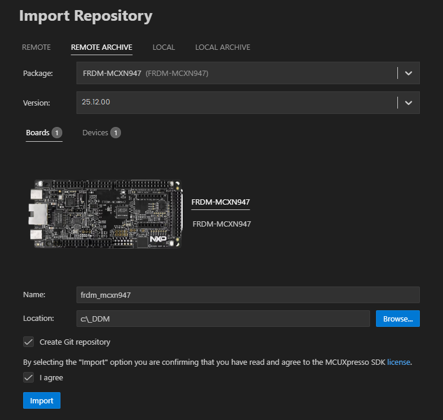

## Importing the Repository

If you have obtained the package from the SDK Builder, follow these steps to import it into VS Code:
1. Open VS Code and click on the MCUXpresso icon in the Activity Bar to open the MCUXpresso panel.
 
2. Click  **Import Repository** and select the **Local Arcive** tab.

3. Navigate to the extracted SDK repository folder and select it to complete the import process.
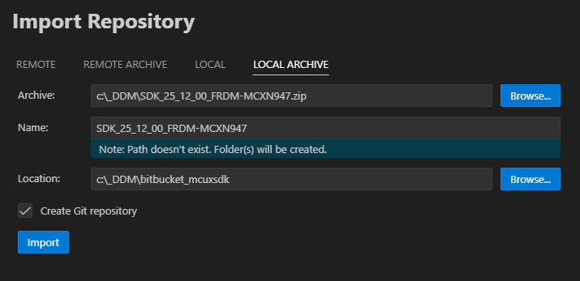

## Importing an example
When your workspace is completely empty you will see that under 'Projects' there will be two options to import an example. If your workspace is not empty, then use the QuickStart panel to import an example.
This guide will focus on importing an example from the repository retrieved previously.

1. Click on **Import Example from Repository** in the **Quickstart Panel** view.
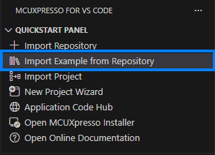
2. Select the repository you previously imported from the dropdown list.
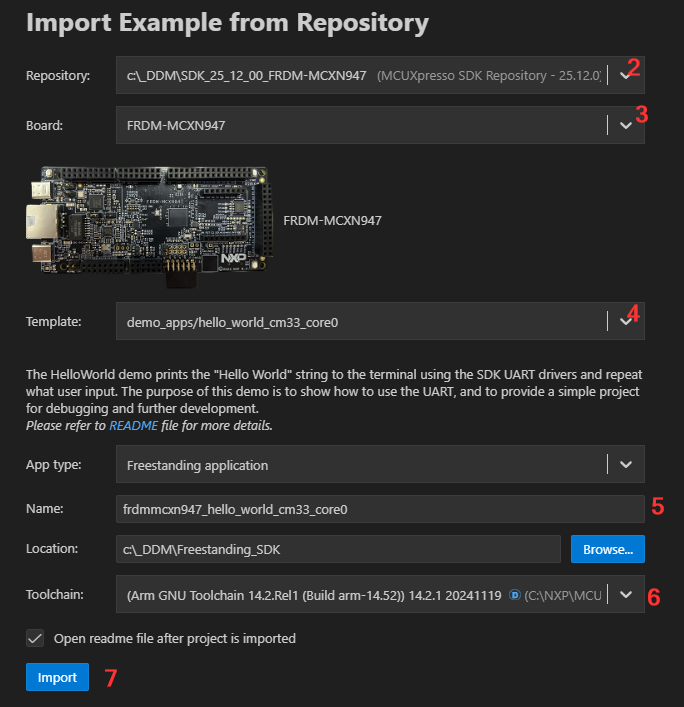
3. Select the board 
4. Choose the example application you wish to import.
5. You will need to select the APP type, i.e. freestanding, standalone or repository application, the name and location of the project.
6. Next select the toolchain of choice, i.e. as ARM GNU Toolchain.
7. Click **Import** to complete the import process.

## Run an example application

**Note:** for full details on MCUXpresso for VS Code debug probe support, see [MCUXpresso for VS Code Wiki](https://github.com/nxp-mcuxpresso/vscode-for-mcux/wiki/DebugK).

1. Open the **Serial Monitor** from the VS Code's integrated terminal. Select the VCom Port for your device and set the baud rate to 115200 and press **Start Monitoring**.
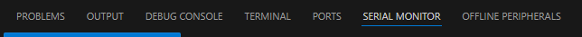
2. Navigate to the **PROJECTS** view and click the play button to initiate a debug session.
    The debug session will begin. The debug controls are initially at the top.
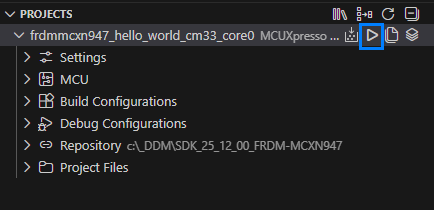
3. Click **Continue** on the debug controls to resume execution of the code. Observe the output on the **Serial Monitor**.
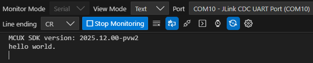

## Exploring the Project Structure
Once you have successfully imported an example, you can explore the project structure in the **File Explorer** view. The project follows a standard CMake-based layout that is consistent across all MCUXpresso SDK releases. The structure of the workspace follows a standardized layout. To get started, refer to [SDK Project Layout](../gsd/explore_sdk.md) for a detailed breakdown of the project hierarchy.

## Additional Resources
- [MCUXpresso for VS Code Wiki](https://github.com/nxp-mcuxpresso/vscode-for-mcux/wiki)
- [Official GitHub Repositories](https://github.com/nxp-mcuxpresso)

